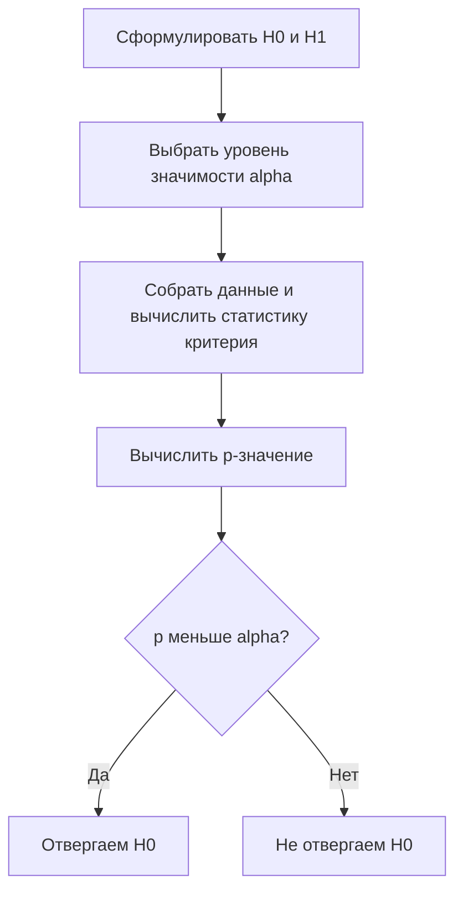

Проверка гипотез — это способ принимать решения о свойствах генеральной совокупности по случайной выборке, контролируя при этом вероятность ошибиться. Идея простая: мы формулируем «осторожное» предположение, считаем, насколько наблюдаемые данные противоречат ему, и решаем, достаточно ли этого противоречия, чтобы предположение отвергнуть.

Эта тема опирается на [теорию вероятностей](/probability/) (распределения, случайные величины) и на базовые понятия [статистики](/statistics/) (выборка, оценка параметров, доверительные интервалы). Если доверительные интервалы вы ещё не разбирали — стоит вернуться к ним: проверка гипотез и интервальное оценивание тесно связаны.

## Зачем вообще нужны гипотезы

Допустим, мы поменяли кнопку оформления заказа и конверсия в выборке выросла с 4.0% до 4.3%. Это реальный эффект или просто случайный шум выборки? Сама по себе разница ни о чём не говорит: при подбрасывании монеты тоже бывают серии из пяти орлов подряд.

Проверка гипотез отвечает на вопрос: **насколько вероятно увидеть такие (или более экстремальные) данные, если на самом деле эффекта нет?** Если такая случайность слишком маловероятна, мы склоняемся к тому, что эффект реален.



## Нулевая и альтернативная гипотезы

**Нулевая гипотеза** $H_0$ — это «скучное» предположение об отсутствии эффекта, отсутствии различий, равенстве параметра конкретному значению. Именно её мы пытаемся опровергнуть.

**Альтернативная гипотеза** $H_1$ (или $H_a$) — то, что мы подозреваем: эффект есть, различия есть, параметр не равен заявленному значению.

Примеры пар:

| Задача | $H_0$ | $H_1$ |
|---|---|---|
| Новая кнопка повышает конверсию | $p_{\text{new}} = p_{\text{old}}$ | $p_{\text{new}} \neq p_{\text{old}}$ |
| Препарат снижает давление | $\mu_{\text{лек}} = \mu_{\text{плацебо}}$ | $\mu_{\text{лек}} < \mu_{\text{плацебо}}$ |
| Монета честная | $p = 0.5$ | $p \neq 0.5$ |

Альтернатива бывает **двусторонней** ($\mu \neq \mu_0$ — отклонение в любую сторону) и **односторонней** ($\mu > \mu_0$ или $\mu < \mu_0$). Сторону выбирают **до** сбора данных, исходя из содержательного вопроса, а не подгоняют под результат.

:::caution[Асимметрия гипотез]
$H_0$ и $H_1$ неравноправны. Мы не «доказываем» $H_0$ — мы либо находим достаточно улик против неё, либо нет. Формулировка «не отвергли $H_0$» означает «данных не хватило», а не «эффекта точно нет». Это как презумпция невиновности: оправдательный вердикт не означает доказанную невиновность.
:::

## Статистика критерия

**Статистика критерия** (test statistic) — это число, вычисляемое из выборки так, чтобы при верной $H_0$ его распределение было известно. Чем сильнее данные противоречат $H_0$, тем более «экстремальное» значение статистики мы видим.

Типичный шаблон — отношение «наблюдаемый эффект» к «его случайному разбросу»:

$$
T = \frac{\text{оценка} - \text{значение при } H_0}{\text{стандартная ошибка оценки}}
$$

Например, для проверки гипотезы о среднем при известной дисперсии $\sigma^2$ используется $z$-статистика:

$$
Z = \frac{\bar{x} - \mu_0}{\sigma / \sqrt{n}}
$$

Здесь $\bar{x}$ — выборочное среднее, $\mu_0$ — значение из $H_0$, $\sigma/\sqrt{n}$ — стандартная ошибка среднего. При верной $H_0$ величина $Z$ распределена приблизительно стандартно нормально $\mathcal{N}(0, 1)$. Большое по модулю значение $Z$ — сигнал против $H_0$.

## P-значение и уровень значимости

**P-значение** — вероятность получить статистику критерия такую же или более экстремальную, чем наблюдаемая, **при условии, что $H_0$ верна**:

$$
p = P\big(\,|T| \geq |t_{\text{набл}}| \;\big|\; H_0\,\big)
$$

(для двустороннего критерия). Маленькое $p$ означает: «если бы эффекта не было, такие данные были бы редкостью» — это улика против $H_0$.

**Уровень значимости** $\alpha$ — порог, который мы фиксируем заранее (часто $0.05$, $0.01$). Правило решения:

- если $p \leq \alpha$ — отвергаем $H_0$ (результат «статистически значим»);
- если $p > \alpha$ — не отвергаем $H_0$.

$\alpha$ — это и есть допустимая нами вероятность ошибочно отвергнуть верную $H_0$.

:::danger[Чем p-значение НЕ является]
- p-значение **не** равно вероятности того, что $H_0$ верна. Это $P(\text{данные} \mid H_0)$, а не $P(H_0 \mid \text{данные})$ — путать их так же грубо, как путать $P(A\mid B)$ и $P(B\mid A)$.
- $p = 0.04$ **не** значит «вероятность ошибки 4%» для данного конкретного вывода.
- Статистическая значимость $\neq$ практическая важность. При огромной выборке значимым станет даже ничтожный эффект. Всегда смотрите на **размер эффекта** и доверительный интервал, а не только на «звёздочку значимости».
:::

## Ошибки I и II рода и мощность

Любое решение по выборке может оказаться неверным. Возможны два типа ошибок.

|  | $H_0$ верна | $H_0$ ложна |
|---|---|---|
| **Отвергли $H_0$** | Ошибка I рода ($\alpha$) | Верное решение (мощность $1-\beta$) |
| **Не отвергли $H_0$** | Верное решение ($1-\alpha$) | Ошибка II рода ($\beta$) |

- **Ошибка I рода** (false positive): отвергли верную $H_0$ — «нашли эффект, которого нет». Её вероятность равна $\alpha$.
- **Ошибка II рода** (false negative): не отвергли ложную $H_0$ — «пропустили реальный эффект». Её вероятность обозначают $\beta$.
- **Мощность критерия** — $1 - \beta$ — вероятность обнаружить эффект, когда он действительно есть.

Аналогия с медицинским тестом: ошибка I рода — здоровому сказали «болен», ошибка II рода — больному сказали «здоров».

Между ошибками есть конфликт: уменьшая $\alpha$ (становясь строже к уликам), мы повышаем $\beta$ (чаще пропускаем эффект). На мощность влияют:

$$
\text{мощность} \uparrow \quad\text{при}\quad
\begin{cases}
\text{больше размер выборки } n \\
\text{больше истинный размер эффекта} \\
\text{меньше дисперсия данных} \\
\text{больше } \alpha
\end{cases}
$$

:::tip[Планируйте размер выборки заранее]
До эксперимента полезно сделать **расчёт мощности**: задать желаемую мощность (обычно $0.8$), уровень $\alpha$ и минимальный интересующий размер эффекта — и вычислить необходимое $n$. Это уберегает от исследования, которое физически не способно поймать эффект.
:::

## T-тест: сравнение средних

**t-тест Стьюдента** применяют, когда дисперсия неизвестна и оценивается по выборке (типичный случай). Статистика строится так же, как $z$, но с выборочным стандартным отклонением $s$:

$$
t = \frac{\bar{x} - \mu_0}{s / \sqrt{n}}
$$

При верной $H_0$ она следует **распределению Стьюдента** с $n-1$ степенями свободы. Оно похоже на нормальное, но с более тяжёлыми хвостами; при росте $n$ сходится к $\mathcal{N}(0,1)$.

Разновидности:

- **одновыборочный** — сравнить среднее выборки с константой $\mu_0$;
- **двухвыборочный** — сравнить средние двух независимых групп (A/B-тест);
- **парный** — сравнить «до/после» на одних и тех же объектах.

Ключевые предпосылки: данные приблизительно нормальны (или выборка велика — работает [центральная предельная теорема](/probability/)), наблюдения независимы.

```python
from scipy import stats

control = [4.1, 3.8, 4.5, 4.0, 3.9, 4.2]
variant = [4.6, 4.9, 4.3, 4.8, 5.0, 4.7]

# двухвыборочный t-тест (двусторонний)
t_stat, p_value = stats.ttest_ind(control, variant)
print(f"t = {t_stat:.3f}, p = {p_value:.4f}")
# t = -3.7xx, p = 0.00xx  ->  при alpha=0.05 отвергаем H0 о равенстве средних
```

## Хи-квадрат: категориальные данные

Критерий **хи-квадрат** ($\chi^2$) работает с частотами категорий. Самое частое применение — **проверка независимости** двух категориальных признаков по таблице сопряжённости. Идея: сравниваем наблюдаемые частоты $O_{ij}$ с ожидаемыми $E_{ij}$ (теми, что были бы при независимости признаков):

$$
\chi^2 = \sum_{i,j} \frac{(O_{ij} - E_{ij})^2}{E_{ij}}
$$

где для таблицы $E_{ij} = \dfrac{(\text{сумма строки } i)\cdot(\text{сумма столбца } j)}{N}$. Большое $\chi^2$ означает, что наблюдаемые частоты сильно расходятся с ожидаемыми при независимости, то есть признаки, видимо, связаны. Число степеней свободы для таблицы $r\times c$ равно $(r-1)(c-1)$.

```python
import numpy as np
from scipy import stats

# строки: устройство (desktop/mobile), столбцы: купил / не купил
table = np.array([[90, 410],
                  [60, 440]])
chi2, p, dof, expected = stats.chi2_contingency(table)
print(f"chi2 = {chi2:.2f}, dof = {dof}, p = {p:.4f}")
```

:::note
Хи-квадрат — асимптотический критерий: он надёжен, когда ожидаемые частоты в ячейках не слишком малы (часто требуют $E_{ij} \geq 5$). Для маленьких таблиц с малыми частотами используют точный критерий Фишера.
:::

## Множественные сравнения и p-hacking

Если проверять одну гипотезу на уровне $\alpha = 0.05$, вероятность ложного срабатывания — 5%. Но если проверять **много** гипотез, ложные «открытия» почти гарантированы. При $m$ независимых тестах вероятность хотя бы одной ошибки I рода (FWER):

$$
P(\text{хотя бы одна ошибка}) = 1 - (1 - \alpha)^m
$$

Например, при $\alpha = 0.05$ и $m = 20$ тестах: $1 - 0.95^{20} \approx 0.64$. То есть среди 20 заведомо пустых гипотез примерно с вероятностью 64% хотя бы одна окажется «значимой» по чистой случайности.

Поправки на множественность снижают этот риск:

- **поправка Бонферрони** — сравнивать каждое p-значение с $\alpha / m$ (просто, но консервативно);
- **процедура Бенджамини–Хохберга** — контролирует не FWER, а долю ложных открытий (FDR); мягче и популярна в ML и биоинформатике.

**P-hacking** — сознательное или невольное «выуживание» значимости:

- проверять много вариантов и сообщать только сработавший;
- останавливать сбор данных, как только $p$ упало ниже $0.05$ («peeking»);
- перебирать подгруппы, преобразования, способы исключения выбросов до получения $p < 0.05$;
- менять гипотезу после взгляда на данные (HARKing — Hypothesizing After the Results are Known).

:::caution[Как защититься]
- Фиксируйте $H_1$, $\alpha$, размер выборки и план анализа **до** сбора данных (предрегистрация).
- Разделяйте данные: гипотезы генерируйте на одной части, проверяйте — на отложенной.
- Сообщайте обо **всех** проведённых тестах, а не только об удачных.
- Применяйте поправки на множественность.
- Помните про размер эффекта и воспроизводимость — один значимый результат это ещё не открытие.
:::

Подробнее о связи с распределениями и оценками см. [теорию вероятностей](/probability/) и раздел [статистики](/statistics/); практические расчёты удобно делать инструментами из [Python для данных](/python-data/) (`scipy.stats`, `statsmodels`).

## Задания

### Задание 1. Интерпретация p-значения

A/B-тест дал $p = 0.03$ при $\alpha = 0.05$. Коллега говорит: «Значит, вероятность того, что новая версия не лучше старой, равна 3%». В чём ошибка и как правильно сформулировать вывод?

<details>
<summary>Решение</summary>

Ошибка в подмене условной вероятности. p-значение — это $P(\text{данные не хуже наблюдаемых} \mid H_0)$, а не $P(H_0 \mid \text{данные})$. Утверждение коллеги — про второе.

Корректная формулировка: «Если бы между версиями не было разницы ($H_0$ верна), вероятность получить такое или более выраженное различие в данных составляла бы 3%. Поскольку $0.03 \leq 0.05$, мы отвергаем $H_0$ на уровне значимости 5%».

Дополнительно стоит привести **размер эффекта** и доверительный интервал для разницы конверсий, а не ограничиваться фактом значимости.

</details>

### Задание 2. Множественные сравнения

Аналитик проверил 10 независимых гипотез, каждую на уровне $\alpha = 0.05$, и все $H_0$ на самом деле верны.

1. Какова вероятность получить хотя бы один «значимый» результат?
2. Какой порог даст поправка Бонферрони и какова станет вероятность хотя бы одной ошибки I рода с ним?

<details>
<summary>Решение</summary>

**Пункт 1.** Вероятность хотя бы одной ошибки:

$$
1 - (1 - 0.05)^{10} = 1 - 0.95^{10} \approx 1 - 0.5987 = 0.4013
$$

То есть около **40%** — почти как подбросить монету. Это и есть причина, по которой множественные тесты без поправок ненадёжны.

**Пункт 2.** Поправка Бонферрони: порог $\alpha' = \dfrac{0.05}{10} = 0.005$. Тогда вероятность хотя бы одной ошибки:

$$
1 - (1 - 0.005)^{10} = 1 - 0.995^{10} \approx 1 - 0.9511 = 0.0489 \le 0.05
$$

FWER возвращается под контроль на уровне примерно 5%.

</details>

### Задание 3. Ошибки рода и мощность

Для каждой ситуации укажите тип ошибки (I или II) и как изменится её вероятность при описанном действии:

1. Спам-фильтр отправил важное письмо в спам ($H_0$: письмо не спам).
2. Исследователь увеличил размер выборки в 4 раза, оставив $\alpha$ прежним. Что произойдёт с мощностью?
3. Чтобы «быть осторожнее», аналитик снизил $\alpha$ с $0.05$ до $0.01$. Как это повлияет на $\beta$?

<details>
<summary>Решение</summary>

1. $H_0$ («не спам») на самом деле верна, но фильтр её отверг (пометил как спам) — это **ошибка I рода** (ложноположительное срабатывание).

2. Увеличение $n$ уменьшает стандартную ошибку ($\sigma/\sqrt{n}$), статистика критерия растёт по модулю, $\beta$ падает — **мощность $1-\beta$ увеличивается**. Эффект становится легче обнаружить.

3. Снижение $\alpha$ делает критерий строже: отвергать $H_0$ становится труднее. Это уменьшает вероятность ошибки I рода, но при прочих равных **увеличивает $\beta$** (ошибку II рода) и, соответственно, снижает мощность. Налицо компромисс между двумя типами ошибок.

</details>

### Задание 4. Хи-квадрат вручную

Дана таблица сопряжённости (устройство × покупка):

| | Купил | Не купил | Итого |
|---|---|---|---|
| Desktop | 30 | 70 | 100 |
| Mobile | 20 | 80 | 100 |
| **Итого** | 50 | 150 | 200 |

Вычислите ожидаемые частоты и статистику $\chi^2$. Сколько степеней свободы у критерия?

<details>
<summary>Решение</summary>

Ожидаемые частоты: $E_{ij} = \dfrac{(\text{сумма строки})\cdot(\text{сумма столбца})}{N}$.

$$
E_{\text{Desktop, Купил}} = \frac{100 \cdot 50}{200} = 25, \quad
E_{\text{Desktop, Не купил}} = \frac{100 \cdot 150}{200} = 75
$$
$$
E_{\text{Mobile, Купил}} = \frac{100 \cdot 50}{200} = 25, \quad
E_{\text{Mobile, Не купил}} = \frac{100 \cdot 150}{200} = 75
$$

Статистика:

$$
\chi^2 = \frac{(30-25)^2}{25} + \frac{(70-75)^2}{75} + \frac{(20-25)^2}{25} + \frac{(80-75)^2}{75}
$$
$$
= \frac{25}{25} + \frac{25}{75} + \frac{25}{25} + \frac{25}{75} = 1 + 0.333 + 1 + 0.333 = 2.667
$$

Степени свободы: $(r-1)(c-1) = (2-1)(2-1) = 1$.

Критическое значение $\chi^2$ при $\alpha = 0.05$ и $1$ степени свободы $\approx 3.84$. Так как $2.667 < 3.84$, **$H_0$ о независимости признаков не отвергается** — связь между типом устройства и покупкой статистически не подтверждена на этих данных.

</details>
