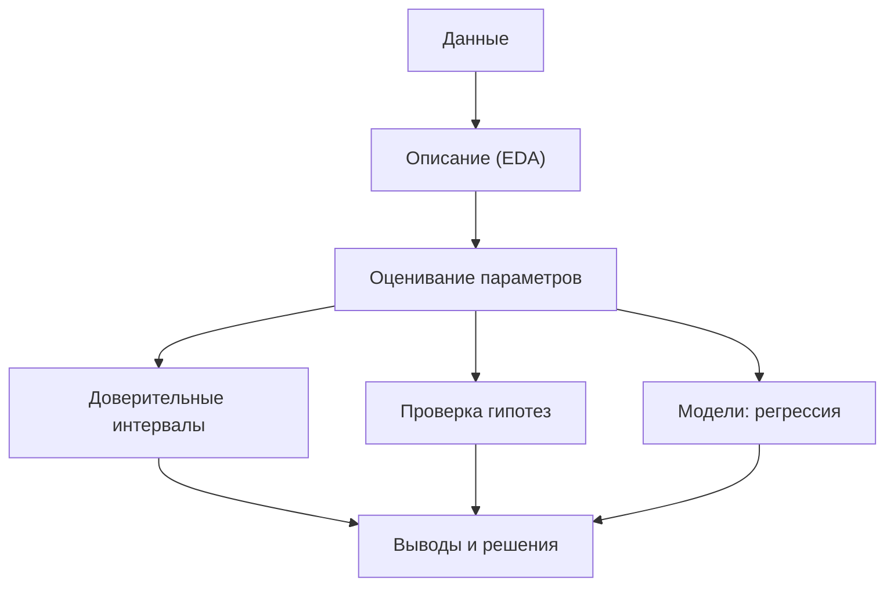

Статистика — это наука о том, как делать выводы о большом (генеральной совокупности) по малому (выборке) в условиях неопределённости. Теория вероятностей описывает, как из известной модели мира рождаются данные; статистика решает обратную задачу — по наблюдаемым данным восстанавливает модель. Именно эта обратная задача лежит в основе всего машинного обучения: мы видим конечный набор примеров и хотим сказать что-то про закономерность, которая их породила.


## Зачем статистика для ML

Машинное обучение — это, по сути, прикладная статистика на больших данных и гибких моделях. Без статистического мышления модель легко превращается в генератор красивых, но недостоверных чисел.

- **Оценка параметров.** Обучение модели — это оценивание её параметров по данным. Метод максимального правдоподобия и метод наименьших квадратов, которыми обучаются логистическая и линейная регрессии, пришли прямо из статистики.
- **Неопределённость предсказаний.** Точечная оценка (одно число) почти всегда обманчива. Доверительные интервалы и стандартные ошибки показывают, насколько можно доверять метрике, коэффициенту или прогнозу.
- **Сравнение моделей и A/B-тесты.** Модель A показала accuracy 0.91, модель B — 0.92. Это реальное улучшение или шум выборки? Ответ даёт проверка гипотез.
- **Корректная валидация.** Разброс метрики между фолдами кросс-валидации, оценка bias и variance, понимание переобучения — всё это статистические понятия.
- **Понимание данных.** Прежде чем обучать что-либо, данные нужно описать: распределения, выбросы, корреляции, пропуски. Это описательная статистика и разведочный анализ (EDA).

:::tip
Хорошее эмпирическое правило: любая цифра, полученная по данным (метрика, коэффициент, среднее), — это случайная величина. Всегда полезно спросить «а какой у неё разброс?», прежде чем делать выводы.
:::

## Ключевые идеи темы

### Выборка и генеральная совокупность

Мы почти никогда не видим всю популяцию — только выборку из неё. Качество выводов зависит от того, насколько выборка репрезентативна и насколько велика. Объём выборки $n$ напрямую влияет на точность: стандартная ошибка среднего убывает как $1/\sqrt{n}$.

$$
\mathrm{SE}(\bar{X}) = \frac{\sigma}{\sqrt{n}}
$$

### Оценка как случайная величина

Среднее по выборке $\bar{X}$, дисперсия, коэффициент регрессии — это оценки. Если повторить эксперимент, мы получим другие числа. Поэтому у оценки есть собственное распределение (выборочное распределение), смещение и разброс.

### Центральная предельная теорема

Сумма (и среднее) большого числа независимых слагаемых распределена приблизительно нормально, какой бы ни была форма исходного распределения. Это объясняет, почему нормальное распределение встречается повсюду и почему доверительные интервалы для среднего работают даже для «ненормальных» данных при большом $n$.

### Оценивание и правдоподобие

Центральная идея — функция правдоподобия: насколько вероятны наблюдаемые данные при разных значениях параметра. Максимизируя её, получаем оценку максимального правдоподобия (MLE):

$$
\hat{\theta}_{\text{MLE}} = \arg\max_{\theta} \prod_{i=1}^{n} p(x_i \mid \theta)
$$

### Сигнал против шума

Статистика — это, по сути, искусство отделять систематический сигнал от случайного шума. Проверка гипотез формализует вопрос «может ли наблюдаемый эффект быть случайностью?», а доверительные интервалы отвечают «в каком диапазоне лежит истинное значение?».



## Связь с другими темами

- [Теория вероятностей](/probability/) — фундамент статистики: случайные величины, распределения, матожидание и дисперсия. Без неё статистические выводы не имеют смысла.
- [Линейная алгебра](/linear-algebra/) — язык регрессии и многомерных данных: матрица «объект-признак», нормальное уравнение, ковариационная матрица.
- [Математический анализ](/calculus/) — оптимизация правдоподобия и суммы квадратов: производные, градиент, поиск экстремумов.
- [Python и работа с данными](/python-data/) — практический инструментарий: `numpy`, `pandas`, `scipy.stats`, `statsmodels`, визуализация для EDA.
- [Машинное обучение](/machine-learning/) — прямое применение: обучение как оценивание, валидация, метрики, bias-variance.

## Разделы темы

| Раздел | О чём |
| --- | --- |
| [Описательная статистика](/statistics/descriptive/) | Меры центра и разброса (среднее, медиана, дисперсия, квантили), формы распределений, выбросы, визуализация и разведочный анализ данных. |
| [Оценивание](/statistics/estimation/) | Точечные оценки, смещение и состоятельность, метод моментов и метод максимального правдоподобия, выборочные распределения. |
| [Доверительные интервалы](/statistics/confidence-intervals/) | Интервальные оценки, уровень доверия, интервалы для среднего и доли, бутстрап как универсальный численный подход. |
| [Проверка гипотез](/statistics/hypothesis-testing/) | Нулевая и альтернативная гипотезы, p-value, ошибки I и II рода, мощность, t-тесты и хи-квадрат, A/B-тестирование. |
| [Корреляция и регрессия](/statistics/regression/) | Ковариация и коэффициент корреляции, линейная регрессия методом наименьших квадратов, интерпретация коэффициентов, $R^2$. |
| [Задания](/statistics/exercises/) | Практические задачи на закрепление: расчёты, симуляции и анализ данных на Python. |

## Как изучать эту тему

:::note[Маршрут]
Идите по разделам в порядке таблицы — каждый опирается на предыдущий. Описание данных → оценивание параметров → измерение неопределённости (интервалы и гипотезы) → моделирование зависимостей (регрессия).
:::

- **Сначала интуиция, потом формула.** Прежде чем выводить формулу стандартной ошибки, поймите, почему оценка по большей выборке надёжнее. Формула должна подтверждать интуицию, а не заменять её.
- **Симулируйте.** Лучший способ прочувствовать выборочное распределение, ЦПТ или смысл p-value — сгенерировать данные и посмотреть, что происходит при повторении эксперимента.

```python
import numpy as np

rng = np.random.default_rng(0)
# 10 000 раз берём выборку из 30 значений и считаем среднее
means = [rng.exponential(scale=2.0, size=30).mean() for _ in range(10_000)]
print(np.mean(means), np.std(means))  # ~2.0 и ~2/sqrt(30): среднее приближается к нормальному
```

- **Считайте руками на маленьких числах.** Один раз посчитать t-статистику и доверительный интервал на 5–10 числах вручную полезнее, чем сто раз вызвать готовую функцию.
- **Связывайте с ML сразу.** Встретив MLE — вспомните, что так обучается логистическая регрессия. Встретив наименьшие квадраты — это линейная регрессия. Так теория не повиснет в воздухе.
- **Не путайте «статистически значимо» и «важно на практике».** При большой выборке значимым становится даже крошечный, бесполезный эффект. Всегда смотрите на размер эффекта, а не только на p-value.

:::caution
Самая частая ошибка новичков — делать категоричные выводы из одной выборки без оценки разброса. Если вы не знаете доверительный интервал своей метрики, вы не знаете, реальна она или это случайность.
:::

Освоив эту тему, вы перестанете воспринимать число, полученное из данных, как точную истину и научитесь видеть за ним распределение, неопределённость и риск ошибки — навык, который отличает осознанного ML-инженера от подбирающего гиперпараметры наугад.
