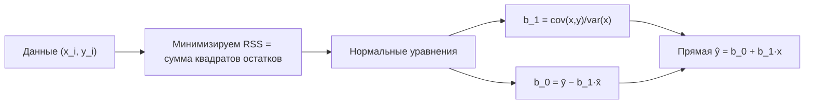
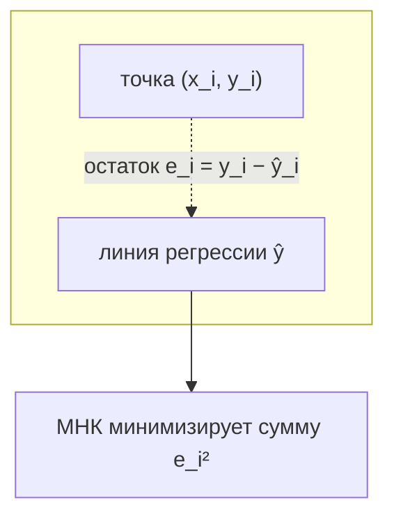
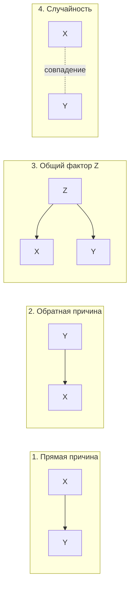

Когда у нас есть две числовые величины — рост и вес, рекламный бюджет и продажи, число комнат и цена квартиры, — естественно спросить: связаны ли они и насколько сильно? Ответ на «насколько сильно» дают коэффициенты корреляции, а на «как именно одна зависит от другой» — регрессия. Эти два инструмента лежат в самом фундаменте машинного обучения: линейная регрессия — это буквально первая модель, с которой стоит начинать (см. [/machine-learning/linear-models/](/machine-learning/linear-models/)).

В этом разделе мы разберём корреляцию Пирсона и её подводные камни, выведем простую линейную регрессию через метод наименьших квадратов, поймём, что измеряет $R^2$, как читать коэффициенты — и почему сильная корреляция сама по себе ничего не говорит о причинах.

## Корреляция Пирсона

### Ковариация: совместная изменчивость

Прежде чем измерять силу связи, нужно понять, согласованно ли две величины отклоняются от своих средних. Это измеряет **ковариация**. Для выборки из $n$ пар $(x_i, y_i)$:

$$
\operatorname{cov}(x, y) = \frac{1}{n}\sum_{i=1}^{n} (x_i - \bar{x})(y_i - \bar{y})
$$

Интуиция: для каждой точки смотрим, в какую сторону она отклонилась по $x$ и по $y$ от средних $\bar{x}, \bar{y}$. Если обычно отклонения «в одну сторону» (оба выше среднего или оба ниже) — произведения положительны, и ковариация положительна. Если одна величина растёт, когда другая падает — произведения отрицательны.

Проблема ковариации в том, что её величина зависит от единиц измерения. Переведём рост из метров в сантиметры — ковариация вырастет в 100 раз, хотя связь та же самая. Поэтому её нормируют.

### Коэффициент корреляции Пирсона

**Корреляция Пирсона** $r$ — это ковариация, делённая на произведение стандартных отклонений. Это нормировка, которая убирает масштаб:

$$
r = \frac{\operatorname{cov}(x, y)}{\sigma_x \, \sigma_y} = \frac{\sum_{i=1}^{n}(x_i - \bar{x})(y_i - \bar{y})}{\sqrt{\sum_{i=1}^{n}(x_i - \bar{x})^2}\,\sqrt{\sum_{i=1}^{n}(y_i - \bar{y})^2}}
$$

Результат всегда лежит в диапазоне $-1 \le r \le 1$:

- $r = +1$ — идеальная положительная линейная связь (все точки на прямой с положительным наклоном);
- $r = -1$ — идеальная отрицательная линейная связь;
- $r = 0$ — линейная связь отсутствует.

:::note[Связь с косинусом угла]
Если центрировать векторы $\tilde{x} = x - \bar{x}$ и $\tilde{y} = y - \bar{y}$, то корреляция Пирсона — это в точности косинус угла между ними: $r = \dfrac{\tilde{x} \cdot \tilde{y}}{\|\tilde{x}\|\,\|\tilde{y}\|}$. Отсюда и диапазон $[-1, 1]$. Подробнее о скалярном произведении и косинусе — в [/linear-algebra/](/linear-algebra/).
:::

### Грубая шкала интерпретации

Жёстких границ нет, и они зависят от области, но как ориентир:

| $\lvert r \rvert$ | Сила линейной связи |
|---|---|
| 0.0 – 0.1 | практически отсутствует |
| 0.1 – 0.3 | слабая |
| 0.3 – 0.5 | умеренная |
| 0.5 – 0.7 | заметная |
| 0.7 – 0.9 | сильная |
| 0.9 – 1.0 | очень сильная |

### Ограничения корреляции Пирсона

Здесь начинается самое важное. Слово «линейная» в определении — не формальность.

**1. Измеряет только линейную связь.** Две переменные могут быть связаны идеально жёстко, а $r$ при этом будет около нуля. Классический пример: $y = x^2$ для $x$ из симметричного диапазона $[-3, 3]$. Зависимость детерминированная, но симметричная парабола даёт $r \approx 0$.

```python
import numpy as np

x = np.linspace(-3, 3, 100)
y = x**2
print(np.corrcoef(x, y)[0, 1])  # ~0.0 — Пирсон "не видит" параболу
```

**2. Чувствительность к выбросам.** Одна аномальная точка способна как создать, так и уничтожить корреляцию, потому что в формулу входят квадраты и произведения отклонений.

**3. Квартет Энскомба.** Знаменитый пример: четыре совершенно разных набора данных имеют почти одинаковые средние, дисперсии, корреляцию ($r \approx 0.816$) и даже одинаковую линию регрессии — но выглядят они кардинально по-разному. Мораль: **всегда стройте диаграмму рассеяния**, не доверяйте одному числу.

```python
import seaborn as sns
df = sns.load_dataset("anscombe")  # 4 набора с одинаковой статистикой
```

:::caption[Datasaurus]
Современное усиление этой идеи — «Datasaurus Dozen»: десятки наборов с идентичной описательной статистикой, один из которых на графике складывается в силуэт динозавра. Статистика совпадает — картинки совершенно разные.
:::

:::tip[Альтернатива: корреляция Спирмена]
Если связь монотонная, но нелинейная (например, экспоненциальная), используйте **ранговую корреляцию Спирмена** — это корреляция Пирсона, посчитанная на рангах значений, а не на самих значениях. Она устойчива к выбросам и улавливает любую монотонную зависимость.
:::

## Простая линейная регрессия

Корреляция говорит, *насколько сильна* связь. Регрессия идёт дальше и строит **модель**: как предсказать $y$ по $x$. В простейшем случае ищем прямую:

$$
\hat{y} = b_0 + b_1 x
$$

где $b_0$ — свободный член (intercept, значение $\hat{y}$ при $x = 0$), а $b_1$ — наклон (slope, на сколько меняется $\hat{y}$ при росте $x$ на единицу). Шляпка над $y$ означает «предсказанное», в отличие от наблюдаемого $y_i$.

### Метод наименьших квадратов (МНК / OLS)

Какую именно прямую считать «лучшей»? Метод наименьших квадратов выбирает ту, что минимизирует сумму квадратов **остатков** (residuals) — вертикальных расстояний от точек до прямой:

$$
\text{RSS}(b_0, b_1) = \sum_{i=1}^{n} \big(y_i - \hat{y}_i\big)^2 = \sum_{i=1}^{n} \big(y_i - b_0 - b_1 x_i\big)^2
$$

Почему квадраты, а не модули? Квадраты дают гладкую функцию, которую легко дифференцировать, сильнее штрафуют большие ошибки и приводят к красивому аналитическому решению. Приравняв частные производные $\partial \text{RSS}/\partial b_0$ и $\partial \text{RSS}/\partial b_1$ к нулю (это normal equations, нормальные уравнения), получаем явные формулы:

$$
b_1 = \frac{\sum_{i=1}^{n}(x_i - \bar{x})(y_i - \bar{y})}{\sum_{i=1}^{n}(x_i - \bar{x})^2} = \frac{\operatorname{cov}(x,y)}{\operatorname{var}(x)}, \qquad b_0 = \bar{y} - b_1 \bar{x}
$$

Два факта стоит запомнить навсегда:

- Формула $b_0 = \bar{y} - b_1\bar{x}$ означает, что **линия регрессии всегда проходит через точку средних** $(\bar{x}, \bar{y})$.
- Наклон связан с корреляцией простым соотношением: $b_1 = r \cdot \dfrac{\sigma_y}{\sigma_x}$. То есть корреляция и наклон — это две грани одного и того же.



### Геометрия остатков



Остаток $e_i = y_i - \hat{y}_i$ — это вертикальный «промах» модели на $i$-й точке. МНК делает сумму их квадратов минимальной. Важное свойство: при наличии свободного члена сумма остатков равна нулю, $\sum e_i = 0$.

### Код: одна строка против ручного счёта

```python
import numpy as np
from sklearn.linear_model import LinearRegression

x = np.array([1, 2, 3, 4, 5], dtype=float)
y = np.array([2.1, 3.9, 6.2, 7.8, 10.1])

# Вручную по формулам МНК
b1 = np.cov(x, y, bias=True)[0, 1] / np.var(x)
b0 = y.mean() - b1 * x.mean()
print(f"вручную:   b0={b0:.3f}, b1={b1:.3f}")

# Через scikit-learn (X должен быть двумерным)
model = LinearRegression().fit(x.reshape(-1, 1), y)
print(f"sklearn:   b0={model.intercept_:.3f}, b1={model.coef_[0]:.3f}")
```

## Коэффициент детерминации R²

Насколько хороша построенная прямая? Сравним её с самой примитивной моделью — «всегда предсказывать среднее $\bar{y}$». Разложим общую изменчивость $y$:

$$
\underbrace{\sum (y_i - \bar{y})^2}_{\text{TSS, вся изменчивость}} = \underbrace{\sum (\hat{y}_i - \bar{y})^2}_{\text{ESS, объяснённая моделью}} + \underbrace{\sum (y_i - \hat{y}_i)^2}_{\text{RSS, необъяснённая}}
$$

**Коэффициент детерминации** — это доля изменчивости $y$, которую объяснила модель:

$$
R^2 = 1 - \frac{\text{RSS}}{\text{TSS}} = 1 - \frac{\sum (y_i - \hat{y}_i)^2}{\sum (y_i - \bar{y})^2}
$$

Интерпретация:

- $R^2 = 1$ — модель идеальна, все точки лежат на прямой ($\text{RSS} = 0$);
- $R^2 = 0$ — модель не лучше, чем тупо предсказывать среднее;
- $R^2 = 0.7$ — модель объясняет 70% разброса $y$.

:::note[Для простой регрессии $R^2 = r^2$]
В случае с одним предиктором коэффициент детерминации равен **квадрату** корреляции Пирсона. Поэтому при $r = 0.816$ (квартет Энскомба) получаем $R^2 \approx 0.667$ — модель объясняет около двух третей разброса.
:::

:::caution[Высокий R² ≠ хорошая модель]
$R^2$ сам по себе не гарантирует адекватности. Он не падает при добавлении бессмысленных признаков (для этого есть скорректированный $R^2_{adj}$), может быть высоким при систематически кривой подгонке, и его легко завысить, оценивая на тех же данных, на которых обучались. В ML всегда смотрят на качество **на отложенной выборке** — см. [/machine-learning/](/machine-learning/).
:::

## Интерпретация коэффициентов

Правильное чтение коэффициентов — половина пользы от регрессии.

**Наклон $b_1$.** «При увеличении $x$ на одну единицу предсказанное $y$ изменяется в среднем на $b_1$ единиц (при прочих равных)». Например, если модель цены квартиры дала $b_1 = 95000$ для площади в м², это значит: каждый дополнительный квадратный метр добавляет в среднем 95 000 к предсказанной цене. Знак $b_1$ совпадает со знаком корреляции.

**Свободный член $b_0$.** Предсказание при $x = 0$. Часто не имеет содержательного смысла (площадь 0 м²? рост 0 см?) и служит лишь для «настройки высоты» прямой. Интерпретируйте его буквально только если $x = 0$ реально встречается в данных.

**Единицы измерения важны.** Коэффициенты привязаны к шкалам. Перевод $x$ из метров в сантиметры уменьшит $b_1$ в 100 раз — связь та же, число другое. Поэтому для сравнения «вкладов» разных признаков их часто стандартизуют (приводят к нулевому среднему и единичной дисперсии); тогда коэффициенты становятся сопоставимыми.

:::tip[Связь с машинным обучением]
Всё, что здесь описано, напрямую переносится на ML. Простая регрессия — частный случай множественной линейной регрессии $\hat{y} = b_0 + b_1 x_1 + \dots + b_p x_p$, которую обучают тем же МНК (или градиентным спуском при больших данных). Метрики $R^2$, MSE, остатки — стандартный инструментарий. Дальше идут регуляризация (Ridge, Lasso) против переобучения. Полное продолжение темы — в [/machine-learning/linear-models/](/machine-learning/linear-models/), а математика оптимизации — в [/calculus/](/calculus/).
:::

## Корреляция не означает причинность

Это главное предостережение раздела. Из того, что $x$ и $y$ сильно коррелируют, **не следует**, что $x$ вызывает $y$. Возможны как минимум четыре сценария:



1. **$X$ действительно влияет на $Y$** — то, что обычно подразумевают.
2. **Обратная причинность** — на самом деле $Y$ влияет на $X$.
3. **Конфаундер (общий фактор $Z$)** — третья переменная вызывает и $X$, и $Y$. Классика: продажи мороженого коррелируют с числом утоплений. Причина обоих — жара (лето), а не мороженое.
4. **Чистое совпадение** — особенно при переборе многих переменных (спурные корреляции). На сайте Tyler Vergen «Spurious Correlations» собраны абсурдные примеры вроде совпадения числа фильмов с Николасом Кейджем и утоплений в бассейнах.

:::danger[Практический вывод]
Наблюдательные данные позволяют утверждать только связь, но не причину. Чтобы говорить о причинно-следственной связи, нужны **рандомизированные эксперименты** (A/B-тесты) или методы причинного вывода (causal inference): инструментальные переменные, контроль конфаундеров, естественные эксперименты. Регрессия на наблюдательных данных оценивает ассоциацию, а не эффект вмешательства.
:::

## Задания

### Задание 1. Считаем корреляцию и регрессию руками

Дана выборка из 5 точек:

| $x$ | 1 | 2 | 3 | 4 | 5 |
|---|---|---|---|---|---|
| $y$ | 2 | 4 | 5 | 4 | 5 |

Найдите коэффициент корреляции Пирсона $r$, наклон $b_1$ и свободный член $b_0$ линии регрессии. Через какую точку обязана проходить прямая?

<details>
<summary>Решение</summary>

Средние: $\bar{x} = 3$, $\bar{y} = (2+4+5+4+5)/5 = 4$.

Отклонения и произведения:

| $x_i - \bar{x}$ | $y_i - \bar{y}$ | произведение | $(x_i-\bar{x})^2$ | $(y_i-\bar{y})^2$ |
|---|---|---|---|---|
| -2 | -2 | 4 | 4 | 4 |
| -1 | 0 | 0 | 1 | 0 |
| 0 | 1 | 0 | 0 | 1 |
| 1 | 0 | 0 | 1 | 0 |
| 2 | 1 | 2 | 4 | 1 |

Суммы: $\sum(x_i-\bar{x})(y_i-\bar{y}) = 6$, $\sum(x_i-\bar{x})^2 = 10$, $\sum(y_i-\bar{y})^2 = 6$.

Наклон:
$$
b_1 = \frac{6}{10} = 0.6
$$

Свободный член:
$$
b_0 = \bar{y} - b_1\bar{x} = 4 - 0.6 \cdot 3 = 2.2
$$

Корреляция:
$$
r = \frac{6}{\sqrt{10}\,\sqrt{6}} = \frac{6}{\sqrt{60}} \approx \frac{6}{7.746} \approx 0.775
$$

Прямая $\hat{y} = 2.2 + 0.6x$ обязательно проходит через точку средних $(\bar{x}, \bar{y}) = (3, 4)$ — проверка: $2.2 + 0.6\cdot 3 = 4$. ✓

</details>

### Задание 2. Считаем R²

Для модели из Задания 1 ($\hat{y} = 2.2 + 0.6x$) вычислите $R^2$ напрямую через RSS и TSS, а затем проверьте, что он равен $r^2$.

<details>
<summary>Решение</summary>

Предсказания $\hat{y}_i = 2.2 + 0.6 x_i$ и остатки $e_i = y_i - \hat{y}_i$:

| $x_i$ | $y_i$ | $\hat{y}_i$ | $e_i$ | $e_i^2$ |
|---|---|---|---|---|
| 1 | 2 | 2.8 | -0.8 | 0.64 |
| 2 | 4 | 3.4 | 0.6 | 0.36 |
| 3 | 5 | 4.0 | 1.0 | 1.00 |
| 4 | 4 | 4.6 | -0.6 | 0.36 |
| 5 | 5 | 5.2 | -0.2 | 0.04 |

$\text{RSS} = 0.64 + 0.36 + 1.00 + 0.36 + 0.04 = 2.4$.

$\text{TSS} = \sum (y_i - \bar{y})^2 = 6$ (посчитано в Задании 1).

$$
R^2 = 1 - \frac{\text{RSS}}{\text{TSS}} = 1 - \frac{2.4}{6} = 1 - 0.4 = 0.6
$$

Проверка через корреляцию: $r^2 = 0.775^2 \approx 0.6$. ✓ Модель объясняет 60% разброса $y$.

</details>

### Задание 3. Когда Пирсон обманывает

Не вычисляя точных значений, объясните, каким окажется $r$ для данных $y = |x|$ при $x$, равномерно покрывающем отрезок $[-5, 5]$. Что это говорит о применимости корреляции Пирсона, и какой инструмент стоит взять вместо диаграммы рассеяния?

<details>
<summary>Решение</summary>

Зависимость $y = |x|$ симметрична относительно $x = 0$: при $x < 0$ величина $y$ убывает с ростом... нет — при движении $x$ от $-5$ к $0$ значение $y$ падает, а при движении от $0$ к $5$ растёт. Положительные и отрицательные «вклады» $(x_i - \bar{x})(y_i - \bar{y})$ взаимно гасятся.

Поэтому $r \approx 0$, хотя связь между $x$ и $y$ детерминированная и жёсткая. Это прямая иллюстрация ограничения: **корреляция Пирсона измеряет только линейную связь**, а здесь зависимость нелинейная и немонотонная.

Выводы:
- одно число $r$ может полностью скрыть сильную нелинейную зависимость;
- обязательно строить **диаграмму рассеяния** (scatter plot) — глазами «галочка» $y=|x|$ видна мгновенно;
- ранговая корреляция Спирмена здесь тоже не спасёт (связь не монотонная), нужны более общие меры зависимости (например, взаимная информация) или явная нелинейная модель.

```python
import numpy as np
x = np.linspace(-5, 5, 101)
y = np.abs(x)
print(round(np.corrcoef(x, y)[0, 1], 3))  # ≈ 0.0
```

</details>

### Задание 4. Причинность

Аналитик обнаружил, что в городах, где больше пожарных машин выезжает на пожар, ущерб от пожара выше ($r = 0.8$). Он делает вывод: «Пожарные машины усугубляют пожары, нужно посылать меньше». В чём ошибка и как её формально назвать?

<details>
<summary>Решение</summary>

Ошибка — подмена корреляции причинностью при наличии **конфаундера** (общего фактора).

Скрытая третья переменная $Z$ здесь — **масштаб (серьёзность) пожара**. Большой пожар вызывает одновременно и отправку большего числа машин, и больший ущерб:

$$
Z\ (\text{размер пожара}) \to X\ (\text{число машин}), \qquad Z \to Y\ (\text{ущерб})
$$

Корреляция между $X$ и $Y$ реальна, но она наведена общим фактором $Z$, а не причинной связью «машины → ущерб». На самом деле причинность скорее обратная и опосредованная: машины как раз *снижают* ущерб по сравнению с тем, что было бы без них.

Как проверить корректно: сравнивать ущерб при разном числе машин **внутри пожаров одинакового масштаба** (контроль конфаундера $Z$), либо провести контролируемый эксперимент. Сокращать число машин на основе наблюдательной корреляции — методологическая ошибка.

</details>
