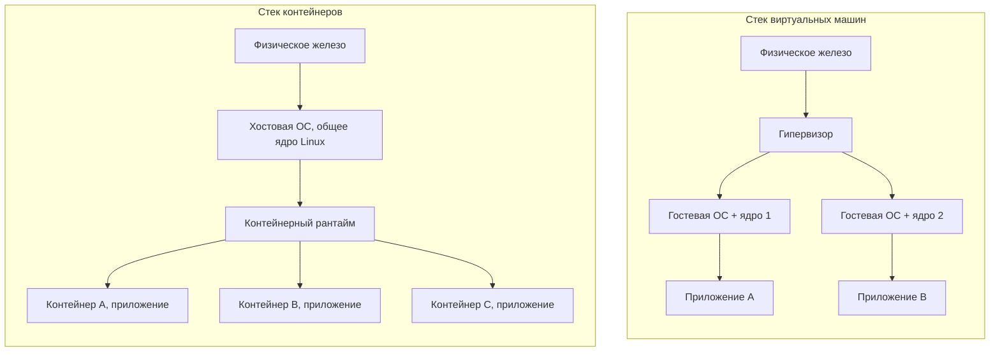
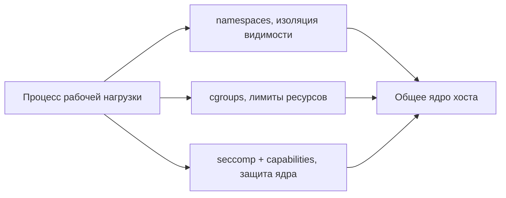

До сих пор мы разбирали виртуализацию железа: гипервизор создаёт иллюзию полноценного компьютера, поверх которой запускается гостевая ОС со своим ядром. Контейнеры решают похожую задачу — изолировать рабочую нагрузку — но делают это принципиально иначе. Чтобы выбирать осознанно, нужно понять, на каком уровне проходит граница изоляции в каждом случае.

## Фундаментальное различие

Сформулируем тезис, из которого вытекает всё остальное.

- **Виртуальная машина виртуализирует железо.** Гипервизор (см. [/virtualization/hypervisors/](/virtualization/hypervisors/)) предоставляет каждой ВМ виртуальные CPU, память, диски и сетевые карты. Внутри ВМ работает **собственное полноценное ядро ОС** — своё у каждой машины. Гость не знает (в идеале), что он виртуализирован, и может быть совершенно другой ОС, чем хост: Windows на хосте с Linux, FreeBSD рядом с Ubuntu.

- **Контейнер виртуализирует операционную систему.** Никакого второго ядра нет: все контейнеры на хосте **разделяют одно и то же ядро Linux**. Изолируется лишь пользовательское окружение — какие процессы, файлы, сетевые интерфейсы и идентификаторы пользователей «видит» процесс. По сути контейнер — это обычный процесс Linux, которому ядро показало урезанную, изолированную картину мира.

Обратите внимание на разницу высоты стеков: у ВМ каждое приложение тянет за собой целое ядро и системное окружение, у контейнеров ядро ровно одно на всех.

## Механизмы контейнеров в Linux

Контейнер — это не отдельная сущность ядра, а комбинация нескольких независимых примитивов Linux, которые рантайм (containerd, CRI-O, runc) собирает воедино.

### Namespaces — изоляция видимости

Пространства имён (namespaces, появились в ядре начиная с 2.4.19 в 2002 году, основной набор оформился к 3.8 в 2013-м) определяют, **что процесс видит**. Каждый тип пространства изолирует свой класс системных ресурсов:

| Namespace | Что изолирует |
|---|---|
| **pid** | Дерево идентификаторов процессов: внутри контейнера init имеет PID 1 и не видит процессы хоста |
| **net** | Сетевые интерфейсы, таблицы маршрутизации, порты, iptables |
| **mnt** | Точки монтирования и дерево файловой системы |
| **uts** | Hostname и доменное имя (UNIX Time-sharing System) |
| **ipc** | Межпроцессное взаимодействие: очереди сообщений, семафоры, разделяемая память System V/POSIX |
| **user** | Отображение UID/GID: root внутри контейнера может быть непривилегированным пользователем на хосте |
| **cgroup** | Видимость иерархии cgroups, скрывает реальное расположение контролёров ресурсов |

Создаются они системными вызовами `clone()`, `unshare()` и `setns()`. Именно user namespace — ключ к «rootless»-контейнерам: процесс с UID 0 внутри сопоставляется с обычным UID снаружи, и реальная компрометация хоста требует дополнительной эскалации.

### Cgroups — лимиты ресурсов

Если namespaces отвечают на вопрос «что видно», то control groups (cgroups) отвечают на вопрос «сколько можно потребить». Это иерархический механизм учёта и ограничения:

- **CPU** — доли процессорного времени (`cpu.weight`) и жёсткие квоты (`cpu.max`);
- **память** — лимиты RSS, поведение при превышении (OOM-kill), учёт страничного кэша;
- **I/O** — пропускная способность блочных устройств (`io.max`);
- **pids** — максимальное число процессов (защита от fork-бомбы).

Актуальна версия **cgroup v2** с единой иерархией; v1 с раздельными контролёрами считается устаревшей. Без cgroups «соседний» контейнер мог бы съесть всю память хоста — namespaces от этого не защищают.

### Дополнительные слои защиты и упаковки

Namespaces и cgroups задают изоляцию и лимиты, но безопасность контейнера держится ещё на нескольких механизмах:

- **Capabilities** — дробление всемогущего root на ~40 отдельных привилегий (`CAP_NET_BIND_SERVICE`, `CAP_SYS_ADMIN` и т. д.); рантайм по умолчанию оставляет контейнеру лишь минимальный набор.
- **seccomp** (secure computing mode) — фильтр системных вызовов на базе BPF: запрещает контейнеру дёргать опасные или ненужные syscalls (например, `keyctl`, `ptrace`), сокращая поверхность атаки на ядро.
- **LSM** — мандатные политики SELinux или AppArmor поверх всего этого.
- **Overlay/union-ФС** (OverlayFS) — образ контейнера собирается из слоёв «только для чтения», а поверх монтируется тонкий записываемый слой. Это даёт мгновенное создание контейнера без копирования образа и общие слои между контейнерами — основа дедупликации и переносимости образов OCI.

:::note[Контейнер как сумма примитивов]
Не существует системного вызова «создать контейнер». Docker или Kubernetes — это оркестровка: рантайм создаёт namespaces, настраивает cgroups, применяет seccomp-профиль и capabilities, монтирует overlay-ФС и запускает процесс. Контейнер — это соглашение, а не объект ядра.
:::

## Сравнение по ключевым осям

| Ось | Виртуальные машины | Контейнеры |
|---|---|---|
| **Граница изоляции** | Виртуальное железо, отдельное ядро на каждую ВМ | Общее ядро хоста, изолировано лишь user-space |
| **Сила изоляции** | Сильная: уязвимость в госте не достаёт до хоста без побега из ВМ | Слабее: общий kernel — единая точка отказа, поверхность атаки = весь syscall-интерфейс |
| **Накладные расходы** | Высокие: каждая ВМ несёт полную ОС, отдельная память под ядро | Почти нулевые: лишний процесс + метаданные |
| **Скорость старта** | Секунды-минуты (загрузка ядра, init, сервисы) | Миллисекунды (это просто `fork`/`exec`) |
| **Плотность на хост** | Десятки | Сотни и тысячи |
| **Размер образа** | Гигабайты (полная ОС) | Мегабайты (только приложение и его зависимости) |
| **Разные ОС/ядра** | Да: Windows, BSD, иные версии ядра | Нет: только то же ядро, что у хоста (Linux-контейнеры на Linux) |
| **Переносимость** | Тяжёлый образ, привязка к формату гипервизора | Лёгкий слоистый образ OCI, запускается где угодно |

Ключевой компромисс читается из таблицы: контейнеры платят **ослабленной изоляцией** за выигрыш в плотности и скорости. Общее ядро означает, что одна уязвимость уровня ядра (повышение привилегий, побег через `/proc`, дыра в неотфильтрованном syscall) потенциально компрометирует все контейнеры на хосте сразу.

## Когда что выбирать

**Виртуальные машины** оправданы, когда:

- нужна **сильная изоляция** — мультитенантность с недоверенными нагрузками, выполнение чужого кода;
- требуются **разные ОС или версии ядра** на одном железе;
- действуют **требования соответствия** (PCI DSS, регуляторные нормы), предписывающие аппаратную изоляцию;
- нагрузке нужны специфичные модули ядра или kernel-tuning, конфликтующие с соседями.

**Контейнеры** выигрывают, когда:

- важна **высокая плотность** и эффективное использование железа;
- архитектура — **микросервисы**, которые быстро масштабируются и пересоздаются;
- нужны **быстрые CI/CD-пайплайны**: образ собирается, тестируется и выкатывается за секунды;
- окружение однородно (один Linux), а нагрузки доверенные или уже изолированы на другом уровне.

:::caution[Контейнер — не граница безопасности по умолчанию]
Стандартный контейнер на общем ядре нельзя считать надёжной границей для враждебного кода. Если вы запускаете недоверенные нагрузки и при этом хотите плотность контейнеров — смотрите в сторону гибридов ниже.
:::

## Гибриды: граница размывается

Дихотомия «ВМ или контейнер» давно перестала быть бинарной. Появился класс решений, берущих сильную изоляцию ВМ и оборачивающих её в эргономику контейнеров.

- **microVM — лёгкие виртуальные машины.** [AWS Firecracker](https://firecracker-microvm.github.io/) — минималистичный VMM на Rust поверх KVM, выбросивший всё лишнее из эмуляции устройств. Результат: старт гостевого user-space примерно за **125 мс** и накладные расходы памяти **менее 5 МиБ на microVM**, что позволяет держать тысячи их на одном хосте. На Firecracker построены AWS Lambda и Fargate. Каждая нагрузка получает собственное ядро и аппаратную изоляцию, но запускается почти как контейнер.

- **Kata Containers** — реализуют OCI-совместимый рантайм, где каждый «контейнер» на самом деле работает в отдельной лёгкой ВМ (поверх QEMU или Firecracker). Для Kubernetes это выглядит как обычный под, но изоляция — аппаратная.

- **gVisor** (Google) — идёт третьим путём, без аппаратной виртуализации. Это **пользовательское ядро**: компонент Sentry, написанный на Go, перехватывает системные вызовы контейнера и реализует интерфейс Linux заново, в user-space. Приложение не общается с ядром хоста напрямую — Sentry сам решает, разрешить, отклонить или эмулировать вызов, и сильно сужает поверхность атаки на настоящее ядро. Цена — заметные накладные расходы на syscall-интенсивных нагрузках.

| Технология | Механизм изоляции | Отдельное ядро | Старт |
|---|---|---|---|
| Обычный контейнер (runc) | namespaces + cgroups | Нет (общее ядро) | Миллисекунды |
| gVisor | User-space ядро Sentry, перехват syscalls | Нет (своё в user-space) | Десятки мс |
| Kata / Firecracker | Аппаратная виртуализация (KVM) | Да | ~100+ мс |
| Классическая ВМ | Аппаратная виртуализация | Да | Секунды-минуты |

Эти решения показывают, что изоляция и плотность — не строгий выбор «или-или», а спектр. Можно получить почти контейнерную скорость старта при почти ВМ-уровне изоляции, заплатив инженерной сложностью.

:::tip[Куда дальше]
Здесь мы рассмотрели контейнеры со стороны виртуализации — как альтернативу гипервизорам. Внутреннее устройство контейнерных платформ, образы OCI, оркестрация в Kubernetes и сетевые модели — тема отдельного будущего курса, который появится в нашем [роадмапе](/roadmap/). Практику аппаратной виртуализации, на которой стоят microVM, разберём в разделе [/virtualization/kvm-qemu/](/virtualization/kvm-qemu/).
:::

## Итог

Виртуальная машина дублирует железо и ядро ради сильной изоляции, контейнер разделяет ядро ради скорости и плотности. В Linux контейнер собирается из namespaces (видимость), cgroups (ресурсы), capabilities и seccomp (защита ядра) и overlay-ФС (упаковка образов). Выбор определяется тем, что для вас критичнее — изоляция или эффективность, а гибриды вроде Firecracker, Kata и gVisor доказывают, что современный инженер всё чаще может не выбирать, а комбинировать.
