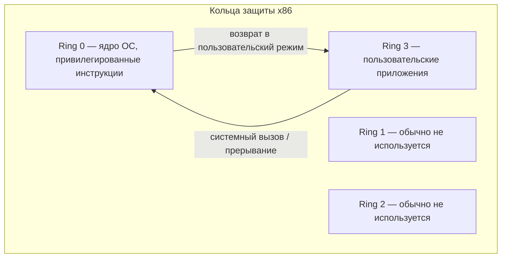
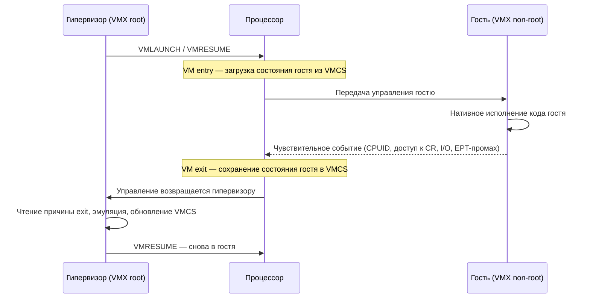

Виртуализация процессора — фундамент любого гипервизора. Задача звучит обманчиво просто: дать нескольким гостевым операционным системам иллюзию, что каждая из них единолично владеет физическим CPU, при этом сохранив изоляцию и приемлемую производительность. Сложность в том, что архитектура x86 исторически не была спроектирована под виртуализацию, и наивные подходы на ней не работают. Чтобы понять почему и какие решения были изобретены, нужно начать с механизма привилегий — колец защиты.

## Кольца защиты x86 (ring 0–3)

Процессоры x86, начиная с 80286 и в защищённом режиме 80386, поддерживают четыре уровня привилегий — кольца (rings), пронумерованные от 0 до 3. Чем меньше номер, тем выше привилегии. Текущий уровень кода обозначается полем **CPL** (Current Privilege Level) в селекторе сегмента кода (регистр CS, биты 0–1).

- **Ring 0** — самый привилегированный уровень. Здесь работает ядро операционной системы. Только в кольце 0 разрешено выполнять привилегированные инструкции: загрузку управляющих регистров (`MOV CR0`, `MOV CR3`), управление таблицами дескрипторов (`LGDT`, `LIDT`), останов процессора (`HLT`), прямой доступ к портам ввода-вывода и т. д.
- **Ring 3** — наименее привилегированный уровень, на котором исполняются пользовательские приложения. Попытка выполнить здесь привилегированную инструкцию вызывает аппаратное исключение — **#GP (General Protection Fault)**, которое перехватывает ядро.
- **Ring 1 и Ring 2** — промежуточные уровни. На практике классические ОС (Linux, Windows) их не используют, ограничиваясь моделью 0/3: ядро в ring 0, приложения в ring 3.

Переход из ring 3 в ring 0 происходит контролируемо — через системные вызовы (`SYSCALL`/`SYSENTER`, ранее `int 0x80`), прерывания и исключения. Это и есть та граница, на которой ОС защищает себя от приложений.

## Формулировка проблемы виртуализации CPU

Гостевая операционная система написана в предположении, что её ядро работает в ring 0 и имеет полный контроль над железом. Но в виртуализированной системе ring 0 уже занят — там должен находиться сам гипервизор (VMM, Virtual Machine Monitor), иначе он не сможет контролировать гостей и арбитрировать доступ к ресурсам.

Решение, известное ещё с мейнфреймов IBM, — **депривилегирование** (ring deprivileging): гипервизор остаётся в ring 0, а гостевое ядро переносится на менее привилегированный уровень.

- **Модель 0/1/3**: гипервизор в ring 0, гостевое ядро в ring 1, гостевые приложения в ring 3. Кольцо 1 даёт ядру гостя чуть больше изоляции от приложений.
- **Модель 0/3**: гостевое ядро тоже помещается в ring 3 рядом с приложениями (используется в 64-битном режиме, где кольца 1 и 2 фактически непригодны из-за особенностей сегментации long mode).

Идея депривилегирования опирается на классический приём, описанный Попеком и Голдбергом ещё в 1974 году: **trap-and-emulate**.

## Trap-and-emulate и почему он не работает на x86

Классический критерий **Попека–Голдберга** гласит: архитектура эффективно виртуализируема, если множество **чувствительных** (sensitive) инструкций является подмножеством **привилегированных** (privileged) инструкций.

- **Привилегированная инструкция** — та, что вызывает trap (исключение) при выполнении вне ring 0.
- **Чувствительная инструкция** — та, что либо меняет состояние системных ресурсов (control-sensitive), либо ведёт себя по-разному в зависимости от уровня привилегий или конфигурации (behavior-sensitive).

Если все чувствительные инструкции привилегированны, то схема работает идеально: гость депривилегирован, и любая его попытка сделать что-то «системное» вызывает trap → управление переходит к VMM в ring 0 → VMM эмулирует инструкцию так, будто гость действительно в ring 0, и возвращает управление. Гость ничего не замечает.

Проблема в том, что **x86 этому критерию не удовлетворяет**. На x86 существует группа инструкций, которые являются чувствительными, но **не привилегированными**: при выполнении в ring 3 (или ring 1) они не вызывают trap, а тихо выполняются, выдавая «неправильный» с точки зрения гостя результат. Гипервизор не получает шанса вмешаться. Классические примеры:

| Инструкция | Что делает | Проблема в депривилегированном госте |
|---|---|---|
| `POPF` | Восстанавливает регистр флагов из стека | Бит `IF` (Interrupt Flag) тихо игнорируется в ring > 0 вместо trap. Гостевое ядро думает, что включило/выключило прерывания, а на деле нет |
| `SGDT`, `SIDT` | Читают регистры GDTR/IDTR (адрес таблиц дескрипторов) | Доступны из любого кольца. Гость видит реальные таблицы хоста, а не свои — утечка состояния VMM |
| `SLDT`, `STR` | Читают LDT и Task Register | Аналогично раскрывают реальное состояние процессора |
| `SMSW` | Читает Machine Status Word (младшие биты CR0) | Доступна из ring 3, гость видит реальный CR0 |
| `PUSHF`/`POPF` | Сохранение/восстановление флагов | Гость не может надёжно отслеживать виртуальный IF |

Этих «непослушных» инструкций на x86 насчитали **17** (исследование Робина и Ирвина, 2000 г.). Их существование означает, что чистый trap-and-emulate на голом x86 **невозможен**: часть критичного состояния гость считывает и меняет в обход гипервизора, что ломает либо корректность, либо изоляцию. Именно это десятилетиями считалось причиной «невиртуализируемости» x86.

## Подход 1: полная виртуализация через бинарную трансляцию

Прорыв совершила VMware в 1998–1999 годах, показав, что x86 всё-таки можно виртуализировать без помощи железа — методом **динамической бинарной трансляции** (BT, binary translation).

Суть подхода:

- **Пользовательский код гостя (ring 3)** исполняется напрямую на процессоре (direct execution) — он и так непривилегирован, ничего эмулировать не нужно, накладные расходы минимальны.
- **Привилегированный код гостевого ядра** не исполняется напрямую. Гипервизор перехватывает его блоками, на лету **транслирует** в безопасный эквивалентный код и кеширует результат в **translation cache**. Безопасные инструкции остаются как есть и идут нативно; проблемные чувствительные инструкции (тот самый POPF, SGDT и пр.) и привилегированные операции заменяются на вызовы в гипервизор (callouts) или на эмулирующие последовательности.

Трансляция работает «почти один к одному»: большинство инструкций транслируются сами в себя, изменяются лишь чувствительные и управляющие поток места. Благодаря кешированию транслированных блоков и адаптивным оптимизациям накладные расходы для многих рабочих нагрузок оказывались умеренными.

:::note[Историческая заслуга]
Бинарная трансляция доказала, что x86 виртуализируем чисто программно, и сделала возможным появление массового рынка виртуализации задолго до аппаратной поддержки. Однако BT сложна в реализации, дорога для нагрузок с большим числом системных операций и плохо подходит для виртуализации привилегированных режимов нового поколения.
:::

## Подход 2: паравиртуализация (кратко)

Альтернатива — не пытаться обмануть гостевое ядро, а **изменить его**. Гостевое ядро модифицируется так, чтобы вместо проблемных инструкций оно делало явные **гипервызовы** (hypercalls) к гипервизору. Так работал классический Xen. Это убирает необходимость в трансляции и даёт высокую производительность, но требует модификации гостевой ОС. Подробно — в разделе [Паравиртуализация](/virtualization/paravirtualization/).

## Подход 3: аппаратная виртуализация (VT-x и AMD-V)

В 2005–2006 годах Intel и AMD добавили в процессоры аппаратные расширения, которые решают проблему x86 на уровне железа: **Intel VT-x** (кодовое имя Vanderpool, технология VMX) и **AMD-V** (SVM, Secure Virtual Machine). Они вводят, по сути, новый «нулевой минус первый» уровень привилегий для гипервизора — неформально его называют **ring -1**.

### Intel VT-x: VMX root и non-root

VT-x вводит два новых режима работы процессора, **ортогональных** кольцам защиты:

- **VMX root mode** — режим, в котором работает гипервизор. В нём доступны новые инструкции управления виртуализацией.
- **VMX non-root mode** — режим, в котором исполняется гость. Здесь сохраняются все четыре кольца (гостевое ядро снова может работать в «своём» ring 0!), но при этом определённые события автоматически передают управление гипервизору.

Ключевой момент: гостевое ядро снова исполняется в ring 0 — но в non-root режиме. Проблема чувствительных-непривилегированных инструкций исчезает, потому что железо само определяет, какие операции должны вызывать выход в гипервизор.

**VMCS** (Virtual Machine Control Structure) — структура в памяти (одна на виртуальный CPU), которая хранит всё, что нужно для переходов:

- **Guest-state area** — сохранённое состояние гостя (регистры, CR, RIP, RSP и т. д.), загружаемое при VM entry и сохраняемое при VM exit.
- **Host-state area** — состояние гипервизора, восстанавливаемое при VM exit.
- **VM-execution controls** — настройки того, какие события должны вызывать VM exit (например, перехватывать ли `CPUID`, обращения к конкретным CR, доступ к портам, MSR).
- **VM-exit / VM-entry controls** и поля **VM-exit information** — причина выхода (exit reason) и сопутствующие данные.

Доступ к VMCS — только через специальные инструкции `VMREAD`/`VMWRITE`, что абстрагирует её внутренний формат.

**Инструкции управления VT-x**:

- `VMXON` / `VMXOFF` — вход и выход из режима VMX-операций.
- `VMPTRLD` — загрузить указатель на активную VMCS.
- `VMLAUNCH` — первый запуск гостя по данной VMCS.
- `VMRESUME` — последующие возобновления (быстрее, чем VMLAUNCH).
- `VMCALL` — гипервызов из гостя в гипервизор.

### AMD-V (SVM): VMCB

AMD-V устроен идейно так же, но структура называется **VMCB** (Virtual Machine Control Block) и объединяет состояние и настройки перехватов в одном блоке. Ключевые инструкции: `VMRUN` (запуск гостя — аналог VMLAUNCH/VMRESUME), `VMLOAD`/`VMSAVE` (сохранение/восстановление части состояния), `VMMCALL` (гипервызов). В отличие от VT-x, VMCB читается обычными обращениями к памяти, без VMREAD/VMWRITE.

| Аспект | Intel VT-x (VMX) | AMD-V (SVM) |
|---|---|---|
| Управляющая структура | VMCS | VMCB |
| Доступ к структуре | `VMREAD` / `VMWRITE` | прямой доступ к памяти |
| Запуск гостя | `VMLAUNCH` / `VMRESUME` | `VMRUN` |
| Гипервызов | `VMCALL` | `VMMCALL` |
| Включение режима | `VMXON` / `VMXOFF` | бит `EFER.SVME` |
| Вложенные таблицы страниц | EPT (Extended Page Tables) | NPT/RVI (Nested Page Tables) |

### VM entry, VM exit и почему частые выходы дороги

Цикл работы аппаратного гипервизора — это бесконечное чередование двух переходов:

- **VM entry** — гипервизор отдаёт процессор гостю (`VMLAUNCH`/`VMRESUME`/`VMRUN`). Железо загружает guest-state из VMCS/VMCB.
- **VM exit** — некое событие в госте требует вмешательства гипервизора. Процессор автоматически сохраняет состояние гостя, загружает состояние хоста и передаёт управление гипервизору, указывая **причину выхода**.

Что вызывает VM exit (настраивается через controls): инструкции `CPUID`, `HLT`, `INVLPG`, обращения к управляющим регистрам (`MOV to/from CR0/CR3/CR4`), доступ к портам ввода-вывода, чтение/запись определённых MSR, внешние прерывания, исключения, а также промахи вложенной трансляции адресов (EPT/NPT violation).

:::caution[Стоимость VM exit]
Каждый VM exit — это сотни-тысячи тактов: сохранение и восстановление полного состояния процессора, сброс конвейера, потеря «горячих» TLB и кешей, выполнение кода обработчика в гипервизоре. Рабочая нагрузка с большим числом системных операций (интенсивный ввод-вывод, частые переключения контекста, много `CPUID`) генерирует лавину exit-ов и может работать заметно медленнее, чем нативно. Поэтому вся последующая эволюция виртуализации — это борьба за **сокращение числа VM exit**: вложенные таблицы страниц (EPT/NPT) убирают exit-ы на трансляцию памяти, APICv/AVIC — на доступ к контроллеру прерываний, posted interrupts — на доставку прерываний.
:::

Управление памятью гостя (вложенная трансляция через EPT/NPT, теневые таблицы страниц) — большая отдельная тема, рассмотренная в разделе [Виртуализация памяти](/virtualization/memory/). Практическое применение VT-x/AMD-V через гипервизор KVM и эмулятор QEMU разбирается в разделе [KVM/QEMU на практике](/virtualization/kvm-qemu/).

## Итог

Архитектура x86 изначально не была виртуализируема по критерию Попека–Голдберга из-за чувствительных, но непривилегированных инструкций вроде `POPF`, `SGDT`, `SIDT`, `SMSW`, которые не вызывают trap. Индустрия прошла путь от программных решений — динамической бинарной трансляции (VMware) и паравиртуализации (Xen) — к аппаратной поддержке Intel VT-x и AMD-V, которые ввели отдельный режим для гипервизора (неформальный ring -1), вернули гостевому ядру привилегированное кольцо в изолированном non-root режиме и переложили перехват чувствительных операций на железо через механизм VM exit/VM entry. Это сделало виртуализацию x86 одновременно корректной, безопасной и достаточно быстрой для повсеместного применения.

## Задания

### Задание 1. Критерий Попека–Голдберга и «непослушные» инструкции

Сформулируйте критерий эффективной виртуализируемости по Попеку–Голдбергу. Почему классический x86 (до VT-x/AMD-V) ему не удовлетворяет? На примере инструкции `POPF` объясните, что конкретно ломается, если гостевое ядро депривилегировано и работает в ring 1 или ring 3.

Решение

**Критерий.** Архитектура эффективно виртуализируема, если множество **чувствительных** инструкций является подмножеством **привилегированных**.

- **Привилегированная** инструкция — вызывает trap (исключение) при выполнении вне ring 0.
- **Чувствительная** инструкция — либо меняет состояние системных ресурсов (control-sensitive), либо ведёт себя по-разному в зависимости от уровня привилегий/конфигурации (behavior-sensitive).

Если выполнено условие «чувствительные ⊆ привилегированные», то схема **trap-and-emulate** работает идеально: гость депривилегирован, любая «системная» операция вызывает trap → управление переходит к VMM в ring 0 → VMM эмулирует инструкцию так, будто гость в ring 0, и возвращает управление. Гость ничего не замечает.

**Почему x86 не подходит.** На x86 есть инструкции, которые чувствительны, но **не привилегированы**: в ring > 0 они не делают trap, а тихо выполняются с «неправильным» для гостя результатом. Гипервизор не получает шанса вмешаться. Таких инструкций насчитали **17** (Робин и Ирвин, 2000).

**Пример `POPF`.** Эта инструкция восстанавливает регистр флагов из стека. Среди флагов — `IF` (Interrupt Flag), управляющий разрешением прерываний. В ring 0 `POPF` меняет `IF`, а в ring > 0 бит `IF` **тихо игнорируется** (никакого #GP не возникает). Последствие: гостевое ядро, выполняя `POPF`, думает, что оно включило или выключило прерывания, а на деле состояние `IF` не изменилось. Гипервизор не узнаёт об этой попытке и не может её эмулировать → ломается корректность работы гостя (некорректное управление прерываниями), и нет надёжного способа отслеживать виртуальный `IF`.

### Задание 2. Что произойдёт, если…

Разберите два сценария.

1. Гость работает под **полной виртуализацией с бинарной трансляцией** (VMware-подход). Гостевое приложение в ring 3 выполняет обычный арифметический и пользовательский код. Будет ли этот код транслироваться? А что происходит с привилегированным кодом гостевого ядра?
2. Гость работает под **VT-x**. Его ядро снова находится в ring 0 (но в non-root режиме) и пытается выполнить `SGDT`, чтобы прочитать адрес таблицы дескрипторов. Почему здесь не возникает той утечки состояния хоста, которая была бы на «голом» x86 при депривилегировании?

Решение

**Сценарий 1 (бинарная трансляция).**

- Пользовательский код гостя (ring 3) **не транслируется** — он исполняется напрямую на процессоре (direct execution). Он и так непривилегирован, эмулировать нечего, накладные расходы минимальны.
- Привилегированный код гостевого ядра напрямую **не исполняется**. Гипервизор перехватывает его блоками, на лету транслирует в безопасный эквивалент и кеширует в **translation cache**. Трансляция идёт «почти один к одному»: безопасные инструкции остаются как есть и идут нативно, а проблемные чувствительные (`POPF`, `SGDT` и т. п.) и привилегированные операции заменяются на вызовы в гипервизор (callouts) или эмулирующие последовательности. За счёт кеширования транслированных блоков и адаптивных оптимизаций накладные расходы для многих нагрузок умеренные.

**Сценарий 2 (VT-x, `SGDT` в non-root).**

На голом x86 проблема `SGDT` была в том, что она доступна из любого кольца и при депривилегировании гость прочитал бы **реальный** регистр GDTR хоста — утечка состояния VMM.

Под VT-x гостевое ядро исполняется в **ring 0, но внутри VMX non-root mode**. Режимы root/non-root **ортогональны** кольцам. Само железо определяет, какие операции должны вызывать VM exit, и состояние, видимое гостю (в т. ч. через VMCS guest-state area), — это его собственное виртуальное состояние, а не состояние хоста. Гостю возвращается «своё» значение, а не реальная таблица хоста. Проблема чувствительных-непривилегированных инструкций исчезает, потому что перехват чувствительных операций переложен на железо, а не на корректность депривилегирования.

### Задание 3. Сопоставление Intel VT-x и AMD-V

Заполните соответствия между механизмами Intel VT-x и AMD-V и кратко объясните роль структуры VMCS: какие основные области она содержит и как к ней обращаются у Intel в отличие от AMD.

Решение

| Аспект | Intel VT-x (VMX) | AMD-V (SVM) |
|---|---|---|
| Управляющая структура | VMCS | VMCB |
| Доступ к структуре | `VMREAD` / `VMWRITE` | прямой доступ к памяти |
| Запуск гостя | `VMLAUNCH` / `VMRESUME` | `VMRUN` |
| Гипервызов из гостя | `VMCALL` | `VMMCALL` |
| Включение режима | `VMXON` / `VMXOFF` | бит `EFER.SVME` |
| Вложенные таблицы страниц | EPT | NPT/RVI |

**VMCS** (Virtual Machine Control Structure) — структура в памяти, **одна на виртуальный CPU**, хранящая всё необходимое для переходов гость↔гипервизор. Основные области:

- **Guest-state area** — состояние гостя (регистры, CR, RIP, RSP и т. д.): загружается при VM entry, сохраняется при VM exit.
- **Host-state area** — состояние гипервизора, восстанавливаемое при VM exit.
- **VM-execution controls** — какие события должны вызывать VM exit (перехватывать ли `CPUID`, доступ к конкретным CR, портам, MSR).
- **VM-exit / VM-entry controls** и поля **VM-exit information** — причина выхода (exit reason) и сопутствующие данные.

**Отличие доступа.** У Intel к VMCS обращаются только через специальные инструкции `VMREAD`/`VMWRITE` — это абстрагирует внутренний (непубличный) формат структуры. У AMD VMCB читается и пишется **обычными обращениями к памяти**, без отдельных инструкций.

### Задание 4. Стоимость VM exit и борьба за их сокращение

Объясните, почему частые VM exit делают нагрузку медленной. Затем для нагрузки с интенсивным вводом-выводом и частыми переключениями контекста предложите, за счёт каких аппаратных механизмов индустрия сокращает число VM exit, и сопоставьте каждый механизм с типом exit-а, который он устраняет.

Решение

**Почему дорого.** Каждый VM exit стоит сотни–тысячи тактов, потому что при нём происходит:

- сохранение состояния гостя в VMCS/VMCB и восстановление состояния хоста (полное состояние процессора);
- сброс конвейера;
- потеря «горячих» TLB и кешей;
- выполнение кода обработчика в гипервизоре (чтение причины exit, эмуляция, обновление управляющей структуры).

Нагрузка с большим числом системных операций (интенсивный I/O, частые переключения контекста, много `CPUID`) генерирует **лавину exit-ов** и может работать заметно медленнее, чем нативно. Что вообще вызывает exit (настраивается через controls): `CPUID`, `HLT`, `INVLPG`, обращения к `CR0/CR3/CR4`, доступ к портам I/O, чтение/запись определённых MSR, внешние прерывания, исключения, промахи вложенной трансляции адресов (EPT/NPT violation).

**Механизмы сокращения VM exit и устраняемые ими выходы:**

| Механизм | Какой VM exit устраняет |
|---|---|
| EPT / NPT (вложенные таблицы страниц) | exit-ы на трансляцию памяти гостя (вместо теневых таблиц) |
| APICv / AVIC | exit-ы на доступ к контроллеру прерываний (APIC) |
| Posted interrupts | exit-ы на доставку прерываний гостю |

Идея общая: вся эволюция аппаратной виртуализации после VT-x/AMD-V — это **борьба за сокращение числа VM exit**, поскольку именно переходы между гостем и гипервизором составляют основные накладные расходы. Для нагрузки с интенсивным I/O и частыми переключениями контекста особенно важны APICv/AVIC и posted interrupts (минимизируют exit-ы вокруг прерываний), а EPT/NPT снимают давление на подсистему памяти при частой смене адресных пространств.

