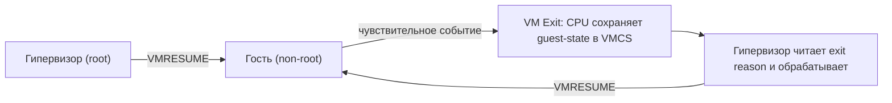
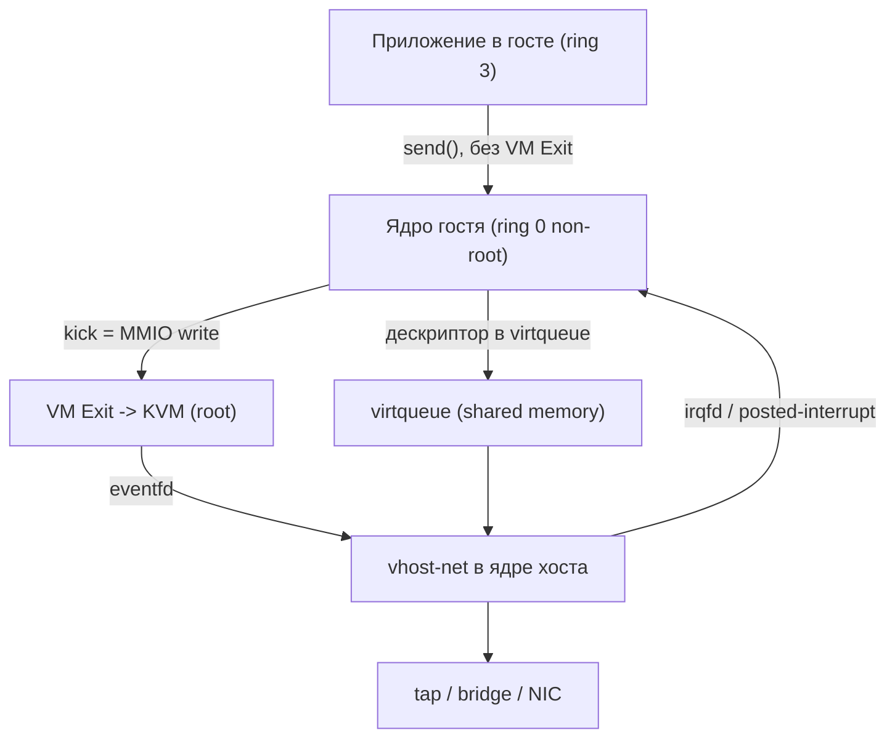

Эта страница собирает интегральные задания по всему курсу. В отличие от упражнений внутри отдельных разделов, здесь задачи намеренно «сшивают» несколько тем сразу: например, проследить путь от инструкции гостя через VT-x до обработки в гипервизоре, или сравнить изоляцию контейнера и ВМ на уровне ядра и железа. Перед началом стоит освежить материал разделов [intro](/virtualization/intro/), [hypervisors](/virtualization/hypervisors/), [cpu](/virtualization/cpu/), [memory](/virtualization/memory/), [io](/virtualization/io/), [paravirtualization](/virtualization/paravirtualization/), [containers-vs-vm](/virtualization/containers-vs-vm/), [kvm-qemu](/virtualization/kvm-qemu/) и [platforms](/virtualization/platforms/).

Задания сгруппированы по уровням. Базовые проверяют понимание терминологии и базовых механизмов; средние требуют связать два-три механизма и обосновать выбор; продвинутые — это мини-исследования, где нужно собрать конфигурацию, оценить накладные расходы или спроектировать решение. К каждому заданию приложен разбор — открывайте его только после самостоятельной попытки.

## Базовые

### Задание 1. Классификация гипервизоров и режимов виртуализации

Дайте определения и разнесите по категориям: гипервизор Type-1 и Type-2; полная виртуализация, паравиртуализация, аппаратная виртуализация. Для каждой пары приведите по одному реальному продукту. Объясните, почему деление «Type-1 / Type-2» и деление «полная / пара / аппаратная» — это две *ортогональные* оси, а не одна шкала.

<details>
<summary>Решение</summary>

**Ось 1 — где работает гипервизор:**

| Тип | Где исполняется | Примеры |
|-----|-----------------|---------|
| Type-1 (bare-metal) | прямо на железе, сам является ОС-подобным слоем | VMware ESXi, Xen, Microsoft Hyper-V, KVM* |
| Type-2 (hosted) | как процесс внутри обычной хостовой ОС | VirtualBox, VMware Workstation, QEMU (в user-space) |

\* KVM — пограничный случай: это модуль ядра Linux, поэтому формально Type-1 (часть ядра, работает на железе), но хост-ОС Linux при этом остаётся полноценной.

**Ось 2 — как обрабатываются привилегированные инструкции гостя:**

- **Полная виртуализация** — гость не модифицирован, чувствительные инструкции перехватываются и эмулируются (классически — через бинарную трансляцию, как в ранних VMware).
- **Паравиртуализация** — ядро гостя модифицировано и обращается к гипервизору через hypercall'ы вместо привилегированных инструкций (классический Xen PV).
- **Аппаратная виртуализация** — CPU предоставляет режим, в котором чувствительные инструкции гостя автоматически вызывают выход в гипервизор (Intel VT-x, AMD-V).

**Почему оси ортогональны:** один и тот же гипервизор может комбинировать подходы. Например, KVM (Type-1-подобный) использует аппаратную виртуализацию для CPU/памяти, но паравиртуализацию (virtio) для устройств. Xen умеет и PV-, и HVM-режим. То есть «куда поставили гипервизор» и «как он обрабатывает инструкции» — независимые характеристики.

</details>

### Задание 2. Кольца защиты и проблема «ring deprivileging»

Объясните схему колец защиты x86 (ring 0–3). Почему до появления VT-x/AMD-V нельзя было просто запустить гостевое ядро в ring 0? Что такое «ring deprivileging» и какие инструкции делают наивный подход некорректным?

<details>
<summary>Решение</summary>

**Кольца x86:** ring 0 — ядро (полный доступ к привилегированным инструкциям), ring 3 — пользовательские приложения; ring 1 и 2 на практике почти не использовались.

**Проблема:** гостевое ядро ожидает работать в ring 0, но если дать ему реальный ring 0, оно получит полный контроль над железом и над другими ВМ. Поэтому гипервизор применяет **ring deprivileging** — понижает гостевое ядро в ring 1 (или ring 3), оставляя ring 0 себе.

**Почему наивно не работает — критерий Попека–Голдберга:** для корректной виртуализации все *чувствительные* инструкции (меняющие или зависящие от состояния процессора/режима) должны быть подмножеством *привилегированных* (вызывающих trap в непривилегированном режиме). У классического x86 это нарушалось: существовали инструкции, которые чувствительны, но **не** делают trap в ring 1/3 — они просто «тихо» выполняются с другим результатом. Примеры:

- `POPF` — пытается изменить флаг IF (разрешение прерываний); в непривилегированном режиме изменение IF молча игнорируется, trap'а нет.
- `SGDT` / `SIDT` / `SLDT` / `SMSW` — читают системные регистры без привилегий, гость «увидит» реальные значения хоста.
- `PUSHF` — кладёт реальные флаги в стек, раскрывая состояние хоста.

Из-за этих «нетрапящихся чувствительных» инструкций нельзя положиться на простой trap-and-emulate. Решения до VT-x: бинарная трансляция (VMware) или модификация гостя (паравиртуализация Xen). VT-x/AMD-V добавили root/non-root режимы, где даже такие инструкции корректно вызывают VM Exit.

</details>

### Задание 3. Жизненный цикл VM Exit / VM Entry

Опишите, что происходит при VM Exit в архитектуре Intel VT-x: какие структуры данных задействованы, кто и куда сохраняет состояние, какие основные причины (exit reasons) бывают. Нарисуйте цикл «гость → выход → обработка → возврат».

<details>
<summary>Решение</summary>

**Ключевая структура — VMCS** (Virtual Machine Control Structure), по одной на виртуальный CPU. В ней хранятся: guest-state area (состояние гостя), host-state area (состояние гипервизора), поля управления (какие события вызывают выход) и поля с информацией о причине выхода.

**Режимы:** VMX root (гипервизор) и VMX non-root (гость). Переходы:

- `VMLAUNCH` / `VMRESUME` — **VM Entry**: процессор загружает guest-state из VMCS и начинает исполнять гостя в non-root.
- **VM Exit** — гость выполнил действие, требующее вмешательства: CPU автоматически сохраняет состояние гостя в guest-state area, загружает host-state и передаёт управление гипервизору.

**Типичные exit reasons:**

- доступ к контрольным регистрам (`MOV to/from CR3`, `CR0`),
- `CPUID`, `RDMSR`/`WRMSR`,
- `HLT`, `INVLPG`,
- EPT violation (промах в таблицах второго уровня — см. задание про память),
- внешнее прерывание, исключение,
- `VMCALL` (hypercall из гостя),
- доступ к I/O-порту (`IN`/`OUT`).

**Цикл:**



Каждый VM Exit стоит сотни-тысячи тактов, поэтому главная оптимизация производительности — **сокращать число выходов** (например, через virtio, APICv, posted interrupts).

</details>

### Задание 4. Контейнер против виртуальной машины: что изолируется

Сравните контейнер (например, Docker/runc) и виртуальную машину по уровням изоляции. Что использует контейнер для изоляции вместо отдельного ядра? Заполните таблицу различий и приведите два сценария, где контейнер неприемлем и нужна именно ВМ.

<details>
<summary>Решение</summary>

**Контейнер не имеет своего ядра** — все контейнеры на хосте делят одно ядро Linux. Изоляция строится на трёх механизмах ядра:

- **namespaces** — изолируют видимость ресурсов: `pid`, `net`, `mnt`, `uts`, `ipc`, `user`, `cgroup`, `time`.
- **cgroups** — ограничивают потребление ресурсов: CPU, память, I/O, pids.
- **capabilities / seccomp / LSM (AppArmor, SELinux)** — ограничивают набор разрешённых действий и системных вызовов.

| Критерий | Контейнер | Виртуальная машина |
|----------|-----------|--------------------|
| Ядро | общее с хостом | собственное гостевое |
| Граница изоляции | namespaces + cgroups (в ПО) | аппаратная (VT-x/EPT) |
| Накладные расходы | минимальные | заметные (отдельная ОС, эмуляция) |
| Время старта | миллисекунды | секунды-минуты |
| Размер образа | десятки-сотни МБ | гигабайты |
| Можно запустить другую ОС | нет (только то же ядро) | да (Windows на Linux-хосте и т.п.) |

**Когда нужна именно ВМ:**

1. **Другое ядро/ОС** — запустить Windows-нагрузку на Linux-хосте или конкретную версию ядра, отличную от хостовой.
2. **Жёсткая граница безопасности при недоверенном коде** — мультитенантность с недоверенными арендаторами: эскалация из контейнера через уязвимость ядра компрометирует весь хост, тогда как пробив гипервизора существенно сложнее. (Компромисс — micro-VM: Firecracker, Kata Containers.)

</details>

## Средние

### Задание 5. Двухуровневая трансляция адресов: shadow page tables vs EPT/NPT

Объясните, зачем при виртуализации памяти нужны два уровня трансляции. Сравните два подхода: shadow page tables и аппаратные вложенные таблицы (Intel EPT / AMD NPT). Что такое GVA → GPA → HPA? Почему EPT снижает число VM Exit?

<details>
<summary>Решение</summary>

**Два уровня адресов:** гость думает, что управляет физической памятью, но его «физика» — на самом деле виртуальная. Получается цепочка:

- **GVA** (Guest Virtual Address) — виртуальный адрес внутри гостя,
- **GPA** (Guest Physical Address) — «физический» с точки зрения гостя,
- **HPA** (Host Physical Address) — реальный физический адрес.

Гостевые таблицы страниц переводят GVA → GPA. Нужен ещё перевод GPA → HPA, которым управляет гипервизор.

**Shadow page tables (программный подход):**
Гипервизор строит «теневые» таблицы, отображающие сразу GVA → HPA, и подсовывает их MMU. Любая запись гостя в его собственные таблицы (или в CR3) перехватывается через VM Exit, чтобы синхронизировать теневые таблицы. Проблемы: огромное число выходов на write-intensive нагрузках, по теневому набору на каждый гостевой контекст, высокая сложность.

**EPT / NPT (аппаратный подход):**
Процессор хранит *вторую* таблицу страниц (GPA → HPA), которой управляет гипервизор. MMU при промахе сам проходит обе иерархии. Гость свободно правит свои таблицы (GVA → GPA) без выходов.

| Критерий | Shadow PT | EPT/NPT |
|----------|-----------|---------|
| Кто хранит GPA→HPA | гипервизор (теневые) | аппаратный второй уровень |
| VM Exit при правке гостевых PT | да, много | нет |
| Стоимость промаха TLB | дешевле (один проход) | дороже (2D-walk до n×m обращений) |
| Сложность кода | высокая | низкая |

**Почему EPT снижает выходы:** гость больше не вызывает trap при каждой модификации своих таблиц и при переключении CR3. Выход (EPT violation) случается только когда нужного GPA→HPA отображения нет (например, lazy-аллокация или dirty-трекинг). Плата — более дорогой промах TLB (двумерный обход), что частично компенсируется huge pages.

</details>

### Задание 6. virtio: зачем паравиртуализация устройств

Объясните, почему полная эмуляция устройства (например, сетевой карты e1000) медленнее, чем virtio. Опишите устройство virtqueue и роль драйвера фронтенда/бэкенда. Почему virtio считают паравиртуализацией, хотя ОС вроде бы «обычная»?

<details>
<summary>Решение</summary>

**Проблема полной эмуляции:** при эмуляции реального устройства (e1000, IDE) гость выполняет множество мелких обращений к регистрам (MMIO/PIO). Каждое такое обращение — VM Exit с дорогой эмуляцией регистровой модели в гипервизоре. На пакет/блок набегают десятки выходов.

**virtio** — стандартизованный интерфейс паравиртуализованных устройств. Ключевые элементы:

- **Frontend-драйвер** в госте (`virtio-net`, `virtio-blk`, `virtio-scsi`) — знает, что работает в виртуальной среде.
- **Backend** в гипервизоре/хосте (в QEMU или в ядре через vhost-net / vhost-user в DPDK).
- **virtqueue** — кольцевой буфер в разделяемой памяти. Гость кладёт дескрипторы (указатели на буферы) в очередь и уведомляет бэкенд одним «kick». Бэкенд обрабатывает пачку запросов и сигналит обратно.

```text
Гость: virtio-net (frontend)  <-- virtqueue (shared ring) -->  vhost-net (backend) --> tap/bridge
```

**Выигрыш:** вместо десятков VM Exit на операцию — **батчинг**: много дескрипторов обрабатываются за один цикл, уведомления можно подавлять (`VIRTIO_F_EVENT_IDX`). С vhost-net обработка уходит в ядро хоста, минуя user-space QEMU.

**Почему это паравиртуализация:** гость *знает*, что виртуализован, и использует специальный кооперативный интерфейс к гипервизору вместо «притворства» под реальное железо. Современные дистрибутивы несут virtio-драйверы в составе ядра, поэтому это незаметно для пользователя, но архитектурно это именно паравиртуализация устройств.

</details>

### Задание 7. SR-IOV, passthrough и IOMMU

Что такое device passthrough и SR-IOV? Какую роль играет IOMMU (VT-d / AMD-Vi)? Сравните три варианта доступа ВМ к сети — virtio, SR-IOV VF passthrough, полный PCI passthrough — по производительности, изоляции и живой миграции.

<details>
<summary>Решение</summary>

- **PCI passthrough** — гипервизор отдаёт всё физическое PCI-устройство одной ВМ напрямую. Максимальная производительность, но устройство монополизировано одной ВМ.
- **SR-IOV** — одно физическое устройство (PF, Physical Function) аппаратно «нарезается» на несколько Virtual Functions (VF). Каждая VF пробрасывается в свою ВМ как отдельное PCI-устройство. Делёж одной карты между многими ВМ почти без участия CPU хоста.
- **IOMMU (Intel VT-d / AMD-Vi)** — критически важен: устройство при passthrough делает DMA по адресам, которые гость считает физическими (GPA), а реально это HPA. IOMMU транслирует адреса DMA (GPA→HPA) и защищает память хоста/других ВМ от произвольного DMA устройства. Без IOMMU passthrough небезопасен.

| Критерий | virtio | SR-IOV (VF) | Полный passthrough |
|----------|--------|-------------|--------------------|
| Производительность | хорошая (с vhost) | близка к bare-metal | bare-metal |
| Нагрузка на CPU хоста | есть (бэкенд) | минимальна | минимальна |
| Делёж устройства | да | да (несколько VF) | нет |
| Изоляция DMA | не нужна (нет прямого DMA) | через IOMMU | через IOMMU |
| Живая миграция | да, легко | сложно/ограниченно | практически нет |
| Гибкость (overcommit, snapshot) | высокая | низкая | низкая |

**Вывод:** virtio — выбор по умолчанию (гибкость + миграция). SR-IOV — когда нужна почти-нативная сеть многим ВМ и миграция второстепенна. Полный passthrough — для уникального устройства (GPU, спец-карта), отданного одной ВМ.

</details>

### Задание 8. Сборка Docker-образа и поведение слоёв

Дан Dockerfile. Найдите проблемы с точки зрения размера образа, кэширования слоёв и безопасности, затем перепишите его. Объясните, как работает слоистая ФС (overlayfs) и copy-on-write.

```dockerfile
FROM ubuntu:latest
RUN apt-get update
RUN apt-get install -y python3 python3-pip
COPY . /app
RUN pip3 install -r /app/requirements.txt
WORKDIR /app
USER root
CMD python3 app.py
```

<details>
<summary>Решение</summary>

**Проблемы:**

1. `ubuntu:latest` — нефиксированный тег, невоспроизводимые сборки; для Python лучше специализированный slim-образ.
2. `apt-get update` и `install` в *разных* слоях — при изменении строки install будет использован устаревший кэш update; плюс не удалён `apt` cache, слой раздут.
3. `COPY . /app` стоит до установки зависимостей — любое изменение исходника инвалидирует кэш слоя с `pip install`, зависимости ставятся заново каждый раз.
4. `USER root` — контейнер работает от root, нарушение принципа наименьших привилегий.
5. `CMD` в shell-форме — процесс не получает сигналы как PID 1 корректно.

**Переписанный вариант:**

```dockerfile
FROM python:3.12-slim

WORKDIR /app

# Сначала только зависимости — слой кэшируется, пока не изменится requirements.txt
COPY requirements.txt .
RUN pip install --no-cache-dir -r requirements.txt

# Затем исходный код
COPY . .

# Непривилегированный пользователь
RUN useradd --create-home appuser
USER appuser

CMD ["python", "app.py"]
```

**Слоистая ФС и CoW:** каждая инструкция, меняющая ФС (`RUN`, `COPY`, `ADD`), создаёт неизменяемый слой только для чтения. Образ — стек таких слоёв, объединённых через **overlayfs**: lowerdir (слои образа) + upperdir (записываемый слой контейнера). При запуске контейнер получает тонкий writable-слой сверху. **Copy-on-write:** чтение идёт из нижних слоёв; при первой записи в файл он копируется в верхний слой и правится там. Поэтому слои образа разделяются между контейнерами (экономия места), а порядок инструкций определяет эффективность кэша: меняющееся реже — выше.

</details>

### Задание 9. cgroups v2 и namespaces «руками»

Не используя Docker, продемонстрируйте изоляцию процесса средствами ядра: создайте новый PID/UTS/mount namespace через `unshare` и ограничьте память через cgroups v2. Объясните, что именно увидит и не увидит изолированный процесс.

<details>
<summary>Решение</summary>

**Namespaces через unshare:**

```bash
# Новый PID + UTS + mount namespace, монтируем свой /proc
sudo unshare --pid --uts --mount --fork --mount-proc bash

# Внутри:
hostname container-demo        # меняем hostname — хост не затронут (UTS ns)
echo $$                        # PID == 1: процесс думает, что он init
ps aux                         # видны только процессы своего PID namespace
```

- **PID ns** — процесс становится PID 1, видит только потомков в своём namespace.
- **UTS ns** — свой hostname/domainname, изменение не влияет на хост.
- **mount ns** + `--mount-proc` — свой `/proc`, отражающий только видимые процессы.
- Чего **не** изолирует этот вызов: сеть (общая с хостом — нет `--net`), пользователи (нет `--user`), ограничения ресурсов (это уже cgroups).

**Ограничение памяти через cgroups v2:**

```bash
# Создаём группу
sudo mkdir /sys/fs/cgroup/demo

# Лимит памяти 100 МБ
echo "100M" | sudo tee /sys/fs/cgroup/demo/memory.max

# Загоняем текущую оболочку в группу
echo $$ | sudo tee /sys/fs/cgroup/demo/cgroup.procs

# Проверка: процесс, превысивший лимит, будет убит OOM-киллером
```

**Итог:** Docker/runc по сути автоматизируют ровно эту связку — несколько namespaces + cgroup + смена корня (`pivot_root`) + seccomp/capabilities. Сам по себе контейнер — не отдельная сущность ядра, а комбинация этих примитивов вокруг процесса.

</details>

## Продвинутые

### Задание 10. Сквозная трассировка: от инструкции гостя до обработки в QEMU/KVM

Проследите полный путь, когда гостевое приложение в ВМ под KVM/QEMU отправляет сетевой пакет через virtio-net. Перечислите все переходы привилегий и компоненты: гостевое приложение → гостевое ядро → virtio → KVM → QEMU/vhost → хост-сеть. Где происходят VM Exit, а где их удаётся избежать?

<details>
<summary>Решение</summary>

**Архитектура KVM/QEMU:** KVM — модуль ядра, предоставляющий `/dev/kvm` и доступ к VT-x/EPT. QEMU — user-space процесс, эмулирующий платформу и устройства; vCPU гостя исполняется через `ioctl(KVM_RUN)`.

**Путь пакета (virtio-net + vhost-net):**

1. Гостевое приложение делает `send()` → переход ring 3 → ring 0 *внутри гостя* (обычный syscall, **без** VM Exit — это переключение колец внутри non-root режима).
2. Гостевое ядро формирует пакет, гостевой драйвер `virtio-net` кладёт дескрипторы в virtqueue (разделяемая память) и делает «kick» — запись в нотификационный регистр.
3. «Kick» вызывает **VM Exit** (доступ к MMIO/PIO устройства) — управление уходит в KVM (root-режим).
4. С **vhost-net** бэкенд живёт в ядре хоста: KVM через eventfd будит поток vhost, который читает virtqueue напрямую из памяти и отправляет кадр в `tap`/bridge — **минуя user-space QEMU** (меньше переключений контекста).
   - Без vhost: KVM возвращает управление в QEMU (`KVM_EXIT_MMIO`), QEMU-бэкенд сам обрабатывает очередь — дороже.
5. Пакет уходит в сетевой стек хоста (tap → bridge/OVS → физический NIC).
6. Завершение: vhost сигналит гостю через **irqfd** (инжекция виртуального прерывания); при APICv/posted-interrupts инъекцию можно сделать **без** VM Exit.



**Где VM Exit:** на «kick» (нотификация устройства). **Где избегаем:** syscall внутри гостя, чтение/запись virtqueue (shared memory), доставка прерывания при posted-interrupts, и сама обработка пакета (vhost в ядре, не QEMU). Главные оптимизации — батчинг дескрипторов, подавление нотификаций, vhost, APICv.

</details>

### Задание 11. Развёртывание ВМ через libvirt с virtio и оценка overhead

Напишите минимальный фрагмент libvirt domain XML для KVM-ВМ с virtio-диском, virtio-сетью и host-passthrough CPU. Объясните каждый ключевой блок. Затем опишите методику измерения накладных расходов виртуализации (CPU, память, сеть, диск) и назовите типичные источники overhead.

<details>
<summary>Решение</summary>

```xml
<domain type='kvm'>
  <name>demo-vm</name>
  <memory unit='GiB'>4</memory>
  <vcpu>2</vcpu>

  <os>
    <type arch='x86_64' machine='q35'>hvm</type>
    <boot dev='hd'/>
  </os>

  <!-- Проброс реальной модели CPU: гость получает все флаги хоста -->
  <cpu mode='host-passthrough'/>

  <features>
    <acpi/><apic/>
  </features>

  <devices>
    <!-- virtio-диск: paravirtualized, минимум VM Exit -->
    <disk type='file' device='disk'>
      <driver name='qemu' type='qcow2' cache='none' io='native'/>
      <source file='/var/lib/libvirt/images/demo.qcow2'/>
      <target dev='vda' bus='virtio'/>
    </disk>

    <!-- virtio-сеть через bridge -->
    <interface type='bridge'>
      <source bridge='br0'/>
      <model type='virtio'/>
    </interface>

    <console type='pty'/>
  </devices>
</domain>
```

**Разбор блоков:**

- `type='kvm'` — аппаратное ускорение через KVM (не чистая эмуляция TCG).
- `machine='q35'` — современный чипсет с PCIe (вместо старого i440fx).
- `host-passthrough` — гость видит реальную модель CPU и все её флаги (быстро, но мешает миграции на другой CPU; альтернатива — `host-model` или именованная модель для совместимости).
- `bus='virtio'`, `model='virtio'` — паравиртуализованные диск и сеть.
- `cache='none' io='native'` — обход page cache хоста и асинхронный AIO для предсказуемой производительности диска.

**Методика измерения overhead:** для каждого ресурса сравнить «bare-metal vs внутри ВМ» одинаковыми бенчмарками:

| Ресурс | Инструмент | Что меряем |
|--------|-----------|------------|
| CPU | `sysbench cpu`, `stress-ng` | разница в ops/s |
| Память | `stream`, `mbw` | пропускная способность, влияние EPT/huge pages |
| Диск | `fio` (random/seq, разные blocksize) | IOPS, latency |
| Сеть | `iperf3`, `netperf` | throughput, latency (RTT) |

**Типичные источники overhead:**

- частые VM Exit (I/O, прерывания, доступ к привилегированным регистрам);
- двумерный обход страниц при EPT (промахи TLB) — смягчается huge pages / 1G-страницами;
- эмуляция устройств в user-space (если не используется vhost);
- «steal time» — конкуренция за физические ядра при overcommit;
- NUMA-нелокальность памяти/vCPU — лечится pinning и numatune.

</details>

### Задание 12. Выбор платформы под три сценария

Для каждого сценария выберите технологию виртуализации/контейнеризации и обоснуйте: (а) плотный multi-tenant SaaS с тысячами короткоживущих функций недоверенного кода; (б) корпоративная инфраструктура с Windows- и Linux-серверами, нужны снапшоты и живая миграция; (в) CI/CD-конвейер, собирающий сотни образов в день. Сравните хотя бы по изоляции, плотности, скорости старта.

<details>
<summary>Решение</summary>

**(а) Multi-tenant FaaS, недоверенный код:**
Обычные контейнеры (общее ядро) рискованны: эксплойт ядра = компрометация всех арендаторов. Решение — **micro-VM**: AWS Firecracker или Kata Containers. Это лёгкие KVM-ВМ (минимальный device model, старт за ~100 мс), дающие аппаратную границу VT-x/EPT при контейнероподобной плотности и скорости. Компромисс «изоляция ВМ + плотность контейнера».

**(б) Корпоративная смешанная инфраструктура:**
Нужны разные ОС (Windows + Linux), снапшоты, живая миграция, HA — это классическая работа **Type-1 гипервизора**: VMware vSphere/ESXi, Microsoft Hyper-V или KVM с oVirt/Proxmox. Контейнеры тут не подходят: нельзя запустить Windows на Linux-ядре, нужна полная изоляция ОС и зрелые средства управления (vMotion/Live Migration, snapshots, DRS).

**(в) CI/CD-сборка образов:**
**Контейнеры** — естественный выбор: эфемерные сборочные окружения, миллисекундный старт, разделяемые слои кэша, высокая плотность на раннере. Инструменты: Docker/BuildKit, Podman, Kaniko (сборка без демона и без привилегий — важно в кластере). Для усиления изоляции недоверенных сборок — те же Kata/gVisor.

**Сводная таблица:**

| Критерий | Контейнеры | Micro-VM (Firecracker/Kata) | Type-1 гипервизор |
|----------|-----------|------------------------------|-------------------|
| Граница изоляции | namespaces (ПО) | аппаратная, минимальная ВМ | аппаратная, полная ВМ |
| Плотность | очень высокая | высокая | средняя |
| Старт | мс | ~100 мс | секунды-минуты |
| Разные ОС | нет | да (своё ядро) | да |
| Снапшот/миграция | ограниченно | ограниченно | зрелые |
| Лучший сценарий | (в) | (а) | (б) |

</details>

### Задание 13. Безопасность: побеги и защитные слои

Опишите разницу между «container escape» и «VM escape». Перечислите векторы для каждого и сопоставьте защитные механизмы. Почему говорят, что «контейнеры не контейнируют» в контексте безопасности, и какие технологии (gVisor, Kata, seccomp, user namespaces) сужают поверхность атаки?

<details>
<summary>Решение</summary>

**Container escape** — выход из контейнера к хост-ядру/другим контейнерам. Так как ядро общее, поверхность атаки = весь системный вызов-интерфейс ядра. Векторы:

- эксплойт уязвимости ядра через syscall (одна общая точка отказа);
- избыточные capabilities (`CAP_SYS_ADMIN`), `--privileged`;
- монтирование хостового сокета/ФС (`/var/run/docker.sock`, `/`);
- неправильный user namespace (root в контейнере = root на хосте).

**VM escape** — пробив гипервизора из гостя к хосту. Поверхность атаки уже: эмулируемые устройства и интерфейс гипервизора. Векторы — баги в device-эмуляции (исторические CVE в QEMU, например в эмуляции NIC/floppy), в обработке VM Exit. Существенно труднее: аппаратная граница VT-x/EPT.

| Слой | Container | VM |
|------|-----------|----|
| Граница | namespaces + cgroups (общее ядро) | VT-x/EPT (отдельное ядро) |
| Поверхность | весь syscall-интерфейс | device model + hypercalls |
| Сложность побега | ниже | выше |

**«Контейнеры не контейнируют»:** изоляция контейнера — это политика поверх общего ядра, а не аппаратная стена. Любой 0-day в ядре потенциально пробивает все контейнеры. Технологии сужения поверхности:

- **seccomp-bpf** — белый список разрешённых syscalls (Docker по умолчанию блокирует ~44 опасных вызова);
- **user namespaces** — root в контейнере маппится в непривилегированного пользователя хоста;
- **capabilities drop** — убрать всё лишнее, оставить минимум;
- **LSM (AppArmor/SELinux)** — MAC-политики;
- **gVisor** — перехватывает syscalls гостя в user-space sandbox-ядре (Sentry), резко сокращая контакт с реальным ядром;
- **Kata Containers / Firecracker** — оборачивают контейнер в лёгкую ВМ, добавляя аппаратную границу.

Вывод: для доверенных нагрузок хватает контейнера + seccomp + drop caps; для недоверенных — добавляют sandbox-ядро (gVisor) или аппаратную изоляцию (Kata/Firecracker).

</details>

### Задание 14. Спроектировать слой виртуализации «с нуля»

Спроектируйте (на бумаге) минимальный гипервизор Type-1 для x86-64 под доверенные Linux-гости. Перечислите, какие аппаратные механизмы вы используете для CPU, памяти и I/O; как будете планировать vCPU; как организуете доставку прерываний; и какие три первые оптимизации производительности внедрите. Обоснуйте каждое решение.

<details>
<summary>Решение</summary>

**CPU:** используем **Intel VT-x** (VMX root/non-root + VMCS). Каждому vCPU — своя VMCS. Чувствительные инструкции гостя вызывают VM Exit; в обработчике диспетчеризуем по exit reason. Это снимает проблему «нетрапящихся» инструкций классического x86 (см. задание 2) без бинарной трансляции и без модификации гостя.

**Память:** **EPT** (вложенные таблицы GPA→HPA) вместо shadow page tables — гость свободно правит свои таблицы без выходов. Поддержим **huge pages (2 МБ)** для EPT, чтобы смягчить дороговизну двумерного обхода и снизить давление на TLB.

**I/O:** **virtio** как основной транспорт (net/blk) с бэкендом в ядре по модели vhost — минимум VM Exit за счёт батчинга. Для нагрузок, требующих near-native сети, — **SR-IOV** с защитой DMA через **IOMMU (VT-d)**. Полная эмуляция устройств — только для загрузки/совместимости.

**Планирование vCPU:** vCPU — это потоки планировщика хоста. Базово — CFS-подобное справедливое распределение; для latency-чувствительных ВМ — **CPU pinning** (1 vCPU ↔ 1 pCPU) и **NUMA-aware** размещение памяти рядом с vCPU. Учитываем «steal time» при overcommit.

**Доставка прерываний:** виртуальный локальный APIC; аппаратно — **APICv** и **posted interrupts**, чтобы инжектировать прерывания в гостя **без** VM Exit. Уведомления устройств — через eventfd/irqfd.

**Три первые оптимизации (по влиянию):**

1. **EPT + huge pages** — убирает массу выходов на работе с памятью и снижает TLB-промахи.
2. **virtio + vhost** — батчинг и обработка I/O в ядре вместо дорогой per-register эмуляции.
3. **APICv / posted interrupts + подавление нотификаций** — минимизация VM Exit на прерываниях и «kick'ах».

**Общий принцип проектирования:** производительность гипервизора определяется в первую очередь **частотой VM Exit** и **стоимостью обхода памяти**. Поэтому все ключевые решения — аппаратная виртуализация CPU, EPT, virtio/vhost, APICv — направлены на одно: исполнять как можно больше работы внутри non-root режима, не выходя в гипервизор.

</details>
