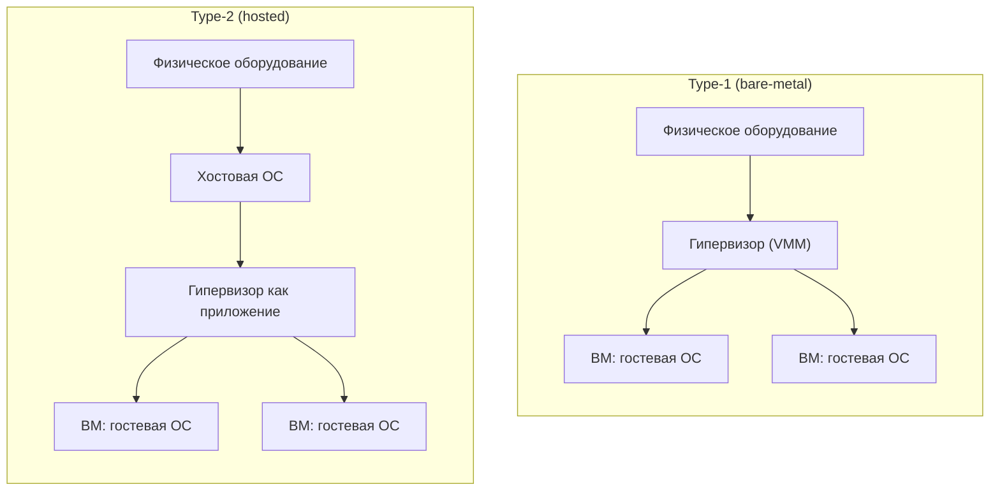

Гипервизор (англ. *hypervisor*), он же **монитор виртуальных машин** (Virtual Machine Monitor, VMM) — это слой программного обеспечения, который создаёт и исполняет виртуальные машины, разделяя один физический компьютер между несколькими изолированными гостевыми окружениями. Термин «гипервизор» исторически восходит к понятию «супервизор» — так называли управляющий код операционной системы; гипервизор стоит «выше» супервизора, управляя самими операционными системами.

Чтобы понимать дальнейшую классификацию, полезно зафиксировать три задачи, которые решает любой VMM.

- **Распределение ресурсов.** Гипервизор мультиплексирует физические ресурсы (CPU, оперативную память, устройства ввода-вывода) между несколькими ВМ, создавая для каждой иллюзию того, что она владеет машиной целиком. Это включает планирование виртуальных процессоров (vCPU) на физические ядра, выделение и переотображение памяти, разделение полосы пропускания дисков и сети.
- **Изоляция.** Сбой, утечка памяти или компрометация одной ВМ не должны затрагивать соседей и сам гипервизор. Изоляция — это и про безопасность (граница доверия), и про надёжность (отказоустойчивость).
- **Эмуляция и виртуализация интерфейсов.** Гостевая ОС обращается к «железу» через привычные ей интерфейсы — таблицы страниц, регистры устройств, инструкции CPU. Гипервизор перехватывает и обрабатывает эти обращения, эмулируя недостающие устройства или транслируя их на реальное оборудование.

Ключевое свойство: гость не должен (в идеале) знать или зависеть от того, что он исполняется в виртуальной среде. Насколько строго это выполняется, и формализуют критерии Попека и Голдберга, к которым мы вернёмся ниже.

## Классификация: Type-1 и Type-2

Классическое разделение, восходящее к работам 1970-х годов, делит гипервизоры на два типа по тому, **где именно** в программном стеке расположен VMM.

### Type-1: bare-metal

Гипервизор Type-1 («bare-metal», «нативный») исполняется **непосредственно на физическом оборудовании**, без промежуточной операционной системы общего назначения. Сам гипервизор берёт на себя функции, традиционно лежащие на ОС: планировщик, управление памятью, драйверы устройств (либо их часть, либо делегирование привилегированной служебной ВМ).

Примеры:

- **VMware ESXi** — коммерческий гипервизор VMware, основа платформы vSphere.
- **Microsoft Hyper-V** — гипервизор Microsoft. Важная деталь: даже при установке роли Hyper-V на Windows Server то, что выглядит как «хостовая Windows», после загрузки гипервизора превращается в привилегированный *root partition* — то есть исходная ОС сама становится гостем над гипервизором.
- **Xen** — открытый гипервизор, исторически известный паравиртуализацией. Управляющий домен `dom0` владеет драйверами и обслуживает гостевые домены `domU`.

Преимущества Type-1:

- **Производительность.** Между гостем и железом нет лишнего слоя ОС общего назначения, путь обращения к ресурсам короче.
- **Безопасность и изоляция.** Поверхность атаки минимальна: тонкий специализированный гипервизор содержит меньше кода, чем полноценная ОС, и не тянет за собой пользовательские службы.
- **Надёжность и масштаб.** Рассчитан на плотную консолидацию и непрерывную работу.

Типичное применение — **дата-центры, серверная консолидация, публичные и частные облака**. Именно Type-1 лежит в основе промышленной виртуализации.

### Type-2: hosted

Гипервизор Type-2 («hosted») работает **как обычное приложение поверх хостовой операционной системы** (Windows, macOS, Linux). Для доступа к оборудованию он пользуется сервисами и драйверами хостовой ОС, а не общается с железом напрямую.

Примеры:

- **VMware Workstation** (Windows/Linux) и **VMware Fusion** (macOS).
- **Oracle VirtualBox** — популярный кроссплатформенный открытый гипервизор.
- **QEMU в пользовательском режиме** — когда QEMU работает без аппаратного ускорения KVM, он эмулирует CPU программно (динамическая бинарная трансляция через TCG), оставаясь обычным процессом хостовой ОС.

Преимущества и недостатки:

- **Плюс — удобство на десктопе.** Установка в один клик, запуск рядом с привычными приложениями, простое управление снапшотами, отсутствие требования отдавать машину под гипервизор целиком. Идеален для разработки, тестирования, обучения, запуска «чужой» ОС на рабочем ноутбуке.
- **Минус — накладные расходы.** Каждое обращение гостя к ресурсу проходит дополнительный слой — хостовую ОС с её планировщиком, кэшами и драйверами. Это даёт более длинные пути, конкуренцию за ресурсы с остальными приложениями хоста и, как правило, меньшую предсказуемость задержек, чем у Type-1.

| Критерий | Type-1 (bare-metal) | Type-2 (hosted) |
|---|---|---|
| Расположение | Прямо на железе | Как приложение поверх хостовой ОС |
| Доступ к устройствам | Собственные драйверы / служебная ВМ | Через драйверы хостовой ОС |
| Накладные расходы | Минимальные | Выше (дополнительный слой ОС) |
| Поверхность атаки | Малая (тонкий VMM) | Больше (ОС + гипервизор) |
| Типичное применение | Дата-центры, облака | Десктоп, разработка, тестирование |
| Примеры | ESXi, Hyper-V, Xen | Workstation/Fusion, VirtualBox, QEMU (user-mode) |

## Пограничный случай: KVM

KVM (Kernel-based Virtual Machine) — это **модуль ядра Linux** (`kvm.ko` плюс архитектурно-зависимые `kvm-intel.ko` / `kvm-amd.ko`), который превращает само ядро Linux в гипервизор. Загрузив модуль, ядро получает возможность исполнять гостевой код напрямую на CPU с аппаратной поддержкой виртуализации (Intel VT-x, AMD-V), переключаясь в специальный «гостевой режим» процессора.

Здесь возникает спор о классификации:

- **Аргумент «KVM — это Type-2».** KVM живёт внутри Linux — операционной системы общего назначения, которая одновременно выполняет обычные процессы, имеет полный набор драйверов и пользовательское пространство. Формально VMM встроен в хостовую ОС, а не заменяет её.
- **Аргумент «KVM — это Type-1».** В отличие от классического hosted-гипервизора, KVM не исполняется поверх ОС как приложение — он **является частью ядра** и переключает CPU в гостевой режим напрямую через аппаратные расширения, как и нативный гипервизор. С точки зрения близости к железу и пути исполнения гостевого кода KVM ведёт себя как bare-metal.

На практике KVM обычно работает в паре с QEMU: QEMU (процесс пользовательского пространства) занимается эмуляцией устройств и управлением жизненным циклом ВМ, а KVM в ядре обеспечивает аппаратно-ускоренное исполнение гостевых инструкций. Подробно эту связку мы разбираем в разделе [KVM/QEMU на практике](/virtualization/kvm-qemu/).

:::note[Вывод о классификации]
Деление на два типа — удобная, но огрублённая модель родом из эпохи, когда у CPU не было аппаратной виртуализации. KVM показывает, что граница размыта: один и тот же механизм можно убедительно отнести к обоим типам. Важнее не ярлык, а как именно гипервизор получает доступ к CPU и устройствам.
:::

## Критерии Попека и Голдберга (1974)

Формальный фундамент теории виртуализации заложили **Джеральд Попек (Gerald J. Popek) и Роберт Голдберг (Robert P. Goldberg)** в статье *«Formal Requirements for Virtualizable Third Generation Architectures»* (Communications of the ACM, 1974). Они определили, какими свойствами должен обладать VMM и при каком условии архитектура процессора вообще допускает эффективную виртуализацию.

### Три свойства VMM

Авторы постулировали, что монитор виртуальных машин должен удовлетворять трём требованиям:

1. **Эквивалентность / верность (equivalence / fidelity).** Программа, исполняемая под управлением VMM, должна вести себя по существу так же, как при исполнении напрямую на оборудовании (за исключением различий в доступности ресурсов и временных характеристик). Иначе говоря, гость «не замечает» виртуализации.
2. **Контроль ресурсов (resource control / safety).** VMM полностью контролирует физические ресурсы: гость не может получить доступ к ресурсам, которые ему не выделены, и не может выйти из-под контроля монитора.
3. **Эффективность (efficiency / performance).** Значительная доля инструкций гостя должна исполняться **напрямую** на реальном процессоре, без вмешательства VMM. Именно это свойство отделяет настоящую виртуализацию от полной программной эмуляции (как в чистом интерпретаторе): эмулятор удовлетворяет эквивалентности и контролю, но не эффективности.

### Привилегированные и чувствительные инструкции

Чтобы сформулировать условие виртуализуемости, инструкции набора команд процессора делят на классы.

- **Привилегированные инструкции (privileged).** Инструкции, которые при выполнении в непривилегированном режиме (user mode) вызывают аппаратное прерывание — *trap*, передающий управление коду ОС или гипервизора, а в привилегированном режиме (supervisor/kernel mode) выполняются нормально.
- **Чувствительные инструкции (sensitive).** Инструкции, которые либо изменяют конфигурацию ресурсов системы (*control-sensitive* — например, переключают режим процессора, меняют отображение памяти), либо ведут себя по-разному в зависимости от текущей конфигурации/режима (*behavior-sensitive* — например, читают регистр состояния и выдают разный результат в зависимости от уровня привилегий).

Идея виртуализации через **trap-and-emulate**: гостевая ОС запускается в непривилегированном режиме; как только она пытается выполнить «опасную» (чувствительную) инструкцию, та должна вызвать trap, гипервизор перехватывает управление и эмулирует требуемый эффект безопасным образом. Большинство же безобидных инструкций исполняется напрямую — отсюда и эффективность.

### Теорема виртуализуемости

Главный результат формулируется так:

:::tip[Условие классической виртуализуемости]
Для любого обычного процессора третьего поколения VMM может быть построен, если **множество чувствительных инструкций является подмножеством множества привилегированных** инструкций.
:::

Логика проста: если каждая чувствительная инструкция одновременно привилегированная, то любая попытка гостя сделать что-то «опасное» в непривилегированном режиме гарантированно вызовет trap — и гипервизор сможет её перехватить и обработать. Тогда схема trap-and-emulate покрывает все опасные случаи, а остальное исполняется нативно (эффективность соблюдена).

### Почему классический x86 этому не удовлетворял

Архитектура x86 до появления аппаратных расширений **нарушала** условие теоремы: в ней существовали инструкции, которые были **чувствительными, но не привилегированными**. Такие инструкции в непривилегированном режиме **не вызывали trap**, а молча выполнялись — но выдавали результат или эффект, не соответствующий виртуальному окружению. Гипервизор не получал шанса вмешаться, и иллюзия для гостя ломалась.

Классические примеры — инструкция `POPF` (и `PUSHF`): в режиме пользователя `POPF` молча игнорировала попытку изменить флаг прерываний `IF` вместо того, чтобы вызвать исключение, поэтому гость не мог быть корректно перехвачен. Другой хрестоматийный пример — инструкция `SGDT`/`SIDT`/`SLDT`/`SMSW`, читающие системные регистры из пользовательского режима без trap. Всего в x86 насчитывали порядка 17 таких «проблемных» инструкций.

Из-за этого «честный» trap-and-emulate на классическом x86 был невозможен, и индустрии пришлось искать обходные пути — **бинарную трансляцию** (VMware) и **паравиртуализацию** (Xen), — а затем производители CPU добавили аппаратные расширения (Intel VT-x, AMD-V), которые ввели новый режим исполнения и тем самым «починили» виртуализуемость x86.

Детальный разбор того, как именно решалась проблема x86 — бинарная трансляция, кольца защиты, аппаратные расширения VT-x/AMD-V и режимы root/non-root — приведён в разделе [Виртуализация CPU](/virtualization/cpu/). Паравиртуализационный подход рассмотрен в разделе [Паравиртуализация](/virtualization/paravirtualization/). Сопоставление конкретных продуктов и их позиционирование — в разделе [Обзор платформ](/virtualization/platforms/).

## Итог

Разделение гипервизоров на Type-1 (bare-metal) и Type-2 (hosted) отражает архитектурное расположение VMM: первый исполняется прямо на железе и доминирует в дата-центрах за счёт производительности и изоляции, второй живёт поверх хостовой ОС и удобен на рабочих станциях. Случай KVM показывает условность этой границы. А критерии Попека и Голдберга дают строгий язык, на котором формулируется, что вообще делает архитектуру виртуализуемой — и почему классический x86 потребовал отдельных инженерных усилий, прежде чем стать пригодным для эффективной виртуализации.

## Задания

### Задание 1 (понимание): три задачи VMM и два типа гипервизоров

а) Перечислите три задачи, которые решает любой монитор виртуальных машин (VMM), и кратко поясните каждую.
б) Чем по своему расположению в программном стеке отличается Type-1 от Type-2? Для каждого типа назовите по два примера платформ из раздела.

Решение

**а) Три задачи любого VMM:**

1. **Распределение ресурсов** — мультиплексирование физических CPU, памяти и устройств ввода-вывода между несколькими ВМ: планирование vCPU на физические ядра, выделение и переотображение памяти, разделение полосы дисков и сети. Каждой ВМ создаётся иллюзия владения машиной целиком.
2. **Изоляция** — сбой, утечка памяти или компрометация одной ВМ не затрагивают соседей и сам гипервизор. Это и про безопасность (граница доверия), и про надёжность (отказоустойчивость).
3. **Эмуляция и виртуализация интерфейсов** — гость обращается к «железу» через привычные интерфейсы (таблицы страниц, регистры устройств, инструкции CPU), а гипервизор перехватывает эти обращения и эмулирует устройства либо транслирует их на реальное оборудование.

Сквозное свойство: в идеале гость не должен знать, что исполняется в виртуальной среде.

**б) Расположение VMM:**

| | Type-1 (bare-metal) | Type-2 (hosted) |
|---|---|---|
| Где живёт VMM | Прямо на физическом оборудовании, без промежуточной ОС общего назначения | Как обычное приложение поверх хостовой ОС |
| Доступ к устройствам | Собственные драйверы / служебная ВМ | Через драйверы хостовой ОС |
| Примеры | ESXi, Hyper-V, Xen | VMware Workstation/Fusion, VirtualBox, QEMU (user-mode) |

Type-1 сам берёт на себя функции ОС (планировщик, управление памятью, драйверы). Type-2 для доступа к оборудованию пользуется сервисами и драйверами хостовой ОС.

### Задание 2 (сценарий): KVM и спорная классификация

Коллега утверждает: «KVM — это однозначно Type-2, потому что он работает внутри Linux, а Linux — обычная ОС с процессами и драйверами». Согласитесь или опровергните. Приведите контраргумент в пользу отнесения KVM к Type-1 и объясните, почему раздел называет границу размытой. Какую роль в типичной связке играет QEMU?

Решение

Утверждение коллеги верно лишь частично — оно отражает только один из двух аргументов.

**Аргумент «KVM ближе к Type-2»** (его и приводит коллега): KVM живёт внутри Linux — ОС общего назначения, которая одновременно выполняет обычные процессы, имеет полный набор драйверов и пользовательское пространство. Формально VMM встроен в хостовую ОС, а не заменяет её.

**Контраргумент «KVM ближе к Type-1»:** в отличие от классического hosted-гипервизора, KVM не исполняется поверх ОС как приложение — он **является частью ядра** (модуль `kvm.ko` плюс `kvm-intel.ko` / `kvm-amd.ko`). Загрузив модуль, ядро само становится гипервизором и переключает CPU в специальный «гостевой режим» напрямую через аппаратные расширения (Intel VT-x, AMD-V) — ровно как нативный гипервизор. По близости к железу и пути исполнения гостевого кода KVM ведёт себя как bare-metal.

**Почему граница размыта:** деление на два типа — огрублённая модель родом из эпохи, когда у CPU не было аппаратной виртуализации. Один и тот же механизм (KVM) убедительно относится к обоим типам. Важнее не ярлык, а как именно гипервизор получает доступ к CPU и устройствам.

**Роль QEMU в связке KVM/QEMU:** QEMU — процесс пользовательского пространства, который занимается эмуляцией устройств и управлением жизненным циклом ВМ; KVM в ядре обеспечивает аппаратно-ускоренное исполнение гостевых инструкций. (Отдельно стоит отметить: сам по себе QEMU без KVM — это Type-2, он программно эмулирует CPU через динамическую бинарную трансляцию TCG.)

### Задание 3 (разбор «что произойдёт, если…»): чувствительная, но не привилегированная инструкция

Рассмотрите гостевую ОС, запущенную в непривилегированном режиме под схемой trap-and-emulate.

а) Сформулируйте теорему Попека–Голдберга: при каком условии для процессора можно построить VMM?
б) Что произойдёт, если гость выполнит инструкцию, которая является **чувствительной, но не привилегированной**? Почему это ломает иллюзию виртуализации?
в) Приведите пример такой инструкции из классического x86 и объясните, почему x86 не удовлетворял теореме. Как индустрия и производители CPU решили эту проблему?

Решение

**а) Условие виртуализуемости (теорема):** для обычного процессора третьего поколения VMM может быть построен, если **множество чувствительных инструкций является подмножеством множества привилегированных**. Тогда любая «опасная» инструкция, выполненная гостем в непривилегированном режиме, гарантированно вызовет trap, и гипервизор её перехватит — схема trap-and-emulate покрывает все опасные случаи, а безобидные инструкции исполняются нативно (соблюдается эффективность).

Напомним классы:
- **Привилегированная** — в user mode вызывает trap (передаёт управление ОС/гипервизору), в kernel mode выполняется нормально.
- **Чувствительная** — либо меняет конфигурацию ресурсов (*control-sensitive*: режим CPU, отображение памяти), либо ведёт себя по-разному в зависимости от режима/конфигурации (*behavior-sensitive*).

**б) Что произойдёт:** если инструкция чувствительная, но не привилегированная, то в непривилегированном режиме она **не вызовет trap** — она молча выполнится, но выдаст результат или эффект, не соответствующий виртуальному окружению. Гипервизор не получит шанса вмешаться и подменить поведение, поэтому иллюзия «настоящего железа» для гостя ломается: гость может, например, увидеть реальное состояние системного регистра вместо виртуального или не заметить, что попытка изменить системный флаг была проигнорирована.

**в) Пример из x86 и решение:**

- `POPF` (и `PUSHF`): в режиме пользователя `POPF` молча игнорировала попытку изменить флаг прерываний `IF` вместо генерации исключения — гость не мог быть корректно перехвачен.
- `SGDT` / `SIDT` / `SLDT` / `SMSW`: читают системные регистры из пользовательского режима без trap.

Всего в x86 насчитывали порядка 17 таких «проблемных» инструкций — чувствительных, но не привилегированных. Поэтому x86 **нарушал** условие теоремы, и честный trap-and-emulate был невозможен.

Решения:
1. **Бинарная трансляция** (VMware) и **паравиртуализация** (Xen) — программные обходные пути.
2. Затем производители CPU добавили **аппаратные расширения Intel VT-x / AMD-V** — новый режим исполнения, который «починил» виртуализуемость x86.

### Задание 4 (практика и анализ): выбор типа гипервизора под сценарии

Для каждого сценария выберите подходящий тип гипервизора (Type-1 или Type-2) и обоснуйте выбор через свойства из раздела (производительность, поверхность атаки, накладные расходы, удобство). Дополнительно: что особенного происходит с исходной Windows Server при установке роли Hyper-V?

1. Облачный провайдер консолидирует сотни ВМ на стойках в дата-центре с требованием максимальной плотности, изоляции и предсказуемых задержек.
2. Разработчик на ноутбуке с macOS хочет рядом с рабочими приложениями быстро поднять Linux-ВМ для тестов, делать снапшоты и не отдавать всю машину под гипервизор.

Решение

**Сценарий 1 → Type-1 (bare-metal), например ESXi / Hyper-V / Xen.**

Обоснование:
- **Производительность.** Между гостем и железом нет слоя ОС общего назначения — путь обращения к ресурсам короче.
- **Безопасность и изоляция.** Тонкий специализированный гипервизор содержит меньше кода → минимальная поверхность атаки; не тянет пользовательские службы.
- **Надёжность и масштаб.** Рассчитан на плотную консолидацию и непрерывную работу.
- **Предсказуемость задержек.** Нет конкуренции за ресурсы с приложениями хостовой ОС, как у Type-2.

Это и есть типичное применение Type-1: дата-центры, серверная консолидация, публичные и частные облака.

**Сценарий 2 → Type-2 (hosted), например VMware Fusion / VirtualBox.**

Обоснование:
- **Удобство на десктопе.** Установка в один клик, запуск рядом с привычными приложениями, простое управление снапшотами, не нужно отдавать машину под гипервизор целиком. Идеален для разработки, тестирования, обучения, запуска «чужой» ОС.
- Допустимый минус — **накладные расходы**: каждое обращение гостя проходит дополнительный слой (хостовую ОС с её планировщиком, кэшами, драйверами), конкуренция за ресурсы и менее предсказуемые задержки. Для задач разработки это приемлемо.

**Про Hyper-V и Windows Server:** даже при установке роли Hyper-V на Windows Server то, что выглядит как «хостовая Windows», после загрузки гипервизора превращается в привилегированный **root partition** — исходная ОС сама становится гостем над гипервизором. Поэтому Hyper-V классифицируется как Type-1, несмотря на «оконный» вид управления из Windows.

