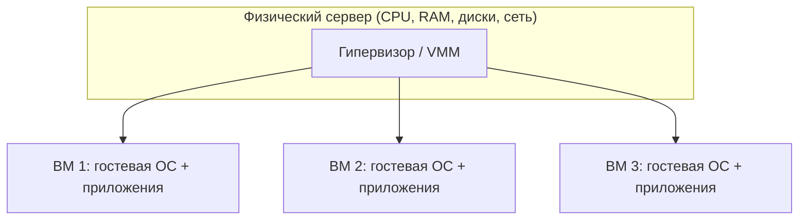

Виртуализация — это технология, которая позволяет одному физическому компьютеру вести себя как несколько независимых машин. Под капотом она лежит почти везде: в облачных провайдерах, корпоративных дата-центрах, CI-системах, на ноутбуке разработчика. Этот раздел отвечает на три вопроса: что такое виртуализация на уровне определения, какую боль она снимает и как мы пришли к нынешнему положению дел — от экспериментов IBM 1960-х до облаков и контейнеров.

## Что такое виртуализация

**Виртуализация** — это абстрагирование физических вычислительных ресурсов (процессора, оперативной памяти, дисков, сети) и предоставление их потребителю в виде логических, программно управляемых сущностей. Каждому окружению создаётся иллюзия, что оно работает на собственном, выделенном только ему оборудовании, хотя на самом деле это оборудование разделяется между многими окружениями.

Три ключевых свойства определяют любую честную виртуализацию:

- **Абстрагирование (abstraction).** Потребитель видит не конкретное «железо», а его модель. Гостевая операционная система обращается к «процессору» и «диску», не зная, что это доля реального CPU и файл на хост-системе.
- **Иллюзия владения (illusion).** Внутри виртуальной машины складывается полная картина самостоятельного компьютера: своё BIOS/UEFI, свои устройства, своя таблица прерываний. ОС внутри неё, как правило, не подозревает, что виртуализирована (это называют **прозрачностью**).
- **Изоляция (isolation).** Сбой, утечка памяти или взлом в одном окружении не должны затрагивать соседей и хост. Это и свойство безопасности, и свойство надёжности.

Программный слой, который создаёт и поддерживает эти иллюзии, называется **гипервизором** (hypervisor) или **монитором виртуальных машин** (Virtual Machine Monitor, VMM). Он распределяет физические ресурсы между гостями, перехватывает их «опасные» обращения к оборудованию и эмулирует ожидаемое поведение. Подробно типы гипервизоров разбираются в разделе [/virtualization/hypervisors/](/virtualization/hypervisors/).

Каждая виртуальная машина (ВМ) получает виртуальные CPU, объём памяти и набор виртуальных устройств. Гипервизор мультиплексирует одно физическое «железо» между ними во времени и пространстве — примерно так же, как операционная система разделяет процессор между процессами, но на уровень ниже.

## Какую проблему решает виртуализация

До массовой виртуализации типичной практикой было правило «одно приложение — один сервер». Это вело к катастрофически низкой утилизации: средняя загрузка процессоров в дата-центрах нередко держалась на уровне 5–15 %. Сервера простаивали, но потребляли стойко-место, электричество и охлаждение. Виртуализация снимает целый букет проблем.

| Проблема | Как решает виртуализация |
| --- | --- |
| Низкая утилизация «железа» | **Консолидация серверов**: десятки ВМ на одном физическом узле, загрузка CPU и памяти растёт в разы |
| Конфликты ПО и зависимостей | **Изоляция**: у каждой ВМ своя ОС, свои библиотеки и версии, они не мешают друг другу |
| Риски безопасности | Компрометация одной ВМ ограничена её границами; гипервизор — дополнительный рубеж |
| Привязка к конкретному «железу» | **Переносимость**: ВМ — это набор файлов, её можно перенести на другой хост, часто даже без остановки (live migration) |
| Долгое восстановление и тестирование | **Снапшоты и клонирование**: мгновенный слепок состояния, откат за секунды, копии для тестов |
| Пики и спады нагрузки | **Эластичность**: ВМ создаются и удаляются по требованию, ресурсы выделяются динамически |

Именно изоляция плюс переносимость плюс эластичность сделали виртуализацию **фундаментом облаков и современных дата-центров**. Когда вы арендуете «виртуальную машину» у облачного провайдера, вы получаете изолированный кусочек чужого огромного физического кластера, который можно создать, склонировать, мигрировать и уничтожить программно, через API.

:::tip[Аналогия]
Гипервизор для оборудования — это то же, чем планировщик ОС является для процессов. ОС создаёт каждому процессу иллюзию собственного непрерывного адресного пространства и «своего» CPU. Гипервизор поднимается на уровень выше и создаёт уже целым операционным системам иллюзию собственного компьютера.
:::

## Виды виртуализации

Термин «виртуализация» широкий и охватывает несколько разных по природе технологий:

- **Серверная (системная) виртуализация** — то, о чём в основном идёт речь в этом курсе: запуск полноценных гостевых ОС в виртуальных машинах под управлением гипервизора.
- **Виртуализация ресурсов** — абстрагирование отдельных классов «железа»:
  - *CPU* — мультиплексирование процессорного времени и режимов исполнения (см. [/virtualization/cpu/](/virtualization/cpu/));
  - *память* — трансляция гостевых адресов в физические, оверкоммит (см. [/virtualization/memory/](/virtualization/memory/));
  - *хранилище* — RAID, LVM, SAN, программно-определяемые тома поверх физических дисков;
  - *сеть* — виртуальные коммутаторы, VLAN, оверлейные сети, SDN.
- **Десктопная виртуализация (VDI)** — рабочие столы пользователей крутятся на серверах, а на тонкий клиент передаётся только изображение.
- **Виртуализация на уровне ОС (контейнеры)** — изоляция процессов в рамках одного ядра без отдельной гостевой ОС; сравнению с ВМ посвящён раздел [/virtualization/containers-vs-vm/](/virtualization/containers-vs-vm/).

:::note
Курс фокусируется на **системной виртуализации** — виртуальных машинах и тех аппаратных и программных механизмах CPU, памяти и ввода-вывода, которые делают её эффективной. Контейнеры мы рассмотрим преимущественно в сравнении, чтобы провести чёткую границу между двумя подходами.
:::

## История: от мейнфреймов IBM до облаков

### 1960-е: рождение идеи в IBM

Концепция виртуальной машины родилась не в эпоху облаков, а более полувека назад — на мейнфреймах IBM. В Кембриджском научном центре IBM в середине 1960-х создали систему **CP-40**, а затем **CP-67** для мейнфрейма IBM System/360 Model 67. Управляющая программа **CP (Control Program)** давала каждому пользователю собственную полную виртуальную копию машины, а внутри неё работала однопользовательская ОС **CMS (Cambridge Monitor System)**. Связка **CP/CMS** — это первый в истории промышленный гипервизор: вместо того чтобы строить сложную многопользовательскую систему разделения времени, инженеры дали каждому пользователю иллюзию отдельного компьютера.

### 1970-е: System/370 и аппаратная поддержка

Идея оказалась настолько удачной, что виртуализация перешла в коммерческую линейку. В **System/370** (с моделей, поддерживавших виртуальную память, начиная с 1972 года) и последующей серии продуктов **VM/370** виртуализация получила аппаратную поддержку. Сформировалось и теоретическое основание: в 1974 году Джеральд Попек и Роберт Голдберг опубликовали **критерии Попека–Голдберга** — формальные условия, при которых архитектуру процессора можно эффективно виртуализировать. Ключевое требование: все «чувствительные» инструкции (меняющие или зависящие от состояния «железа») должны быть подмножеством привилегированных, чтобы их можно было перехватить.

### 1980–90-е: на x86 виртуализация «заглохла»

В эпоху дешёвых ПК и серверов на архитектуре x86 виртуализация почти исчезла из обихода. Причина — техническая: x86 **не удовлетворяла критериям Попека–Голдберга**. В наборе команд существовали «чувствительные, но не привилегированные» инструкции (например, `POPF`, `SGDT`, `SMSW`), которые при выполнении в непривилегированном режиме не вызывали ловушку (trap), а просто молча вели себя иначе. Гипервизор не мог их перехватить, а значит, не мог сохранить корректную иллюзию. Считалось, что x86 в принципе невиртуализируема классическим способом «trap-and-emulate».

### 1998–1999: VMware и бинарная трансляция

Прорыв сделала компания **VMware**, основанная в 1998 году. Её инженеры обошли архитектурное ограничение программно — техникой **бинарной трансляции (binary translation)**: гипервизор на лету сканировал поток инструкций гостевого ядра и заменял проблемные «чувствительные» инструкции безопасными последовательностями, которые можно было корректно перехватить и сэмулировать. Пользовательский код при этом исполнялся почти напрямую. В 1999 году вышел **VMware Workstation**, а затем серверные продукты, и виртуализация x86 стала практической реальностью.

### 2003: Xen и паравиртуализация

Альтернативный путь предложил проект **Xen**, выросший из исследований в Кембриджском университете (первый публичный релиз — 2003 год). Вместо дорогой трансляции Xen применил **паравиртуализацию (paravirtualization)**: гостевую ОС модифицируют так, чтобы она знала о виртуализации и сама делала явные вызовы к гипервизору (**hypercalls**) вместо привилегированных инструкций. Это резко повышало производительность, но требовало правки ядра гостя. Подробнее — в разделе [/virtualization/paravirtualization/](/virtualization/paravirtualization/).

### 2005–2006: аппаратная виртуализация Intel VT-x и AMD-V

Производители процессоров устранили исходную проблему x86 на уровне «железа». **Intel VT-x** (кодовое имя Vanderpool, 2005) и **AMD-V** (Pacifica, 2006) ввели новый, корневой режим работы для гипервизора и аппаратный механизм перехвата всех чувствительных операций (структуры VMCS у Intel, VMCB у AMD; вход в гостя выполняется инструкциями `VMLAUNCH`/`VMRESUME`, а возврат управления гипервизору — событие VM exit). Теперь гипервизору не нужно было ни транслировать код, ни модифицировать гостя — «железо» само корректно ловило привилегированные действия. Это сделало классический `trap-and-emulate` на x86 наконец возможным и быстрым. Детали — в разделе [/virtualization/cpu/](/virtualization/cpu/).

### 2007: KVM в ядре Linux

Аппаратная поддержка открыла дорогу простым гипервизорам. **KVM (Kernel-based Virtual Machine)** появился в 2007 году и был принят в основное ядро Linux (с версии 2.6.20). KVM превращает само ядро Linux в гипервизор Type-1, опираясь на VT-x/AMD-V, а эмуляцию устройств делегирует пользовательскому процессу (обычно QEMU). Эта связка стала стандартом де-факто для облачной инфраструктуры на Linux; практике посвящён раздел [/virtualization/kvm-qemu/](/virtualization/kvm-qemu/).

### 2010-е: контейнеры и облака

Параллельно набирала силу более лёгкая модель — **контейнеры**. Опираясь на механизмы ядра Linux — пространства имён (**namespaces**) и контрольные группы (**cgroups**) — проект **LXC** (2008) дал изоляцию процессов без отдельной гостевой ОС. В 2013 году вышел **Docker**, который сделал контейнеры массовыми за счёт удобной упаковки образов и экосистемы. Виртуальные машины и контейнеры не вытеснили, а дополнили друг друга: ВМ дают сильную изоляцию и совместимость с любыми ОС, контейнеры — плотность и скорость. На этом фундаменте выросли публичные облака, оркестраторы и эластичные дата-центры.

## Что дальше в курсе

Дальше мы спускаемся от общей картины к механизмам:

- [/virtualization/hypervisors/](/virtualization/hypervisors/) — гипервизоры Type-1 и Type-2, их архитектура и компромиссы.
- [/virtualization/cpu/](/virtualization/cpu/) — виртуализация процессора: кольца защиты, trap-and-emulate, VT-x/AMD-V.
- [/virtualization/memory/](/virtualization/memory/) — теневые таблицы страниц, вложенная трансляция (EPT/NPT), оверкоммит памяти.
- [/virtualization/io/](/virtualization/io/) — виртуализация ввода-вывода, эмуляция устройств, virtio, проброс через IOMMU.
- [/virtualization/paravirtualization/](/virtualization/paravirtualization/) — паравиртуализация и hypercalls.
- [/virtualization/containers-vs-vm/](/virtualization/containers-vs-vm/) — контейнеры против виртуальных машин.
- [/virtualization/kvm-qemu/](/virtualization/kvm-qemu/) — KVM/QEMU на практике.
- [/virtualization/platforms/](/virtualization/platforms/) — обзор платформ (VMware, Hyper-V, Proxmox и другие).
- [/virtualization/glossary/](/virtualization/glossary/) — глоссарий терминов и список источников.

:::note[Главная мысль]
Виртуализация — это не один трюк, а слой абстракции над всем «железом» сразу. Поняв, как именно виртуализируются CPU, память и ввод-вывод, вы будете понимать и работу облаков, и поведение собственных ВМ под нагрузкой.
:::
