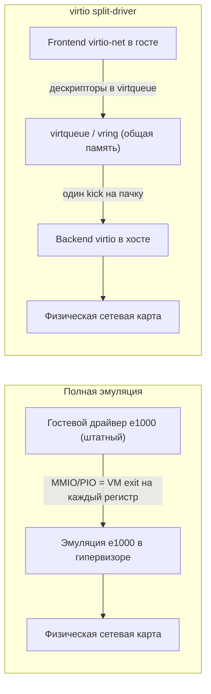
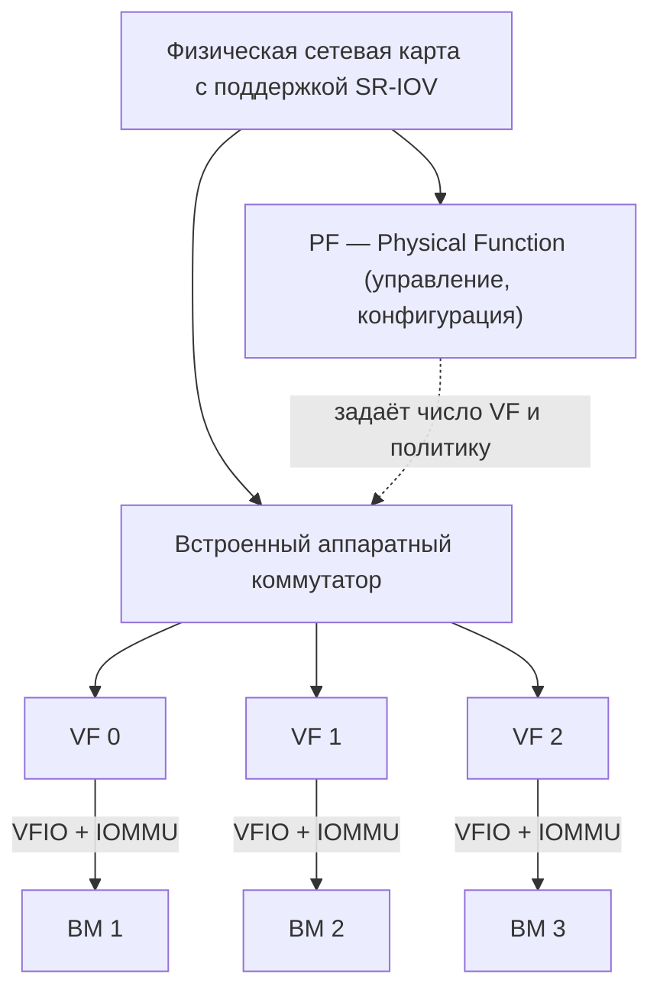
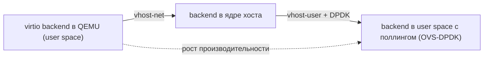

Процессор и память — лишь часть ресурсов, которые гипервизор обязан разделить между виртуальными машинами. Не менее важен ввод-вывод (I/O): дисковые операции, сетевой трафик, графика, USB. Все эти потоки нужно мультиплексировать между гостями так, чтобы они оставались изолированными (одна ВМ не может прочитать диск или перехватить пакеты другой), но при этом производительность оставалась приемлемой. Именно в подсистеме ввода-вывода исторически концентрировались самые большие накладные расходы виртуализации, и именно здесь появились самые интересные решения — от полной эмуляции «железных» устройств до аппаратного разделения сетевой карты на десятки независимых функций.

В этом разделе мы пройдём весь спектр подходов: полная программная эмуляция, паравиртуальный стандарт virtio, прямой проброс устройств через IOMMU и аппаратное разделение через SR-IOV. По дороге опираемся на понятия DMA и IOMMU из раздела [Виртуализация памяти](/virtualization/memory/) и на общую идею кооперации гостя с гипервизором из раздела [Паравиртуализация](/virtualization/paravirtualization/).

## Постановка задачи

Гостевая ОС написана так, будто она владеет реальным оборудованием единолично. Она обращается к контроллеру диска через порты ввода-вывода и MMIO (memory-mapped I/O), ожидает прерываний от сетевой карты, программирует DMA для переноса данных. Но физического контроллера на всех гостей не хватает — а если бы и хватило, прямой неконтролируемый доступ к DMA позволил бы гостю писать в любую область физической памяти, разрушив изоляцию.

Гипервизор должен решить три связанные подзадачи:

- **Мультиплексирование** — один физический диск или одна сетевая карта обслуживают несколько ВМ.
- **Изоляция** — операции одного гостя не должны влиять на данные и трафик другого.
- **Производительность** — минимизировать переключения контекста между гостем и гипервизором (VM exit), которые стоят сотни-тысячи тактов каждое.

Эти три требования находятся в постоянном напряжении друг с другом, и разные технологии находят разный баланс.

## Полная эмуляция устройств

Самый прямолинейный подход: гипервизор программно эмулирует реально существующее устройство. Гость видит, например, сетевую карту Intel 82540 (известную по драйверу `e1000`), дисковый контроллер IDE PIIX3 или AHCI, графику Cirrus Logic. В QEMU за это отвечают модели устройств, написанные на C.

Главное достоинство — **совместимость без модификаций**. Любая ОС, у которой есть штатный драйвер для эмулируемого устройства (а драйверы `e1000`, IDE, AHCI есть практически везде), запускается «из коробки», ничего не зная о виртуализации. Это незаменимо при установке старых или экзотических систем.

Платой за совместимость становится производительность. Каждое обращение гостя к регистру устройства — это запись в MMIO или порт I/O, которая перехватывается гипервизором и вызывает **VM exit**: процессор выходит из гостевого режима, передаёт управление гипервизору, тот разбирает обращение, обновляет состояние эмулируемого устройства и возвращает управление. Передача одного сетевого пакета через `e1000` может потребовать десятки таких переходов — на программирование дескрипторов, чтение статуса, подтверждение прерывания. На интенсивном I/O это означает тысячи VM exit в секунду и заметную потерю пропускной способности.

:::note[Trap-and-emulate в применении к I/O]
Эмуляция устройств — это тот же принцип «перехватить и эмулировать», что и для привилегированных инструкций CPU (см. [Виртуализация CPU](/virtualization/cpu/)), только объектом перехвата выступают обращения к регистрам устройства. Каждый перехват полезен для корректности, но дорог по времени.
:::

## Паравиртуальный ввод-вывод и virtio

Если отказаться от требования «гость не знает о виртуализации», можно радикально сократить число VM exit. Идея паравиртуализации I/O в том, чтобы предоставить гостю не имитацию реального чипа, а специальный виртуальный интерфейс, изначально спроектированный под виртуальную среду и минимизирующий переходы.

Стандартом де-факто здесь стал **virtio**, предложенный Расти Расселом (Rusty Russell) около 2007 года и позже стандартизованный OASIS (VIRTIO 1.0 и далее). Вместо того чтобы каждый гипервизор изобретал свои паравиртуальные драйверы, virtio задаёт единый транспорт и набор устройств:

| Устройство virtio | Назначение |
|---|---|
| `virtio-net` | сетевой адаптер |
| `virtio-blk` | блочное устройство (простой диск) |
| `virtio-scsi` | SCSI-стек (много дисков, passthrough команд, TRIM) |
| `virtio-gpu` | графика |
| `virtio-balloon` | управление памятью (см. memory ballooning) |
| `virtio-rng` | источник энтропии |

### Модель split-driver

virtio построен на модели **split-driver** — драйвер разделён на две половины:

- **Frontend** — драйвер внутри гостевой ОС (`virtio_net`, `virtio_blk` в ядре Linux). Он не притворяется реальным железом, а сразу говорит на языке virtio.
- **Backend** — реализация на стороне хоста или гипервизора (в QEMU, в ядре хоста или в отдельном процессе), которая фактически выполняет работу: пишет на реальный диск, отправляет пакеты в физическую сеть.

Между ними — общий канал передачи.



### virtqueue и vring

Сердце virtio — **virtqueue**, кольцевой буфер дескрипторов, физически реализованный структурой **vring** в памяти, разделяемой между гостем и хостом. Гость не дёргает регистры на каждый байт. Вместо этого он:

1. Формирует цепочку дескрипторов (указатели на буферы в своей памяти — операция чтения или записи).
2. Публикует их в available-кольце.
3. Делает один **kick** — нотификацию хосту, что есть работа.

Backend обрабатывает сразу пачку запросов, складывает результаты в used-кольцо и поднимает одно прерывание. Так десятки операций объединяются в один VM exit вместо одного перехода на каждый регистр. Дополнительно vring поддерживает подавление нотификаций и прерываний (флаги `VRING_AVAIL_F_NO_INTERRUPT`), что под нагрузкой позволяет работать почти в режиме поллинга, вообще без переходов. Отсюда и выигрыш virtio над полной эмуляцией — кратный, особенно на сетевом трафике.

:::tip[Когда что выбирать]
virtio — выбор по умолчанию для любой современной гостевой ОС: драйверы есть в Linux, в Windows ставятся пакетом virtio-win. Полную эмуляцию (`e1000`, AHCI) оставляют для установки систем, у которых ещё нет virtio-драйверов, или для отладки совместимости.
:::

## Проброс устройств: PCI passthrough и IOMMU

И эмуляция, и virtio всё равно проводят данные через программный слой хоста. Когда нужна максимальная производительность или доступ к специфической функции железа (GPU для вычислений, HBA, FPGA), применяют **PCI passthrough** — физическое устройство целиком и напрямую отдаётся одной ВМ. Гость работает с настоящим оборудованием через его родной драйвер, без участия гипервизора в горячем пути.

Проблема в DMA. Устройство переносит данные напрямую в физическую память, оперируя физическими адресами. Но гость знает только свои **гостевые** физические адреса, которые не совпадают с реальными машинными (см. [Виртуализация памяти](/virtualization/memory/)). Без защиты гость мог бы запрограммировать устройство на DMA в чужую память — катастрофа для изоляции.

Решение — **IOMMU** (I/O Memory Management Unit), реализованный как **Intel VT-d** и **AMD-Vi**. IOMMU — это аналог MMU, но для устройств: он перехватывает DMA-обращения и транслирует адреса, которыми оперирует устройство (IOVA), в реальные машинные адреса по таблицам, настроенным гипервизором. Эффект двойной:

- **Трансляция адресов** — устройство, видя «гостевые» адреса, реально пишет в правильные машинные страницы ВМ.
- **Изоляция и защита** — попытка DMA за пределы разрешённого ВМ диапазона блокируется аппаратно.

В Linux это оформлено через драйвер **VFIO** (Virtual Function I/O) и понятие **IOMMU group** — набор устройств, которые из-за топологии PCIe нельзя изолировать по отдельности и которые поэтому пробрасываются только целиком.

```bash
# Включить IOMMU (Intel) через параметр ядра в загрузчике
intel_iommu=on iommu=pt        # для AMD: amd_iommu=on iommu=pt

# Привязать устройство к VFIO и пробросить в QEMU
modprobe vfio-pci
qemu-system-x86_64 ... -device vfio-pci,host=0000:01:00.0
```

Минус passthrough очевиден: устройство занято одной ВМ целиком, мультиплексирования нет. Десять ВМ — десять сетевых карт. Эту проблему и решает следующий уровень.

## SR-IOV: аппаратное разделение устройства

**SR-IOV** (Single Root I/O Virtualization) — расширение спецификации PCI Express, которое позволяет одному физическому устройству представить себя как множество отдельных устройств на уровне железа. Вводятся два типа функций:

- **PF** (Physical Function) — полнофункциональное PCIe-устройство со всеми возможностями конфигурирования, включая управление виртуальными функциями.
- **VF** (Virtual Function) — «облегчённая» функция, у которой есть свои очереди, свой набор регистров и свой DMA-контекст, но нет управляющих возможностей. Каждую VF можно пробросить в отдельную ВМ через тот же VFIO/IOMMU-механизм.

Внутри устройства встроенный коммутатор (на сетевой карте — аппаратный L2-switch) распределяет трафик между VF. В результате каждая ВМ получает фактически собственную сетевую карту с **near-native** производительностью: данные идут напрямую в память ВМ через DMA с трансляцией IOMMU, гипервизор не участвует в передаче пакетов.



```bash
# Создать 4 виртуальные функции на сетевом адаптере
echo 4 > /sys/class/net/ens1f0/device/sriov_numvfs
lspci | grep "Virtual Function"
```

:::caution[Цена за скорость]
SR-IOV даёт почти аппаратную производительность, но платит гибкостью. Число VF ограничено железом (обычно десятки-сотни), а живая миграция ВМ затруднена: VF жёстко привязана к конкретной физической карте конкретного хоста. Поэтому в облаках SR-IOV применяют выборочно — для нагрузок, критичных к задержкам и пропускной способности, тогда как остальные ВМ работают на гибком virtio.
:::

## Ускорения virtio: vhost и DPDK

virtio тоже не стоит на месте. В исходной схеме backend жил в пользовательском процессе QEMU, и каждая нотификация требовала переключения в user space.

**vhost-net** переносит backend `virtio-net` прямо в ядро хоста: kick от гостя обрабатывается потоком ядра, который сразу взаимодействует с сетевым стеком, минуя QEMU в горячем пути. Это убирает лишнее переключение контекста и заметно поднимает пропускную способность. Аналогично существует **vhost-scsi** для блочного I/O.

Следующий шаг — вынести обработку вообще из ядра, в пользовательское пространство, но без накладных расходов прерываний. **DPDK** (Data Plane Development Kit) реализует поллинг-драйверы в user space: выделенные ядра CPU в цикле опрашивают очереди, не дожидаясь прерываний. В связке с virtio это даёт **vhost-user** — backend virtio внутри DPDK-приложения (например, виртуального коммутатора OVS-DPDK), куда virtqueue гостя подключаются через разделяемую память. Так достигается обработка миллионов пакетов в секунду на одном хосте.



## Сводное сравнение

| Подход | Изменение гостя | Мультиплексирование | Скорость | Когда применять |
|---|---|---|---|---|
| Полная эмуляция | не нужно | да | низкая (много VM exit) | установка ОС без virtio, отладка совместимости |
| virtio (+vhost) | паравиртуальный драйвер | да | высокая | универсальный выбор по умолчанию |
| PCI passthrough | нет (родной драйвер) | нет (1 устройство = 1 ВМ) | максимальная | GPU-вычисления, спец. железо |
| SR-IOV | нет (драйвер VF) | да (через VF) | near-native | сетевые нагрузки с низкой задержкой |

Общая логика эволюции читается насквозь: чем меньше программных прослоек между гостем и реальным устройством, тем выше скорость, но тем дороже даётся изоляция и гибкость. Полная эмуляция максимально совместима и максимально медленна; virtio убирает большую часть VM exit ценой специального драйвера; passthrough и SR-IOV отдают аппаратные функции напрямую, опираясь на IOMMU как на гарант безопасности DMA. На практике один хост обычно сочетает несколько подходов: virtio для основной массы ВМ, SR-IOV или passthrough — для немногих, кому критична производительность.

О том, как эти технологии собираются вместе в реальном стеке, читайте в разделе [KVM/QEMU на практике](/virtualization/kvm-qemu/), а место виртуализации I/O в общей картине — в [Обзоре платформ](/virtualization/platforms/).

## Задания

### Задание 1 (на понимание)

Раздел называет три подзадачи, которые гипервизор обязан решить в подсистеме ввода-вывода, и утверждает, что они находятся «в постоянном напряжении друг с другом». Перечислите эти три требования и на одном примере покажите, почему усиление одного из них обычно ухудшает другое.

<details>
<summary>Решение</summary>

Три требования:

- **Мультиплексирование** — один физический диск или одна сетевая карта обслуживают несколько ВМ.
- **Изоляция** — операции одного гостя не должны влиять на данные и трафик другого.
- **Производительность** — минимизировать переключения контекста между гостем и гипервизором (VM exit), которые стоят сотни-тысячи тактов.

Почему они конфликтуют, на примере:

- **Полная эмуляция** даёт идеальные мультиплексирование и изоляцию (всё проходит через программный слой гипервизора), но каждое обращение к регистру устройства вызывает VM exit — производительность низкая.
- **PCI passthrough** отдаёт устройство напрямую и даёт максимальную скорость, но теряет мультиплексирование: одна карта = одна ВМ. Изоляция при этом держится только за счёт IOMMU.

То есть чем меньше программных прослоек между гостем и железом, тем выше скорость, но тем дороже даётся изоляция и гибкость — это сквозная логика всего раздела.

</details>

### Задание 2 (что произойдёт, если…)

Гостевая ОС передаёт по сети поток мелких пакетов. Сравните, что происходит «на каждый пакет» при эмуляции `e1000` и при `virtio-net`. Объясните через механику virtqueue/vring, откуда берётся кратный выигрыш virtio. Что изменится под высокой нагрузкой благодаря флагам подавления нотификаций?

<details>
<summary>Решение</summary>

**Эмуляция `e1000`.** Гость использует штатный драйвер реального чипа. Каждое обращение к регистру устройства — это запись в MMIO/PIO, которая перехватывается гипервизором и вызывает VM exit. Передача одного пакета требует десятков таких переходов: программирование дескрипторов, чтение статуса, подтверждение прерывания. На потоке мелких пакетов это тысячи VM exit в секунду — отсюда потеря пропускной способности.

**`virtio-net` (split-driver).** Гостевой frontend не дёргает регистры на каждый байт, а работает через разделяемую с хостом память:

1. формирует цепочку дескрипторов (указатели на буферы) в virtqueue;
2. публикует их в available-кольце vring;
3. делает один **kick** (нотификацию) на целую пачку запросов.

Backend обрабатывает пачку, складывает результаты в used-кольцо и поднимает одно прерывание. Десятки операций объединяются в один VM exit вместо одного перехода на регистр — отсюда кратный выигрыш.

**Под нагрузкой.** vring поддерживает подавление нотификаций и прерываний (флаг `VRING_AVAIL_F_NO_INTERRUPT`). Когда работа идёт непрерывно, стороны перестают слать kick и прерывания и переходят фактически в режим поллинга — обработка почти без VM exit вообще. Чем плотнее поток, тем ближе virtio к работе «без переходов».

</details>

### Задание 3 (сценарий + конфиг)

Вы пробрасываете физическую сетевую карту в ВМ через PCI passthrough. Допишите ключевые шаги настройки (параметр ядра и команды). Затем ответьте: почему без IOMMU такой проброс ломает изоляцию, и что такое IOMMU group — почему оно может заставить пробросить «лишние» устройства?

<details>
<summary>Решение</summary>

Ключевые шаги (Intel):

```bash
# Параметр ядра в загрузчике
intel_iommu=on iommu=pt        # для AMD: amd_iommu=on iommu=pt

# Привязка устройства к VFIO и проброс в QEMU
modprobe vfio-pci
qemu-system-x86_64 ... -device vfio-pci,host=0000:01:00.0
```

**Почему без IOMMU ломается изоляция.** При passthrough гость работает с настоящим устройством через родной драйвер и сам программирует DMA. Но устройство оперирует физическими адресами, а гость знает только свои *гостевые* физические адреса, не совпадающие с машинными. Без защиты гость мог бы запрограммировать DMA в чужую память — катастрофа для изоляции.

IOMMU (Intel VT-d / AMD-Vi) решает это как MMU для устройств:

- **Трансляция адресов** — адреса устройства (IOVA) транслируются в реальные машинные страницы ВМ по таблицам гипервизора.
- **Изоляция и защита** — DMA за пределы разрешённого ВМ диапазона блокируется аппаратно.

**IOMMU group.** Это набор устройств, которые из-за топологии PCIe нельзя изолировать друг от друга по отдельности. VFIO пробрасывает группу только целиком. Поэтому, если нужная карта делит группу с другими функциями/устройствами, их придётся пробросить вместе — иначе проброс невозможен без потери гарантий изоляции.

</details>

### Задание 4 (выбор архитектуры)

Облачный провайдер на одном хосте размещает: (а) сотни типовых веб-ВМ; (б) несколько ВМ с задержко-чувствительным сетевым трафиком; (в) одну ВМ для GPU-вычислений. Для каждой группы выберите подход к виртуализации I/O из раздела, обоснуйте выбор и назовите главный недостаток. Почему именно SR-IOV, а не passthrough, для группы (б)? И почему живая миграция для (б) и (в) проблематична?

<details>
<summary>Решение</summary>

| Группа | Подход | Обоснование | Главный недостаток |
|---|---|---|---|
| (а) сотни веб-ВМ | **virtio (+vhost)** | универсальный выбор по умолчанию: мультиплексирование есть, скорость высокая, драйверы есть везде (Linux, virtio-win) | требует паравиртуального драйвера в госте |
| (б) задержко-чувствительная сеть | **SR-IOV** | near-native скорость: каждая ВМ получает свою VF, данные идут в её память напрямую через DMA+IOMMU, гипервизор не в горячем пути | число VF ограничено железом; затруднена живая миграция |
| (в) GPU-вычисления | **PCI passthrough** | нужен доступ к специфической функции железа (GPU) через родной драйвер на максимальной скорости | устройство занято одной ВМ целиком, мультиплексирования нет |

**Почему SR-IOV, а не passthrough, для (б).** Задержко-чувствительных ВМ несколько, а passthrough отдаёт всю карту одной ВМ (10 ВМ = 10 карт). SR-IOV разделяет одну физическую карту на множество VF на уровне железа: встроенный аппаратный L2-коммутатор распределяет трафик между VF, каждую можно пробросить в свою ВМ через VFIO/IOMMU. Получаем и мультиплексирование, и near-native скорость одновременно.

**Почему живая миграция проблематична для (б) и (в).** И VF (SR-IOV), и проброшенное устройство (passthrough) жёстко привязаны к конкретной физической карте конкретного хоста: гость работает с реальным железом напрямую, и его состояние нельзя просто перенести на другой хост, где этого устройства нет. Поэтому в облаках такие подходы применяют выборочно — для немногих критичных нагрузок, а основная масса ВМ остаётся на гибком virtio (мигрируется свободно, так как backend целиком программный).

</details>
