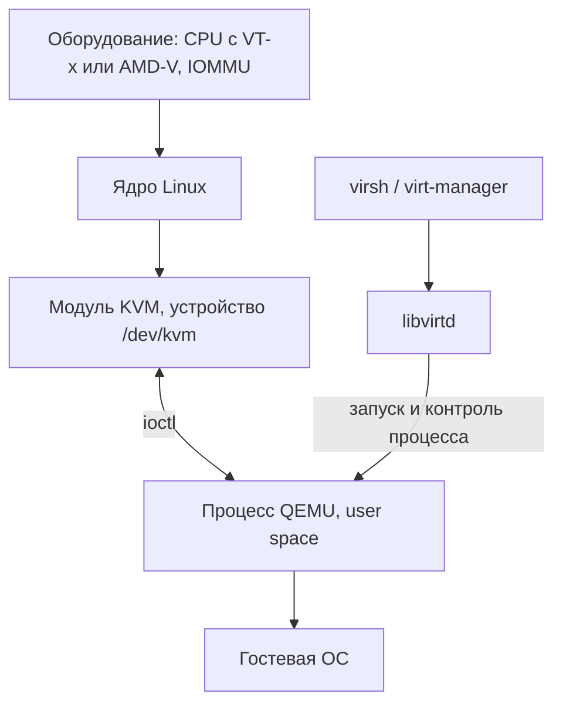
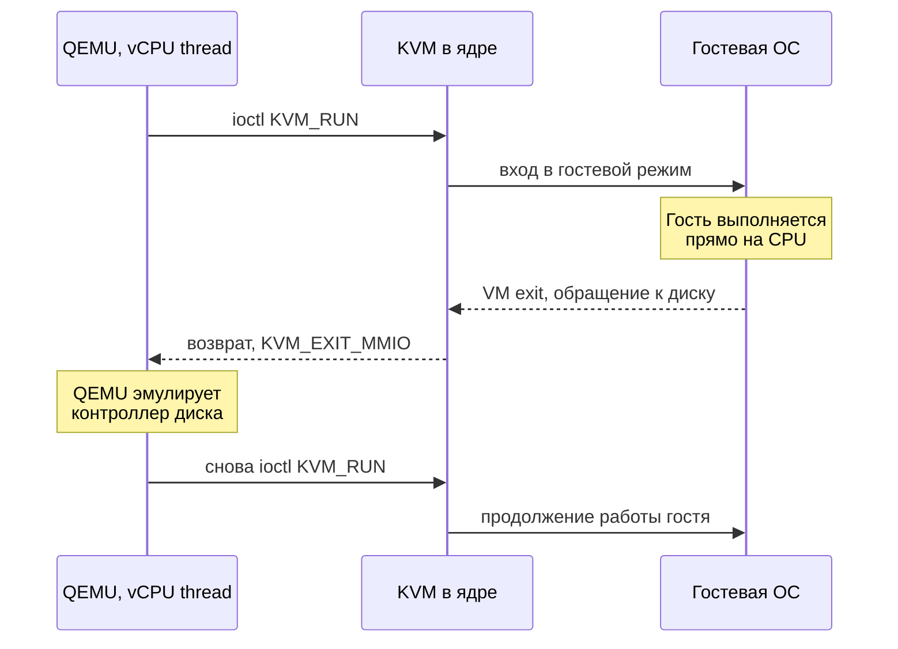
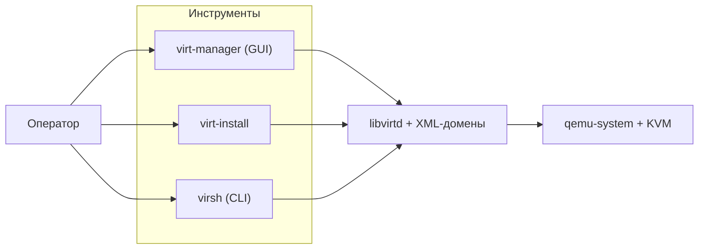

До сих пор мы разбирали виртуализацию по слоям: как [виртуализируется CPU](/virtualization/cpu/), [память](/virtualization/memory/) и [ввод-вывод](/virtualization/io/). Теперь соберём всё это в работающий стек. KVM/QEMU — это де-факто стандарт серверной виртуализации в Linux: на нём построены OpenStack, oVirt/RHV, Proxmox VE и значительная часть публичных облаков (включая Amazon EC2 после перехода на Nitro). Разберём, кто за что отвечает, а затем поднимем виртуальную машину руками и через систему управления.

## Кто есть кто: три слоя стека

Главная мысль, которую легко упустить новичку: KVM сам по себе не запускает виртуальные машины. KVM — это лишь тонкий слой в ядре, дающий доступ к аппаратным расширениям процессора. Эмуляцией «железа» и оркестрацией занимаются процессы в пространстве пользователя.

| Компонент | Где работает | За что отвечает |
|---|---|---|
| **KVM** | Модуль ядра Linux (`kvm.ko` + `kvm-intel.ko`/`kvm-amd.ko`) | Доступ к [VT-x/AMD-V](/virtualization/cpu/), виртуализация CPU и памяти, аппаратные таблицы трансляции (EPT/NPT) |
| **QEMU** | Обычный процесс в user space | Эмуляция устройств (диск, сеть, чипсет, BIOS/UEFI), модель машины, главный цикл выполнения |
| **libvirt** | Демон `libvirtd` + библиотека/API | Декларативное описание ВМ в XML, управление жизненным циклом, сети, пулы хранения, единый API |
| **virsh / virt-manager / virt-install** | CLI и GUI поверх libvirt | Интерфейс оператора |

KVM появился в ядре Linux 2.6.20 (февраль 2007) — его написали Ави Кивити и команда Qumranet. Изначально KVM форкнул QEMU для своих нужд, но со временем поддержка KVM была принята в основной QEMU, и сегодня используется один общий QEMU с флагом `-enable-kvm` (или `accel=kvm`).



KVM превращает Linux-ядро в **гипервизор Type-1 по характеру исполнения, но Type-2 по упаковке** — этот гибридный статус мы обсуждали в разделе про [гипервизоры](/virtualization/hypervisors/). Гостевой код исполняется напрямую на физическом CPU в специальном «гостевом» режиме, а хостом служит полноценная ОС Linux.

## Как QEMU и KVM работают вместе

Взаимодействие построено вокруг символьного устройства `/dev/kvm` и набора системных вызовов `ioctl()`. Логика такова:

1. QEMU открывает `/dev/kvm` и системным вызовом `ioctl(KVM_CREATE_VM)` создаёт контейнер виртуальной машины.
2. QEMU выделяет память процесса под физическую память гостя и регистрирует её в KVM как «слоты памяти» (`KVM_SET_USER_MEMORY_REGION`). Дальше за трансляцию гостевых физических адресов в хостовые отвечает аппаратура — EPT (Intel) или NPT (AMD), см. [виртуализацию памяти](/virtualization/memory/).
3. Для каждого виртуального процессора QEMU вызывает `KVM_CREATE_VCPU` и заводит **отдельный поток** (vCPU thread). Именно поэтому `-smp 4` означает 4 потока, конкурирующих за реальные ядра хоста.
4. Каждый vCPU-поток крутит цикл: вызывает `ioctl(KVM_RUN)`. Этот вызов «отдаёт» физический CPU гостю — управление уходит в гостевой код и не возвращается, пока не произойдёт **VM exit**.

VM exit — это аппаратное событие, когда гостю требуется что-то, что нельзя выполнить напрямую: обращение к памяти эмулируемого устройства (MMIO), инструкция работы с портом ввода-вывода, недопустимая инструкция, прерывание таймера и т. д. Управление возвращается из `KVM_RUN`. Дальше развилка:

- Если событие KVM умеет обработать сам (например, обращение к локальному контроллеру прерываний APIC), он делает это в ядре — быстро, без выхода в user space.
- Если требуется эмуляция устройства (диск, сетевая карта, последовательный порт), KVM завершает `KVM_RUN` с кодом `KVM_EXIT_MMIO` или `KVM_EXIT_IO`, и управление возвращается в QEMU. QEMU эмулирует устройство, обновляет состояние и снова вызывает `KVM_RUN`.



Этот цикл «KVM_RUN → исполнение → VM exit → эмуляция → KVM_RUN» — сердце всей системы. Главная цель оптимизации производительности — **сократить число VM exit**: чем реже гость «выпадает» в QEMU, тем ближе скорость к нативной. Отсюда растут ноги у [паравиртуализации](/virtualization/paravirtualization/): устройства семейства **virtio** спроектированы так, чтобы передавать данные пакетами через кольцевые буферы в разделяемой памяти, а не дёргать эмулятор на каждый байт.

:::note[Почему «гипервизор» здесь — это процесс]
В KVM/QEMU нет отдельного монолитного гипервизора, как ESXi. Каждая ВМ — это обычный Linux-процесс `qemu-system-x86_64`, который вы видите в `ps` и `top`, можете ограничить через cgroups, привязать к ядрам через `taskset` и убить через `kill`. Это огромное удобство эксплуатации: вся экосистема Linux-инструментов применима к виртуальным машинам напрямую.
:::

## Проверка аппаратной поддержки

Прежде чем что-либо запускать, убедитесь, что процессор поддерживает аппаратную виртуализацию и она включена в BIOS/UEFI. Флаг `vmx` — это Intel VT-x, `svm` — AMD-V:

```bash
egrep -c '(vmx|svm)' /proc/cpuinfo
# Ненулевое число (обычно = числу логических ядер) означает поддержку.
# Если 0 — либо CPU не умеет, либо виртуализация выключена в BIOS.
```

Удобная утилита из пакета `cpu-checker` даёт человекочитаемый вердикт:

```bash
sudo apt install cpu-checker   # Debian/Ubuntu
kvm-ok
# INFO: /dev/kvm exists
# KVM acceleration can be used
```

Проверьте, что модули ядра загружены и устройство существует:

```bash
lsmod | grep kvm
# kvm_intel  ...  (или kvm_amd)
# kvm        ...
ls -l /dev/kvm
# crw-rw----+ 1 root kvm ... /dev/kvm
```

Чтобы запускать ВМ без `sudo`, пользователь должен входить в группу `kvm` (а для libvirt — ещё и в `libvirt`):

```bash
sudo usermod -aG kvm,libvirt "$USER"   # перелогиньтесь после этого
```

## Подготовка диска: qcow2 против raw

Виртуальный диск — это файл на хосте. Два основных формата:

| Формат | Особенности | Когда выбирать |
|---|---|---|
| **raw** | Побайтовая копия диска, без метаданных. Максимальная скорость, простота, поддержка sparse-файлов | Максимальная производительность, простой бэкап средствами ФС, СУБД под высокой нагрузкой |
| **qcow2** | QEMU Copy-On-Write v2: тонкое выделение (растёт по мере записи), внутренние снапшоты, сжатие, шифрование, backing-файлы | Десктопы, лаборатории, шаблоны ВМ, когда нужны снапшоты и экономия места |

Создаём «тонкий» диск qcow2 на 20 ГиБ — физически файл займёт несколько сотен килобайт и будет расти по мере записи:

```bash
qemu-img create -f qcow2 disk.qcow2 20G
qemu-img info disk.qcow2
# virtual size: 20 GiB / disk size: 196 KiB
```

Конвертация между форматами и создание диска поверх «золотого образа» (backing file — копия делается только при записи изменённых блоков):

```bash
qemu-img convert -O raw disk.qcow2 disk.raw
qemu-img create -f qcow2 -b base.qcow2 -F qcow2 vm1.qcow2
```

:::caution[Снапшоты qcow2 — не замена бэкапу]
Внутренние снапшоты qcow2 (`qemu-img snapshot -c имя disk.qcow2`) хранятся в том же файле. Это удобно для отката эксперимента, но если файл повредится — вы потеряете и данные, и снапшоты. Для боевых систем используйте внешние снапшоты или резервное копирование на отдельное хранилище. Снимать внутренние снапшоты на работающей ВМ можно только через libvirt с гостевым агентом, иначе файловая система гостя окажется в несогласованном состоянии.
:::

## Запуск ВМ вручную через qemu-system

Соберём команду запуска по кирпичикам. Ключевой принцип — везде, где возможно, использовать **virtio** вместо эмуляции реального железа: это паравиртуальные устройства, дающие почти нативную скорость I/O.

```bash
qemu-system-x86_64 \
  -enable-kvm \
  -cpu host \
  -smp 4 \
  -m 4096 \
  -drive file=disk.qcow2,if=virtio,format=qcow2 \
  -netdev user,id=net0 \
  -device virtio-net-pci,netdev=net0 \
  -cdrom debian-12.iso \
  -boot order=dc \
  -vga virtio \
  -display gtk
```

Что означает каждый флаг:

- `-enable-kvm` — использовать аппаратное ускорение через `/dev/kvm`. Без него QEMU свалится в чистую программную эмуляцию (TCG) — рабочую, но в десятки раз более медленную.
- `-cpu host` — показать гостю модель CPU, идентичную хостовой (все доступные инструкции). Альтернатива — именованные модели вроде `-cpu Haswell` для совместимости при [миграции](/virtualization/platforms/) между разными хостами.
- `-smp 4` — 4 виртуальных процессора (4 vCPU-потока).
- `-m 4096` — 4096 МиБ ОЗУ гостю.
- `-drive ...,if=virtio` — подключить диск через паравиртуальный контроллер virtio-blk.
- `-netdev user,id=net0` — простейшая сеть через встроенный NAT QEMU (SLIRP): гость получает выход в интернет без настройки на хосте, но без входящих соединений. Для production используют `-netdev tap,...` с мостом или `-netdev bridge`.
- `-device virtio-net-pci` — паравиртуальная сетевая карта.
- `-cdrom` и `-boot order=dc` — подключить установочный ISO и грузиться сначала с CD-ROM (`d`), затем с диска (`c`).

После установки ISO отключают и грузятся с диска. Без графики удобно вывести консоль в терминал, добавив `-nographic` и направив последовательный порт в stdio:

```bash
qemu-system-x86_64 -enable-kvm -m 2048 -smp 2 \
  -drive file=disk.qcow2,if=virtio,format=qcow2 \
  -nographic -serial mon:stdio
```

:::tip[Гостю нужны драйверы virtio]
Современные дистрибутивы Linux несут драйверы virtio в ядре «из коробки». Windows — нет: при установке придётся подгрузить драйверы из ISO-образа [virtio-win](https://github.com/virtio-win/virtio-win-pkg-scripts), иначе установщик просто не увидит ни диск, ни сеть.
:::

## Управление через libvirt и virsh

Запускать ВМ длинными командами `qemu-system-x86_64` неудобно: легко ошибиться, тяжело воспроизвести, нет учёта состояния. На практике поверх QEMU работает **libvirt** — он хранит описание каждой ВМ в XML-файле (домене), управляет автозапуском, виртуальными сетями и пулами хранилищ, и предоставляет единый API независимо от того, KVM под ним, Xen или LXC.

Создать и сразу установить ВМ удобно через `virt-install` — он сам сгенерирует корректный QEMU-вызов и зарегистрирует домен:

```bash
virt-install \
  --name debian12 \
  --memory 4096 \
  --vcpus 4 \
  --disk path=/var/lib/libvirt/images/debian12.qcow2,size=20,format=qcow2 \
  --cdrom /var/lib/libvirt/iso/debian-12.iso \
  --os-variant debian12 \
  --network network=default,model=virtio \
  --graphics spice
```

Дальше всё крутится через `virsh`:

```bash
virsh list --all              # все домены и их состояние
virsh start debian12          # запуск
virsh shutdown debian12       # корректное завершение (ACPI-сигнал гостю)
virsh destroy debian12        # «выдернуть питание» (принудительно)
virsh console debian12        # подключиться к консоли (выход: Ctrl+])
virsh dumpxml debian12        # показать XML-описание домена
virsh autostart debian12      # автозапуск при старте хоста
virsh snapshot-create-as debian12 snap1 "до обновления"
```

Команда `virsh dumpxml` показывает то самое декларативное описание, которое libvirt транслирует в аргументы QEMU. Фрагмент типичного домена:

```xml
<domain type='kvm'>
  <name>debian12</name>
  <memory unit='KiB'>4194304</memory>
  <vcpu>4</vcpu>
  <os>
    <type arch='x86_64' machine='q35'>hvm</type>
  </os>
  <devices>
    <disk type='file' device='disk'>
      <driver name='qemu' type='qcow2'/>
      <source file='/var/lib/libvirt/images/debian12.qcow2'/>
      <target dev='vda' bus='virtio'/>
    </disk>
    <interface type='network'>
      <source network='default'/>
      <model type='virtio'/>
    </interface>
  </devices>
</domain>
```

Атрибут `type='kvm'` указывает libvirt использовать ускорение KVM; `bus='virtio'` и `model type='virtio'` — те самые паравиртуальные устройства. Графический инструмент **virt-manager** — это GUI поверх ровно того же libvirt-API: всё, что он делает, можно повторить через `virsh`.



## Итог

Стек KVM/QEMU/libvirt — это разделение труда: **KVM** даёт безопасный аппаратный доступ к виртуализации CPU и памяти через `/dev/kvm`; **QEMU** в пользовательском процессе эмулирует устройства и крутит цикл `KVM_RUN`/VM exit для каждого vCPU; **libvirt** превращает всё это в управляемую, декларативную инфраструктуру. Понимание цикла VM exit объясняет, почему virtio и [паравиртуализация](/virtualization/paravirtualization/) так важны для производительности, а связка с [виртуализацией памяти](/virtualization/memory/) и [ввода-вывода](/virtualization/io/) показывает, где аппаратура берёт на себя то, что иначе делал бы эмулятор.

Как KVM соотносится с VMware ESXi, Microsoft Hyper-V, Xen и контейнерными платформами — в разделе [Обзор платформ](/virtualization/platforms/). Термины и спецификации собраны в [глоссарии](/virtualization/glossary/).
