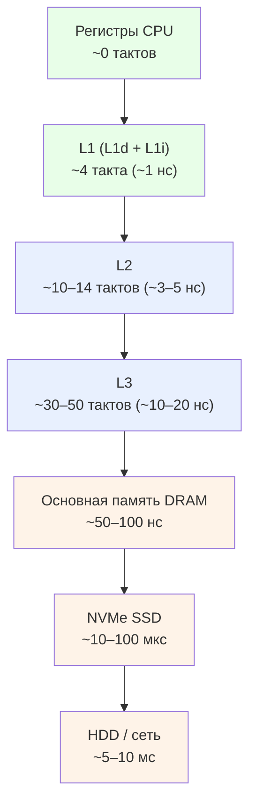
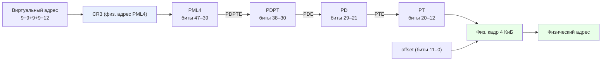
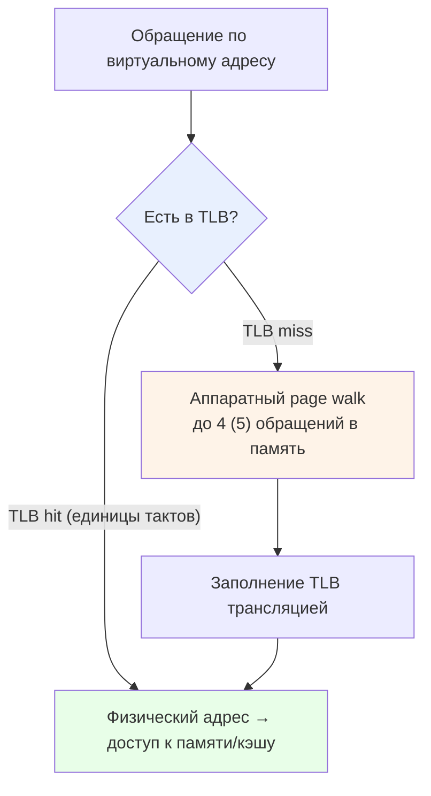
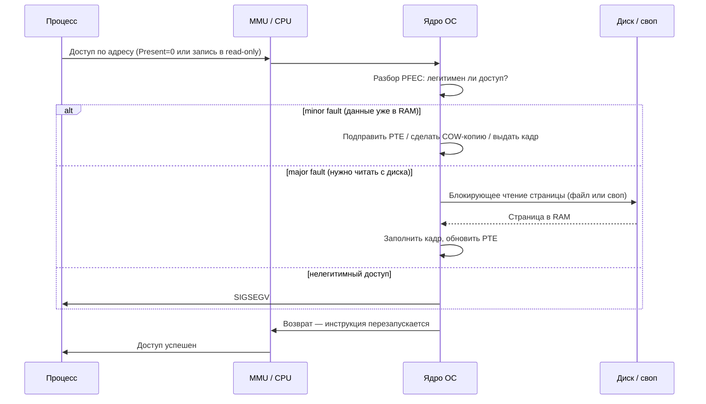

Прежде чем гипервизор сможет виртуализировать память, нужно понимать, как память устроена без всякой виртуализации. Это и есть тема данной главы. Из главы про [виртуализацию CPU](/virtualization/cpu/) уже знакомы кольца защиты (ядро в ring 0, приложения в ring 3) и управляющие регистры вроде CR3 — здесь они снова в центре, но в роли механизма управления памятью, а не процессором. Гостевой ОС из следующей главы оперативная память видится как простой непрерывный массив байтов, начинающийся с адреса 0. На деле за этой иллюзией стоит несколько слоёв: микросхемы DRAM, контроллер памяти, кэши, аппаратный блок трансляции адресов MMU и сложная иерархия таблиц в самой памяти.

Главный вопрос главы: **как процессор превращает адрес, которым оперирует программа, в реальный сигнал на ножках микросхемы памяти — и зачем между ними столько посредников?** Ответ на него — фундамент, поверх которого в [Виртуализации памяти](/virtualization/memory/) появится ещё один, второй уровень трансляции. Пока же — ровно один уровень: виртуальный адрес процесса → физический адрес ОЗУ.

## Физическая память: что это на самом деле

### DRAM, ячейки и регенерация

Оперативная память (RAM, ОЗУ) современных ПК и серверов физически реализуется на **DRAM** (Dynamic Random-Access Memory, динамическая память с произвольным доступом). Слово «динамическая» обманчиво: оно означает не «быстрая», а то, что хранимый заряд со временем утекает и его приходится периодически восстанавливать. Ячейка DRAM предельно проста — это **1T1C**: один полевой транзистор-ключ и один конденсатор. Заряд на конденсаторе кодирует бит (заряжен — единица, разряжен — ноль). Такая компактность даёт высокую плотность и низкую цену за бит, поэтому именно DRAM используют как основную память гигабайтами.

За компактность платят таймингами. Конденсатор теряет заряд через токи утечки, поэтому содержимое каждой строки массива надо периодически считывать и записывать обратно — это **регенерация** (refresh). Стандарт JEDEC требует обновлять каждую ячейку в пределах окна refresh, типично 64 мс (а в расширенном температурном диапазоне, обычно выше ~85 °C, частоту refresh удваивают — эффективное окно сокращается примерно до 32 мс). Регенерацию выполняет автоматика — контроллер памяти и логика самих чипов; прикладная программа на неё не влияет и обычно даже не знает о её существовании. Refresh крадёт небольшую долю пропускной способности, но это плата за плотность.

Есть и вторая тонкость: **чтение DRAM разрушающее**. Считывание разряжает конденсатор на разрядную линию (bit line), слабый сигнал усиливают усилители считывания, и после чтения данные приходится записывать обратно (restore). Это одна из причин, почему DRAM сложнее по таймингам, чем статическая память кэшей.

:::caution[«Динамическая» ≠ «быстрая», «статическая» ≠ «постоянная»]
Кэши процессора строят на **SRAM** (Static RAM, статическая память): типовая ячейка — бистабильный триггер на 6 транзисторах (6T), который удерживает состояние без регенерации, пока подано питание. Отсюда «статическая». Но и DRAM, и SRAM **энергозависимы** (volatile): при отключении питания обе теряют всё содержимое. Энергонезависимая память (Flash/NAND в SSD, ROM) — это совсем другое, с RAM её путать нельзя.
:::

| | DRAM (основная память) | SRAM (кэши, регистровые файлы) |
|---|---|---|
| Ячейка | 1 транзистор + 1 конденсатор (1T1C) | ~6 транзисторов (6T) |
| Плотность | высокая | низкая |
| Цена за бит | низкая | высокая |
| Регенерация (refresh) | нужна | не нужна |
| Латентность | ~50–100 нс | от долей до единиц нс |
| Энергозависимость | да | да |

### Адресация, физический адрес и контроллер памяти

Память **байтово-адресуема**: минимальная адресуемая единица — байт (8 бит), у каждого байта свой адрес, а доступ к слову или двойному слову идёт по адресу младшего байта. Физически же DRAM читается и пишется крупными блоками (строка массива, burst), а байтовую гранулярность обеспечивают контроллер и кэш — снаружи это выглядит как байтовый доступ.

Разрядность адреса задаёт размер адресного пространства: $N$-битный адрес покрывает $2^N$ байт. Отсюда классические числа: $2^{32} = 4\ \text{ГиБ}$ для 32-битного адреса. 64-битная архитектура x86-64 теоретически даёт $2^{64}$ байт, но **полные 64 бита не используются**: виртуальный адрес классически 48-битный (256 ТиБ), а с пятью уровнями таблиц — 57-битный (128 ПиБ); физический адрес ограничен числом реально реализованных линий (часто 39–52 бита). Старшие неиспользуемые биты виртуального адреса обязаны быть копией старшего значащего бита — это требование канонической формы, к нему вернёмся ниже.

Принципиально важно различать два вида адресов. Программа в защищённом режиме работает только с **виртуальными** адресами и физических напрямую не видит. **Физический адрес** — это то, что реально подаётся (через кэши и контроллер) на микросхемы DRAM. Несколько разных виртуальных адресов могут отображаться в один физический кадр, и наоборот. Более того, не вся физическая адресная карта — это ОЗУ: часть диапазонов отведена под **MMIO** — регистры устройств, отображённые в память, под ПЗУ и прочую аппаратуру.

Запросами к микросхемам управляет **контроллер памяти**. В современных x86-64 он интегрирован в кристалл CPU (**IMC** — Integrated Memory Controller). Контроллер превращает запрос по физическому адресу в последовательность команд DRAM (ACTIVATE строки, READ/WRITE столбца, PRECHARGE), следит за таймингами (CAS latency и т. п.), выполняет регенерацию, чередует банки и каналы. Именно он прячет от остального процессора разрушающее чтение и блочную природу DRAM.

Физически модули памяти — это **DIMM** (планки) в слотах. Контроллер обслуживает несколько каналов (dual/quad-channel), суммируя пропускную способность. На DIMM микросхемы группируются в ранги (rank), образующие полную ширину шины данных — типично 64 бита данных (+8 бит ECC у серверных модулей), а внутри чипа массив разбит на банки и bank groups, что позволяет параллелить обращения.

### Иерархия памяти и кэши

Память невозможно сделать одновременно большой, быстрой и дешёвой, поэтому её строят слоями — от крошечной сверхбыстрой вершины к огромному медленному основанию. Каждый верхний уровень кэширует горячие данные нижнего.

Порядки задержек ориентировочны (зависят от частоты, поколения, конкретного чипа — в даташитах кэши указывают в тактах, а не в наносекундах, именно поэтому): при частоте ~3 ГГц L1 — около 4 тактов (~1 нс), L2 — 10–14 тактов, L3 — 30–50 тактов, основная DRAM — десятки-сотни тактов (~50–100 нс). Этот диапазон условен: при попадании в уже открытую строку быстрой DDR5 бывает ближе к 50–60 нс, а при полном цикле (`PRECHARGE`+`ACTIVATE`) да ещё через несколько узлов NUMA доступ уходит за 100 нс. DRAM медленнее L1 примерно в 50–100 раз, а NVMe SSD медленнее DRAM ещё на 2–3 порядка. Между соседними уровнями обычно разрыв в разы или на порядок.

:::note[Регистры — не «нулевой уровень кэша»]
Регистры стоят выше L1, но это не кэш. Кэш индексируется по адресу памяти и работает прозрачно; регистры же — отдельная сущность внутри ядра, явно адресуемая инструкциями. Ещё одна частая неточность: L1, как правило, **разделён** на L1d (данные) и L1i (инструкции) — это не один кэш.
:::

Кэш обменивается с памятью не байтами, а строками. На современных x86-64 (Intel и AMD) **строка кэша (cache line) — 64 байта**. При промахе из памяти подтягивается вся 64-байтная строка, выровненная по границе 64 байт, а не один запрошенный байт. Поэтому распространённое представление, будто обращение к памяти приносит лишь нужный байт, неверно — приходит целая строка. Это же объясняет, почему доступ к соседним данным почти бесплатен и почему важны выравнивание и упаковка структур.

Работает всё это благодаря **принципу локальности**. Временная локальность: если к данным обратились, скоро, вероятно, обратятся снова — их выгодно держать в кэше. Пространственная локальность: если обратились к адресу, скоро понадобятся соседние — поэтому и тянут целую строку, и применяют аппаратный префетч. Без локальности кэши были бы бесполезны; именно она делает среднее время доступа близким к скорости верхних уровней.

### NUMA: память неоднородна по времени доступа

В многосокетных (и многих многочиплетных) системах память физически распределена: у каждого процессора-узла свой контроллер и свои планки — **локальная** память с быстрым доступом. Обращение к памяти соседнего узла (**удалённая** память) идёт через межпроцессорный интерконнект (Intel UPI/QPI, AMD Infinity Fabric) и стоит заметно дороже по латентности и пропускной способности. Отсюда и название **NUMA**: время доступа неоднородно. Память при этом одинаковая (та же DRAM) — неоднородно лишь время, в зависимости от того, чья она. Важно, что NUMA-узел не обязан совпадать с сокетом: при sub-NUMA clustering у Intel и чиплетной компоновке у AMD внутри одного физического процессора может быть несколько NUMA-доменов, каждый со своим контроллером памяти и своей латентностью. ОС старается размещать данные потока в локальном для него узле (NUMA-aware планирование и аллокация). Удобная аналогия: офис из нескольких комнат, у каждого сотрудника свой шкаф под рукой (локально — быстро), а за папкой в шкафу коллеги в другой комнате надо встать и пройти по коридору (удалённо — медленнее).

## Зачем нужна виртуальная память

Допустим, процессы адресовали бы физическую RAM напрямую. Что плохого? Сразу несколько фундаментальных проблем.

- **Нет изоляции и защиты.** Любой процесс мог бы читать и перезаписывать память другого процесса и ядра — нет аппаратного разграничения. Один баг или вредонос рушит всю систему.
- **Сложна релокация.** Программу пришлось бы линковать под конкретные физические адреса либо править адреса загрузчиком при каждом запуске. Два экземпляра одной программы не ужились бы по одним и тем же адресам.
- **Внешняя фрагментация.** При выделении переменных непрерывных блоков со временем остаются мелкие разрозненные свободные участки: суммарно памяти хватает, а непрерывного блока нужного размера нет.
- **Жёсткий потолок по объёму.** Суммарный объём всех процессов был бы намертво ограничен установленной планкой RAM — никакого запаса «про запас».

Решение — дать каждому процессу собственное **виртуальное адресное пространство**. ОС создаёт для каждого процесса отдельный набор таблиц страниц (на x86-64 их корень задаёт регистр CR3). Одинаковые виртуальные адреса в разных процессах транслируются в разные физические кадры — отсюда изоляция. Каждая программа линкуется под один и тот же фиксированный диапазон виртуальных адресов и грузится куда угодно физически: таблицы делают отображение прозрачным (это же основа ASLR — Address Space Layout Randomization, рандомизации размещения адресного пространства, затрудняющей эксплойты). А поскольку отображение гибкое, появляются возможности, немыслимые при прямой адресации:

- **Overcommit (переподписка).** Сумма виртуальных пространств всех процессов может превышать физическую RAM; реальные кадры выделяются лениво, при первом обращении, а холодные страницы вытесняются в своп.
- **Разделяемая память.** Несколько процессов могут отобразить разные виртуальные страницы на один физический кадр (общие библиотеки, shared memory) — экономия RAM и быстрый IPC.
- **Контроль прав.** MMU на каждое обращение проверяет права (присутствие, запись, режим пользователь/ядро, запрет исполнения) и при нарушении прерывает доступ.

Метафора: виртуальное адресное пространство — как почтовые ящики в подъезде. У каждого жильца-процесса свой ящик с номером, а консьерж (MMU плюс ОС) знает, в какой реальной квартире (физическом кадре) живёт адресат. Жильцы не видят чужих квартир, а адресат может переехать — номер на ящике не изменится.

## Страничная организация

Чтобы отображение виртуального на физическое было управляемым, и то, и другое пространство нарезают на блоки одинакового фиксированного размера. Блок виртуального пространства называют **страницей** (page), а физический слот того же размера в RAM — **кадром** или фреймом (frame, page frame). Это разные сущности: страница виртуальна, кадр физичен; равны они только по размеру. Трансляция отображает номер виртуальной страницы (**VPN**) на номер физического кадра (**PFN**), а смещение внутри страницы переносится без изменений.

Размер страницы выбирают степенью двойки — это проектное решение, а не закон природы (на x86-64 базовый размер 4 КиБ; ARM, например, поддерживает также 16 КиБ и 64 КиБ — тоже степени двойки). Причина — в том, как нарезается адрес. Для страницы 4 КиБ нужно ровно 12 младших бит смещения ($2^{12} = 4096$), а старшие биты дают номер страницы. Степень двойки позволяет разбить адрес на номер страницы и смещение простой битовой нарезкой, без деления и умножения, гарантирует выравнивание базовых адресов и позволяет хранить в записи таблицы только номер кадра, а освободившиеся младшие биты использовать под флаги. Произвольный (не степень двойки) размер выбрать нельзя — иначе нарезка ломается.

Страничная организация и устраняет внешнюю фрагментацию: непрерывное виртуальное пространство процесса отображается на произвольно разбросанные физические кадры. Остаётся лишь **внутренняя** фрагментация — недозаполнение последней страницы региона. Полностью фрагментацию страницы не убирают, и большие страницы внутреннюю фрагментацию даже усиливают.

Виртуальное и физическое пространства независимы и по размеру. На x86-64 при классической схеме виртуальный адрес — канонический 48-битный (256 ТиБ), а физический ограничен реализацией (архитектурный максимум 52 бита, 4 ПиБ; конкретные ЦП поддерживают меньше). Установленной RAM при этом обычно ещё на порядки меньше.

:::note[Историческая альтернатива: сегментация]
До страниц память делили на **сегменты** переменной длины, логически соответствующие частям программы (код, данные, стек): логический адрес = (селектор сегмента, смещение), трансляция через таблицу дескрипторов (база + лимит). Беда сегментов переменного размера — та самая внешняя фрагментация. В x86-64 (long mode) сегментация фактически отключена: базы CS/DS/ES/SS принудительно равны нулю, а защита и трансляция целиком возложены на страничную организацию (исключение — FS/GS, чьи базы используют под TLS и per-CPU данные). Так что сегментация и страницы не взаимоисключающи: 32-битный x86 использовал сегментацию поверх страниц, а в long mode от неё осталась лишь функция FS/GS.
:::

## Таблицы страниц на x86-64

### Почему не одноуровневая таблица

Простейшая идея — одна плоская таблица: по номеру виртуальной страницы прямо в ней лежит номер кадра. Посчитаем, во что это обходится. При 48-битном виртуальном адресе и страницах 4 КиБ номер страницы занимает $48 - 12 = 36$ бит, то есть записей нужно

$$2^{36} = 68\,719\,476\,736.$$

Каждая запись (PTE — Page Table Entry) занимает 8 байт, значит одна плоская таблица весила бы

$$2^{36} \times 8 = 2^{39}\ \text{байт} = 512\ \text{ГиБ}$$

**на каждое адресное пространство, то есть на каждый процесс**. Это больше, чем вся RAM типичной машины, и почти вся таблица была бы пустой (большинство виртуальных страниц процесс никогда не использует). Плоская таблица — как телефонный справочник, где строка зарезервирована под каждый теоретически возможный номер, хотя 99,99% номеров никому не выданы.

### Многоуровневая иерархия

Решение — разреженное дерево таблиц фиксированного размера. Промежуточные таблицы создаются только для реально используемых диапазонов адресов, а неиспользуемые ветви дерева вообще не выделяются. Для типичного процесса это превращает 512 ГиБ в десятки КиБ. Цена — обход нескольких уровней (page walk) при промахе кэша трансляций; но он нужен далеко не всегда, как увидим в разделе про TLB.

На x86-64 классически **четыре уровня** трансляции, сверху вниз:

- **PML4** (Page Map Level 4) — корень,
- **PDPT** (Page Directory Pointer Table),
- **PD** (Page Directory),
- **PT** (Page Table).

Запись каждого верхнего уровня содержит физический адрес базы таблицы следующего уровня; запись последнего уровня (PTE) указывает на физический кадр страницы 4 КиБ. Сам шаг обхода прост: физический адрес записи на уровне = (база таблицы из родительской записи) $+$ (индекс этого уровня) $\times\,8$ байт. Walker читает по этому адресу 8 байт, извлекает из них базу таблицы следующего уровня (биты 51–12), берёт индекс следующего уровня и повторяет; на последнем уровне из PTE извлекается уже не база таблицы, а номер кадра (PFN). Умножение на 8 — это сдвиг на 3 бита, поэтому шаг дешёвый. 48-битный виртуальный адрес делится на пять полей: четыре по 9 бит — индексы уровней — плюс 12 бит смещения:

$$\underbrace{47\text{–}39}_{\text{PML4}}\;\big|\;\underbrace{38\text{–}30}_{\text{PDPT}}\;\big|\;\underbrace{29\text{–}21}_{\text{PD}}\;\big|\;\underbrace{20\text{–}12}_{\text{PT}}\;\big|\;\underbrace{11\text{–}0}_{\text{offset}}$$

Девять бит индекса дают ровно $2^9 = 512$ записей на таблицу, а $512 \times 8\ \text{байт} = 4096\ \text{байт}$ — то есть каждая таблица занимает ровно одну страницу 4 КиБ. Это не случайность: размер выбран так, чтобы таблица помещалась в одну физическую страницу, а её база всегда была выровнена на 4 КиБ (поэтому младшие 12 бит базы в записях не хранят). Многоуровневая таблица — как почтовый адрес: страна → регион → город → улица → дом; не нужно заранее перечислять каждый дом на планете, раскрываешь только ту ветку, по которой реально идёшь.

Корень дерева задаёт регистр **CR3** (исторически PDBR, Page Directory Base Register). Важная тонкость: CR3 хранит **физический**, а не виртуальный адрес базы PML4 — иначе при трансляции возникла бы рекурсия. При переключении контекста ОС загружает в CR3 адрес PML4 нового процесса — так у каждого процесса своё адресное пространство (CR3 — как закладка в книге: чтобы открыть «книгу» нужного процесса, ядро просто переставляет закладку). У CR3 есть биты PCD/PWT (политика кэширования), а при включённом CR4.PCIDE младшие 12 бит CR3 несут идентификатор PCID — о нём ниже.

### Canonical-адреса и пять уровней

Регистры 64-битные, но значимы лишь младшие 48 бит. Чтобы будущее расширение разрядности не сломало совместимость, ввели требование **канонической формы**: биты 63–48 обязаны быть знаковым расширением бита 47 (все 16 старших равны биту 47). Это даёт два валидных диапазона — нижний `0x0000_0000_0000_0000`…`0x0000_7FFF_FFFF_FFFF` и верхний `0xFFFF_8000_0000_0000`…`0xFFFF_FFFF_FFFF_FFFF`. Обращение по неканоническому адресу вызывает не page fault, а исключение #GP (или #SS для стековых обращений). Каноничность — как контрольная цифра: старшие биты обязаны «повторять» бит 47, иначе адрес считается испорченным.

Расширение **LA57** добавляет пятый уровень — **PML5** — поверх PML4. Включается битом CR4.LA57 (поддержка определяется через CPUID, leaf 7, subleaf 0, ECX бит 16) и впервые реализовано в Intel Ice Lake. Виртуальный адрес становится 57-битным (разбивка 9-9-9-9-9-12, пространство $2^{57} = 128$ ПиБ), граница каноничности сдвигается на бит 56, а CR3 тогда указывает на PML5. При сброшенном LA57 PML5 игнорируется и работает обычная 4-уровневая схема.

### Структура записи PTE

Поскольку базы таблиц и кадров выровнены на 4 КиБ, младшие 12 бит каждой записи свободны под флаги, а самый старший бит отведён под запрет исполнения. Физический номер кадра (или база следующей таблицы) хранится в битах 51–12 (40 бит, до 52 бит физического адреса; младшие 12 подразумеваются нулями).

| Бит | Имя | Назначение |
|---|---|---|
| 0 | **P** (Present) | 1 — страница отображена; 0 — обращение вызывает #PF, остальные биты свободны для ОС |
| 1 | **R/W** | 0 — только чтение, 1 — чтение и запись |
| 2 | **U/S** (User/Supervisor) | 0 — доступ только из ядра (CPL 0–2), 1 — разрешён пользователю (CPL 3) |
| 3 | PWT | политика сквозной записи кэша |
| 4 | PCD | запрет кэширования |
| 5 | **A** (Accessed) | процессор ставит в 1 при любом обращении; для алгоритмов вытеснения |
| 6 | **D** (Dirty) | процессор ставит в 1 при записи; страницу надо сбросить на диск перед вытеснением |
| 7 | **PS / PAT** | в PDE/PDPTE — Page Size (большая страница); в самой PTE — это PAT, а не PS |
| 51–12 | **PFN** / база | физический номер кадра либо база таблицы следующего уровня |
| 63 | **NX/XD** | No-Execute / Execute Disable: 1 — выборка инструкций запрещена (#PF). Требует IA32_EFER.NXE=1 |

Несколько ключевых нюансов, которые часто понимают неверно:

- **Биты A и D ставит процессор**, а сбрасывает только ОС — не наоборот.
- **Права действуют по логическому И вдоль всего пути обхода.** Эффективное право — самое строгое из всех уровней: если на любом промежуточном уровне стоит read-only, страница read-only, даже если PTE разрешает запись.
- **Бит 7 — это PS только в PDE (2 МиБ) и PDPTE (1 ГиБ)**, в самой PTE на его месте PAT, а в PML4E/PML5E он зарезервирован (страниц 512 ГиБ нет).
- **NX — это старший, 63-й бит**, а не младший, и он не работает без включённого IA32_EFER.NXE.

## MMU и TLB

### MMU и аппаратный обход таблиц

Всю эту трансляцию выполняет **MMU** (Memory Management Unit) — аппаратный блок процессора. На каждое обращение к памяти он переводит виртуальный адрес в физический по таблицам, на которые указывает CR3, заодно проверяя права (R/W, U/S, NX). При нарушении прав или отсутствии трансляции MMU генерирует page fault (#PF, исключение 14) и передаёт управление ОС, положив адрес сбоя в регистр CR2.

На x86/x86-64 обход таблиц **аппаратный**: внутри MMU есть конечный автомат — hardware page table walker, который при необходимости сам читает уровни таблиц из памяти, без участия ОС. Это требует жёстко заданного аппаратурой формата таблиц. (Для контраста: классический MIPS и ранние SPARC при промахе генерировали исключение, и обход делал программный обработчик ОС — зато формат таблиц был свободным. Современные RISC-V и ARMv8 используют аппаратный walk, как x86.)

### TLB — кэш трансляций

Ходить по четырём уровням таблиц на каждое обращение было бы разорительно. Поэтому результаты трансляций кэшируются в **TLB** — небольшом быстром кэше, хранящем готовые отображения «номер страницы → номер кадра» вместе с битами прав. Важно: TLB кэширует **только трансляции адресов**, а не содержимое страниц — это отдельный кэш, работающий параллельно с кэшами данных. TLB — как блокнот секретаря с самыми частыми внутренними номерами: вместо того чтобы каждый раз лезть в толстый справочник (таблицы в памяти), он мгновенно отвечает по недавно использованным записям.

На современных x86 TLB многоуровневый: раздельные L1 iTLB (инструкции) и L1 dTLB (данные), плюс объединённый L2 STLB (Second-level / Shared TLB), причём для разных размеров страниц обычно заведены отдельные наборы записей. Конкретные числа специфичны для микроархитектуры; для примера, Intel Skylake:

| Кэш | 4 КиБ | 2/4 МиБ | 1 ГиБ |
|---|---|---|---|
| L1 dTLB | 64 (4-way) | 32 (4-way) | 4 (4-way) |
| L1 iTLB | 128 (8-way) | 8 на поток (полностью ассоц.) | — |
| L2 STLB | 1536 (12-way, общий с 2 МиБ) | (там же) | 16 (4-way) |

«На поток» означает «на логический поток при SMT/Hyper-Threading»: при двух логических потоках на ядро запись делится между ними.

(Эти величины меняются от поколения к поколению и от вендора к вендору — запоминать их не нужно, важна сама структура.)

При **TLB hit** физический адрес получается за единицы тактов, параллельно с доступом к виртуально-индексируемому L1-кэшу. При **TLB miss** walker обходит до 4 (или 5) уровней, делая до четырёх зависимых обращений в память — при промахах кэша на них это десятки-сотни тактов. Но реальная цена обычно ниже: промежуточные узлы дерева кэшируются в отдельных **paging-structure caches** (кэши уровней PML4E/PDPTE/PDE — у Intel такое название), что позволяет начать обход не с вершины, а с более низкого уровня. Так что промах TLB далеко не всегда означает четыре полноценных похода в память.

Эффективное время доступа (EAT) удобно выразить через долю попаданий в TLB $h$ (hit ratio). Если $T_{mem}$ — время доступа к памяти за данными, то при попадании трансляция почти бесплатна, а при промахе добавляется обход. В упрощённой учебной модели (поиск в TLB пренебрежимо мал, на промахе один лишний поход в память) получаем:

$$EAT = h \cdot T_{mem} + (1 - h)\cdot 2\,T_{mem} = (2 - h)\,T_{mem}.$$

Видно, насколько критичен высокий hit ratio: при $h = 0{,}99$ накладные расходы трансляции — всего около 1% поверх $T_{mem}$, а при $h = 0{,}9$ — уже 10%.

### Флаш TLB, PCID и инвалидация

TLB кэширует трансляции конкретного адресного пространства. Поэтому при переключении процесса (запись нового корня в CR3) по умолчанию инвалидируются все не-глобальные записи текущего контекста — у только что переключённого процесса TLB «холодный», и первые обращения вынуждены идти через page walk. Это как въезд в пустую квартиру: первое время за каждой мелочью бегаешь в магазин (память), пока не обживёшься. Записи, помеченные битом Global (требует CR4.PGE=1), при обычной перезагрузке CR3 НЕ сбрасываются — так ядро не теряет свои общие отображения.

Чтобы не платить «холодным TLB» на каждом переключении, придумали теги. **PCID** (Process-Context Identifier) — 12-битный тег (до 4096 контекстов, значения `0x000`–`0xFFF`), который при CR4.PCIDE=1 хранится в младших 12 битах CR3 и приписывается каждой записи TLB. Поиск учитывает PCID, поэтому записи разных процессов сосуществуют, и смена CR3 не требует полного флаша. Аналог в ARMv8 — ASID, в MIPS/RISC-V — ASID в поле SATP; это одна и та же идея, просто разные имена. PCID/ASID — как именные стикеры на записях в общем блокноте: чужие заметки не стираешь при пересменке, потому что каждый видит только свои. При включённом PCID бит 63 операнда инструкции `MOV CR3` управляет тем, сбрасывать ли записи: 1 — сохранить чужие трансляции, 0 — инвалидировать записи указанного PCID.

Точечная инвалидация одной страницы делается привилегированной инструкцией `INVLPG <addr>`: она сбрасывает записи TLB для соответствующей страницы (для текущего PCID плюс глобальные для этой страницы) и все paging-structure caches текущего PCID — то есть может сбросить больше, чем одну запись. Для инвалидации с явным указанием PCID есть `INVPCID`.

## Page fault и подкачка

### Page fault — это рабочий механизм, а не только ошибка

**Page fault** (#PF) — синхронное исключение процессора, вектор 14 (0x0E). Оно возникает, когда обращение к адресу не может быть обслужено сразу: бит Present=0 в нужной записи, нарушение прав (запись в read-only, доступ user-кода к supervisor-странице, выборка инструкции из NX-страницы), установлен зарезервированный бит и т. п. На x86-64 #PF — это **fault**, а не trap: сохранённый CS:RIP указывает на вызвавшую сбой инструкцию, и после обработки она **перезапускается**. Адрес сбоя кладётся в CR2, а в стек проталкивается код ошибки — **PFEC** (Page-Fault Error Code), битовое поле, по которому ядро решает, легитимен ли доступ:

| Бит | Имя | Значение |
|---|---|---|
| 0 | P | 0 — страница отсутствовала; 1 — сбой по защите при присутствующей странице |
| 1 | W/R | 0 — чтение, 1 — запись |
| 2 | U/S | 0 — доступ из ядра (supervisor), 1 — из пользователя |
| 3 | RSVD | в записи установлен зарезервированный бит |
| 4 | I/D | сбой произошёл при выборке инструкции (актуально при NX, SMEP и т. п.) |
| 5 | PK | нарушение protection key |
| 6 | SS | нарушение shadow stack (CET) |

Ключевая мысль: **большинство page fault штатны**. Это demand paging, ленивое выделение, copy-on-write — нормальная работа ОС. Ошибкой (в Linux — SIGSEGV) page fault становится только когда доступ нелегитимен.

### Demand paging, ленивое выделение и zero page

При `exec`/`mmap` ядро не загружает всё сразу. Оно создаёт описатель области памяти (в Linux — `vm_area_struct`, VMA), а записи таблиц помечает Present=0. Реальное чтение страницы с диска или выделение кадра происходит лениво — на первом обращении, через page fault. Это и есть **demand paging** (демандная подгрузка): старт быстрее, а неиспользуемые части кода и данных вообще не читаются. Это как доставка по требованию: книгу с полки приносят, только когда её реально открыли.

Для анонимной памяти (куча, .bss, стек) полезно различать два разных приёма, которые работают в связке. Первый — **ленивое выделение**: пока к странице не обратились, физический кадр не выдаётся вовсе. Второй — **zero page**: на путь самого первого *чтения* ещё не записанной анонимной страницы ядро Linux подставляет одну общую нулевую страницу read-only, и все такие непрочитанные страницы делят один физический кадр нулей (читать-то из них можно только нули). При первой *записи* срабатывает copy-on-write от этой общей zero page: возникает page fault, ядро выделяет настоящий обнулённый кадр под конкретную страницу, переключает на него отображение и даёт право на запись. Поэтому `malloc` большого буфера почти не тратит RAM, пока в него не пишут — это и есть основа overcommit, при котором RSS (фактически занятая память) много меньше выделенного. (Важно: demand paging не обязательно означает чтение с диска — новая анонимная страница часто просто обнуляется в RAM, обращения к диску нет.)

### Copy-on-write при fork()

Распространённое заблуждение — что `fork()` копирует всю память родителя. На деле работает **copy-on-write** (COW): родитель и потомок сразу после `fork()` делят одни физические кадры, а их приватные writable-страницы помечаются read-only (плюс флаг COW в метаданных ядра). На первой попытке *записи* любым из процессов возникает page fault (в PFEC: P=1, W=1 — страница present, но запись в read-only). Обработчик убеждается, что VMA действительно writable и страница COW, делает приватную копию кадра для пишущего процесса и возвращает ему право на запись. Если на странице остался единственный владелец (счётчик ссылок упал до 1), копия не делается — кадр просто снова становится writable. Так `fork()` остаётся дёшев и хорошо сочетается с паттерном fork+exec. COW — как совместный документ в облаке: пока все только читают, он один; как только кто-то нажал «редактировать», система делает ему персональную копию, не трогая остальных.

### Minor vs major fault, своп и вытеснение

Page fault бывает дешёвым и дорогим, и различает их не «размер», а наличие данных в RAM:

- **Minor (soft) fault** — нужный кадр уже в RAM, не хватает лишь записи в таблице текущего процесса. Примеры: страница уже в page cache; разделяемая библиотека загружена другим процессом; COW-копирование; первое обращение к zero page. Обслуживается быстро, без дискового I/O.
- **Major (hard) fault** — содержимого в RAM нет, его надо читать с диска: из файла (ещё не подгруженный mmap) или из свопа. Включает блокирующий ввод-вывод и на порядки дороже. В Linux счётчики видны как `minflt`/`majflt` (`ps`, `/proc/PID/stat`, `getrusage`).

Аналогия: major fault — поход в архив за коробкой (медленно, блокирующе), minor fault — взять документ с соседнего стола, где он уже лежит.

**Своп** (swapping / paging out) — это вытеснение страниц на диск. Когда свободной памяти мало, ядро по политике замещения выбирает редко используемые страницы и записывает анонимные в swap, а грязные file-mapped — обратно в исходный файл (чистые file-backed просто отбрасывает — их можно перечитать). В записи таблицы ставится Present=0, а оставшиеся биты используются как swap-entry (тип свопа + смещение). Следующее обращение даёт major fault и подгрузку обратно. В Linux баланс между вытеснением анонимной памяти и сбросом page cache регулирует `vm.swappiness`. Заметим: своп не сводится к «кончилась RAM» — ОС может вытеснять холодные страницы и под кэш файлов даже при наличии свободной памяти; это часть нормального управления, а не только аварийный механизм. И своп современных систем — **постраничный**: устаревшее «выгрузить процесс целиком» к нему не относится.

Какие именно страницы вытеснять, решает алгоритм замещения. Оптимальный (Belady, MIN) вытесняет ту, что понадобится позже всех, — но он требует знания будущего и служит лишь эталоном. Истинный LRU на практике неосуществим, и причина именно аппаратная: процессор отмечает обращения лишь грубо — выставляет бит **Accessed** в PTE, но точного времени или порядка доступов железо не ведёт. Чтобы вести истинный LRU, ОС пришлось бы перехватывать каждое обращение программно (через page fault) — это нереально дорого. Поэтому используют приближения, читающие и периодически сбрасывающие бит A, а не отслеживающие каждый доступ: **CLOCK / second-chance** (страницы по кругу, у каждой бит Accessed; A=1 — сбросить и дать «второй шанс», A=0 — вытеснить) и модель **рабочего множества** (working set). CLOCK — как охранник, обходящий шкафчики по кругу: видит метку «недавно пользовались» — стирает её и идёт дальше, видит шкафчик без метки — освобождает. Linux использует двухсписочный LRU (active/inactive) с учётом битов A и D из PTE, а в новых ядрах — MGLRU (multi-generational LRU).

:::caution[Thrashing — пробуксовка]
Если суммарное рабочее множество всех процессов превышает RAM, страницы вытесняются и почти сразу запрашиваются снова — система тратит почти всё время на дисковый I/O вместо вычислений, и throughput падает в разы. Это **thrashing**, прямое следствие чрезмерного overcommit. Это как пробка из-за нехватки парковки: машины-страницы бесконечно кружат, полезное движение почти останавливается. Меры: снизить степень мультипрограммирования, модель рабочего множества, лимиты памяти cgroup, мониторинг PSI (pressure stall information), а как крайняя мера в Linux — OOM-killer. Overcommit, к слову, не бесплатен: если все процессы разом затребуют обещанную память и своп исчерпан, срабатывает OOM-killer или отказ выделения.
:::

### mmap: файлы в адресном пространстве

Системный вызов `mmap` проецирует содержимое файла на диапазон виртуальных страниц: обращение к памяти превращается в чтение/запись файла через тот же механизм page fault и demand paging. Так грузятся исполняемые файлы и `.so`, а приложения получают файловый ввод-вывод без явных `read`/`write`. File-backed страницы связаны с файлом через page cache; `MAP_SHARED` делает записи видимыми в файле и другим процессам (со временем — write-back), `MAP_PRIVATE` использует copy-on-write поверх файла. Анонимная память (`MAP_ANONYMOUS`) backing-файла не имеет, её backing — swap, а первое обращение даёт zero-fill. Механизм #PF при этом для всех случаев единый.

## Большие страницы

Базовая страница 4 КиБ покрывается одной записью TLB. Если рабочий набор — гигабайты (базы данных, виртуализация, HPC), то на одни только трансляции уходит уйма записей TLB, и промахи неизбежны. Лекарство — **большие страницы** (huge pages). На x86-64 их две: 2 МиБ и 1 ГиБ. Образуются они установкой бита PS (Page Size, бит 7) в записи промежуточного уровня, которая тогда сама указывает на физический кадр:

- **PS=1 в PDE** (Page Directory) → страница **2 МиБ**: смещение становится 21-битным, уровень PT пропускается.
- **PS=1 в PDPTE** → страница **1 ГиБ**: смещение 30-битное, пропускаются PD и PT (требует CPUID-флага `pdpe1gb`).

Выигрыш двойной: одна запись TLB покрывает 2 МиБ или 1 ГиБ вместо 4 КиБ (резко меньше промахов), и page walk на один-два уровня короче. Большая страница — как заселить целый подъезд одним ордером вместо ордера на каждую квартиру: меньше бумаг (записей TLB) и короче оформление (меньше уровней обхода). Платят за это внутренней фрагментацией и тем, что COW работает с гранулярностью всей крупной страницы. Само вытеснение крупной страницы целиком в своп не уходит: явные `hugetlbfs`-страницы не свопятся вовсе, а прозрачную THP современное ядро перед вытеснением разбивает (split) обратно на 4 КиБ.

:::tip[THP vs hugetlb]
В Linux есть два способа получить большие страницы. **THP** (Transparent Huge Pages, прозрачные большие страницы) использует страницы 2 МиБ автоматически, без участия приложения: фоновый демон `khugepaged` «схлопывает» (collapse) последовательности 4-КиБ страниц в одну 2-МиБ, а при нехватке непрерывной памяти страница может быть «разбита» обратно (split). Режим задаётся в `/sys/kernel/mm/transparent_hugepage/enabled` — `always`, `madvise` (только для регионов с `madvise(MADV_HUGEPAGE)`) или `never`; во многих дистрибутивах по умолчанию `madvise`. THP-страницы свопятся (с разбиением) и при давлении памяти могут дать latency-спайки из-за collapse/split. **Явные hugepages** (`hugetlbfs`) берутся из заранее зарезервированного пула, не свопятся и не разбиваются. Это разные механизмы: «большие страницы всегда быстрее» — миф, выигрыш зависит от нагрузки.
:::

## Защита и изоляция

Соберём воедино то, что делает память безопасной. У каждого процесса своя таблица страниц (свой CR3) — поэтому процессы не видят чужой памяти. На каждое обращение MMU проверяет права: бит U/S отделяет пользовательские страницы от ядерных, R/W — запись от чтения, NX — данные от кода (защита W^X / DEP). Эффективное право — самое строгое вдоль всего пути обхода. Нарушение немедленно даёт #PF, и ядро превращает его в SIGSEGV, если доступ нелегитимен.

Отдельная история — **KPTI** (Kernel Page-Table Isolation), он же KAISER, в мейнлайне Linux с версии 4.15. Классически ядро отображалось в адресное пространство каждого процесса (чтобы вход в ядро не требовал смены CR3). Уязвимость Meltdown (CVE-2017-5754) показала, что спекулятивное исполнение может прочитать это отображённое, но недоступное ядро. KPTI разделяет таблицы: у процесса теперь два набора — пользовательский (где ядро НЕ отображено, кроме минимального trampoline для входа/выхода) и полный ядерный, а на входе/выходе из ядра CR3 переключается. Цена — лишние переключения CR3 (и связанные сбросы TLB) на каждом syscall и прерывании; снижает её аппаратный PCID (теговый TLB не требует полного флаша). На CPU без Meltdown (например, AMD) KPTI обычно выключен — там он давал бы чистый оверхед. KPTI — как два пропуска: у пользователя пропуск только в общий холл, а чтобы попасть к серверам ядра, на проходной (вход в ядро) меняют пропуск.

## Итог

Оперативная память — это не плоский массив байтов, как её видит программа, а несколько слоёв абстракции над микросхемами DRAM. Физически память реализована на ёмкостных ячейках, требующих регенерации, и доступ к ней медленный — поэтому над DRAM выстроена иерархия кэшей на SRAM, опирающаяся на локальность и обмен 64-байтными строками. Чтобы дать процессам изоляцию, релокацию и overcommit, ОС вводит виртуальную память: пространство нарезается на страницы 4 КиБ, а отображение «виртуальная страница → физический кадр» хранится в разреженном дереве таблиц (PML4→PDPT→PD→PT на x86-64), корень которого задаёт CR3. На каждое обращение MMU выполняет трансляцию, кэшируя её результат в TLB; промах TLB запускает аппаратный page walk. Отсутствие или защита страницы порождает page fault — рабочую лошадку demand paging, ленивого выделения, copy-on-write и свопа. Большие страницы и теги PCID/ASID сглаживают накладные расходы трансляции.

| Понятие | Суть в одной строке |
|---|---|
| DRAM | 1T1C-ячейки, нужен refresh, ~50–100 нс, основная память |
| Иерархия / cache line | регистры→L1/L2/L3→DRAM→диск; обмен строками по 64 байта; локальность |
| Страница / кадр | страница — виртуальна, кадр — физичен; равны по размеру (4 КиБ) |
| Таблицы x86-64 | 4 уровня PML4→PDPT→PD→PT, адрес 9-9-9-9-12, таблица = 512×8 байт = 4 КиБ |
| CR3 | физический адрес корневой таблицы; меняется при переключении процесса |
| PTE-биты | P, R/W, U/S, A, D, PS (в PDE/PDPTE), NX (бит 63), PFN в 51–12 |
| MMU / TLB | аппаратная трансляция + кэш трансляций; hit — единицы тактов, miss — page walk |
| PCID / ASID | тег процесса в TLB, чтобы не флашить весь TLB при смене CR3 |
| Page fault | #PF (вектор 14), CR2 + PFEC; minor (без I/O) vs major (с диска) |
| Demand paging / COW | ленивая подгрузка и копирование при первой записи |
| Своп | постраничное вытеснение холодных страниц; CLOCK/LRU; риск thrashing |
| Большие страницы | 2 МиБ (PDE.PS) и 1 ГиБ (PDPTE.PS): меньше записей TLB, короче walk |
| NUMA | память одинаковая, но локальная быстрее удалённой |

Здесь был ровно **один** уровень трансляции: виртуальный адрес процесса → физический адрес ОЗУ, через таблицы, на которые указывает CR3. В главе [Виртуализация памяти](/virtualization/memory/) поверх этой схемы появится **второй** уровень. Когда сама ОС становится гостем, её «физические» адреса (GPA) перестают быть настоящими — их ещё раз транслируют в реальные адреса хоста (HPA). MMU учат проходить обе карты подряд (аппаратные EPT/NPT), а где железо этого не умеет — гипервизор схлопывает оба уровня в теневые таблицы. Всё, что разобрано здесь — таблицы, CR3, TLB, page fault — там обзаведётся «двойником», но базовая механика останется той же.

## Задания

### Задание 1. Разбор виртуального адреса на индексы

Дан 48-битный канонический виртуальный адрес `0x00007F3C_D2A4_5018` (страницы 4 КиБ, классическая 4-уровневая схема). Разбейте его на индексы PML4, PDPT, PD, PT и смещение. Сколько байт от начала своей страницы лежит адресуемый байт?

Решение

Поля адреса: PML4 = биты 47–39, PDPT = 38–30, PD = 29–21, PT = 20–12, offset = 11–0.

Единственный надёжный приём — для каждого поля брать **полный** адрес: $\text{поле} = (\text{addr} \gg \text{shift})\;\&\;\text{0x1FF}$. Соблазн «отрезать хвостовые шестнадцатеричные цифры» (например, взять только `0x5018` под PT) приводит к ошибке: граница 9-битного поля не совпадает с границей тетрады, и часть нужных бит лежит в соседней цифре. Значимы младшие 48 бит, само число `0x7F3CD2A45018` = **139 899 208 749 080**.

- **offset** = биты 11–0 = `addr & 0xFFF` = `0x018` = **24** (то есть 24 байта от начала страницы).
- **PT** = биты 20–12 = `(addr >> 12) & 0x1FF`. Здесь `addr >> 12 = 0x7F3CD2A45`, и `0x7F3CD2A45 & 0x1FF = 0x45` = **69**. (Если по ошибке взять только хвост `0x5018 >> 12 = 0x5`, потеряется старший бит поля из цифры `4` слева — отсюда неверное «5».)
- **PD** = биты 29–21 = `(addr >> 21) & 0x1FF`. `addr >> 21 = 0x3F9E695`, и `0x3F9E695 & 0x1FF = 0x95` = **149**.
- **PDPT** = биты 38–30 = `(addr >> 30) & 0x1FF`. `addr >> 30 = 0x1FCF3` (= 130 291), и `0x1FCF3 & 0x1FF = 0xF3` = **243**.
- **PML4** = биты 47–39 = `(addr >> 39) & 0x1FF`. `addr >> 39 = 0xFE` = **254**.

Проверка собирается обратно:
$$254\cdot2^{39} + 243\cdot2^{30} + 149\cdot2^{21} + 69\cdot2^{12} + 24 = \mathtt{0x7F3CD2A45018}.$$
Главное в задании — увидеть, что нарезка адреса на индексы не требует ни деления, ни дорогого умножения: это чистая битовая операция (сдвиг + маска), потому что размер страницы и таблиц — степени двойки. Само умножение всё же есть, но дальше — уже внутри обхода: чтобы найти запись в таблице, walker умножает индекс на размер записи (×8, то есть сдвиг на 3) и прибавляет к базе таблицы. И это снова дешёвый сдвиг, а не настоящее деление/умножение.

### Задание 2. Размер таблиц для двух разных процессов

Процесс A держит активными 4 несмежных региона по 8 МиБ. Процесс B — один смежный регион 8 МиБ. Все страницы 4 КиБ. Оцените, сколько физической памяти займут таблицы страниц у каждого (считаем только листовые PT и не учитываем общие верхние уровни ядра). Почему многоуровневая схема выгоднее плоской таблицы на 512 ГиБ?

Решение

Одна PT покрывает $512 \times 4\ \text{КиБ} = 2\ \text{МиБ}$ виртуального пространства (512 записей по 4 КиБ). Каждая PT занимает 4 КиБ физической памяти.

- Регион 8 МиБ требует $8 / 2 = 4$ листовых PT, если он выровнен по границе 2 МиБ. Это $4 \times 4\ \text{КиБ} = 16\ \text{КиБ}$ под PT на регион (плюс по одной PD/PDPT/PML4 — несколько КиБ сверху, общие для близких регионов).
- **Процесс B** (один регион 8 МиБ): 4 PT = **16 КиБ**.
- **Процесс A** (4 региона по 8 МиБ): если регионы разбросаны и каждый требует своих 4 PT, то $4 \times 16\ \text{КиБ} = 64\ \text{КиБ}$ под PT; промежуточные таблицы тоже могут размножиться, если регионы попадают в разные ветви PD/PDPT.

Если бы регион не был выровнен на 2 МиБ, по краям могли понадобиться лишние PT — но порядок величины тот же.

Сравнение с плоской таблицей: плоская таблица заняла бы $2^{36}\times8 = 512\ \text{ГиБ}$ на процесс независимо от того, сколько памяти реально используется. Многоуровневая схема выделяет таблицы только под реально используемые ветви, поэтому оба процесса обходятся десятками КиБ. Цена — обход нескольких уровней при промахе TLB, но он амортизируется попаданиями в TLB и paging-structure caches.

### Задание 3. Эффективное время доступа и TLB

Доступ к памяти за данными $T_{mem} = 80$ нс. Используем учебную модель $EAT = (2 - h)\,T_{mem}$. (а) Каков EAT при hit ratio $h = 0{,}98$? (б) Какой hit ratio нужен, чтобы накладные расходы трансляции не превышали 5% от $T_{mem}$? (в) Как большие страницы и PCID влияют на $h$?

Решение

**(а)** $EAT = (2 - 0{,}98)\cdot 80 = 1{,}02 \cdot 80 = 81{,}6$ нс. То есть всего +1,6 нс (≈2%) поверх чистого доступа.

**(б)** «Накладные расходы ≤ 5%» означает $EAT \le 1{,}05\,T_{mem}$, то есть $(2 - h) \le 1{,}05$, откуда $h \ge 0{,}95$. Достаточно hit ratio 95%.

Из формулы $EAT = (2-h)T_{mem}$ видно: относительные накладные расходы трансляции равны ровно $(1 - h)$. При $h=0{,}99$ — 1%, при $h=0{,}9$ — 10%. Поэтому в реальных системах борются именно за высокий hit ratio TLB.

**(в)** Обе техники повышают $h$. **Большие страницы**: одна запись TLB покрывает 2 МиБ или 1 ГиБ вместо 4 КиБ, поэтому тот же рабочий набор требует кратно меньше записей TLB — промахов меньше. **PCID/ASID**: тегируют записи TLB идентификатором процесса, и при переключении контекста (смене CR3) TLB не флашится целиком — записи переключённого процесса остаются «тёплыми», что убирает всплеск промахов сразу после переключения. (Реальная модель сложнее учебной: на промахе бывает до 4–5 обращений и помогают paging-structure caches — но качественный вывод тот же.)

### Задание 4. Что произойдёт при записи после fork()

Процесс выделил `malloc`-ом буфер 100 МиБ и ничего в него не записал, затем сделал `fork()`. После этого потомок записывает один байт в середину буфера. Опишите по шагам, что происходит с памятью и какие page fault возникают. Сколько физической памяти реально израсходовано к этому моменту?

Решение

1. **После `malloc`, до записи.** Анонимная память выделена лениво: физических кадров нет, страницы в таблице помечены так, что чтение даст общую zero page, а запись вызовет fault. Реально под буфер израсходовано ~0 байт RAM (только метаданные VMA). Это и есть overcommit: RSS ≪ выделенного.

2. **`fork()`.** Память не копируется. Родитель и потомок делят одни и те же отображения; все приватные writable-страницы (включая ещё «нулевые» страницы буфера) помечаются read-only, плюс ставится флаг COW. Копирование не выполнено — `fork()` дёшев.

3. **Потомок пишет один байт.** Обращение к read-only странице вызывает **page fault**. PFEC: W=1 (запись), а P зависит от состояния страницы — если она ещё «нулевая» (никто не писал), это сочетание ленивого выделения и COW: ядро выделяет настоящий обнулённый кадр под эту одну 4-КиБ страницу, ставит потомку право на запись и записывает байт. Это **minor fault** — никакого диска, кадр просто берётся из RAM и обнуляется.

4. **Сколько израсходовано RAM.** Только одна 4-КиБ страница (та, в которую записали), а не 100 МиБ. Остальные страницы буфера так и остаются ленивыми/общими, пока в них не запишут. Если бы байт писал родитель, а потомок к странице больше не обращался и завершился, после падения счётчика ссылок до 1 копия вообще не понадобилась бы — кадр просто снова стал бы writable.

Вывод: благодаря связке ленивого выделения, zero page и copy-on-write реальный расход RAM определяется не объёмом `malloc` и не фактом `fork()`, а тем, сколько страниц действительно записано.

