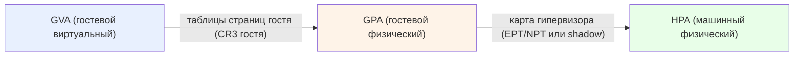
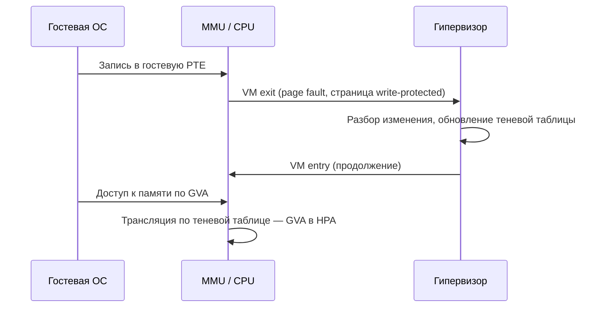
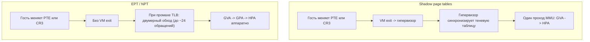
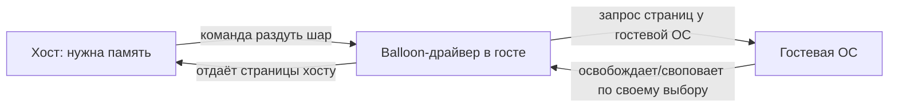

Память — второй после CPU ресурс, который гипервизор обязан виртуализировать так, чтобы гость ничего не заметил. Гостевая ОС искренне считает, что владеет непрерывным диапазоном физической оперативной памяти, начинающимся с нулевого адреса. На деле она работает поверх абстракции, которую создаёт хост. Главная сложность в том, что аппаратная подсистема трансляции адресов (MMU и таблицы страниц) изначально проектировалась под один уровень виртуализации — для одной ОС. Когда ОС сама становится гостем, появляется второй уровень, и одной таблицы страниц перестаёт хватать.

Этот раздел продолжает разговор о перехвате привилегированных операций, начатый в [виртуализации CPU](/virtualization/cpu/): почти все механизмы здесь упираются в стоимость VM exit и в работу MMU в корневом и некорневом режимах VMX.

## Проблема: лишний уровень адресации

Чтобы понять, что именно ломается, вспомним [обычную, невиртуализированную трансляцию](/virtualization/memory-basics/) — страничную память, таблицы страниц и MMU. Процесс работает с виртуальными адресами. MMU по таблицам страниц, на которые указывает регистр CR3 (на x86), переводит виртуальный адрес в физический адрес ОЗУ. Результаты кешируются в TLB (Translation Lookaside Buffer), чтобы не ходить по таблицам при каждом обращении.

Теперь добавим гипервизор. Возникают три различных адресных пространства:

- **GVA (Guest Virtual Address)** — гостевой виртуальный адрес. С ним работают приложения внутри ВМ.
- **GPA (Guest Physical Address)** — гостевой физический адрес. То, что гостевая ОС считает «настоящей» физической памятью. На самом деле это ещё одна абстракция.
- **HPA (Host Physical Address)**, он же машинный адрес — реальный адрес в физических планках ОЗУ хоста.

Гостевая ОС умеет переводить только GVA в GPA — это её собственные таблицы страниц, которые она сама и строит. Но GPA не является адресом реальной памяти: гипервизор разместил гостевую «физическую» память где-то в своём адресном пространстве, возможно, фрагментированно, возможно, частично в свопе. Значит, нужен ещё один перевод — GPA в HPA, и его знает только гипервизор.

Аппаратный MMU старого образца знает только один уровень трансляции и видит только одну таблицу (CR3). Сам по себе он не способен пройти цепочку из двух карт. Отсюда две принципиально разные стратегии: эмулировать второй уровень программно (теневые таблицы страниц) или научить MMU проходить оба уровня аппаратно (EPT/NPT).

## Теневые таблицы страниц (shadow page tables)

Первое поколение аппаратной виртуализации (Intel VT-x и AMD-V до появления вложенных таблиц) не имело двухуровневого MMU. Решение было чисто программным: гипервизор поддерживает собственные **теневые таблицы страниц**, которые отображают GVA напрямую в HPA, схлопывая два уровня в один.

Идея в том, что MMU по-прежнему работает с одной таблицей, но это не таблица гостя, а теневая таблица, подготовленная гипервизором. CR3 на железе указывает именно на неё. Когда гость думает, что загружает свой CR3, гипервизор перехватывает это и подставляет соответствующую теневую таблицу.

Чтобы теневые таблицы оставались корректными, гипервизор должен синхронизировать их с гостевыми при каждом изменении:

1. **Перехват записи в CR3.** Загрузка CR3 (смена адресного пространства, например при переключении процессов в госте) вызывает VM exit. Гипервизор находит или строит теневую таблицу для нового контекста.
2. **Обработка page fault.** Гостевые таблицы страниц помечаются как доступные только для чтения (write-protected). Когда гость пытается изменить запись (PTE) в своей таблице, происходит аппаратный page fault, перехватываемый гипервизором. Гипервизор анализирует, что именно изменил гость, обновляет теневую таблицу и возвращает управление. Такие перехваченные исключения называют «теневыми» или скрытыми page fault, в отличие от настоящих промахов страницы, которые принадлежат госту.

Накладные расходы здесь высоки и складываются из нескольких факторов: частые VM exit на каждое переключение контекста и на каждую правку таблиц; необходимость держать отдельный набор теневых таблиц на каждый гостевой контекст (память на сами теневые структуры); сложная и подверженная ошибкам логика синхронизации. На нагрузках с интенсивным созданием процессов и частыми переключениями адресных пространств теневые таблицы становятся бутылочным горлышком.

:::note[Плюс, который иногда забывают]
У теневых таблиц есть и достоинство: после того как таблица построена и «прогрета», трансляция идёт за один проход MMU, как в невиртуализированной системе. Дорогая только синхронизация, а не само обращение к памяти. Это противоположность компромиссу аппаратных таблиц, о котором ниже.
:::

## Аппаратная вложенная трансляция: EPT и NPT

Чтобы убрать поток VM exit, вендоры добавили в MMU поддержку второго уровня трансляции прямо в железе:

- **Intel EPT (Extended Page Tables)** — появилась в микроархитектуре Nehalem (2008, серверный вариант — 2009).
- **AMD NPT (Nested Page Tables)**, ранее продвигавшаяся под маркетинговым именем **RVI (Rapid Virtualization Indexing)** — появилась в Barcelona/Quad-Core Opteron (2007).

Идея одинакова у обоих вендоров. Гипервизор строит вторую таблицу страниц — вложенную (nested) или расширенную (extended), которая отображает GPA в HPA. Гостевая ОС продолжает свободно управлять своими собственными таблицами (GVA в GPA) через свой CR3 — без всякого перехвата. MMU теперь умеет проходить обе карты подряд.

### Two-dimensional page walk

При промахе TLB MMU выполняет двумерный обход таблиц (two-dimensional page walk). На x86-64 таблицы страниц четырёхуровневые (PML4 → PDPT → PD → PT). Тонкость в том, что каждый из адресов, встречающихся при обходе гостевых таблиц, сам является гостевым физическим (GPA) и потому требует прохода по вложенным таблицам, чтобы превратиться в HPA.

В худшем случае при четырёхуровневых таблицах на обоих измерениях один промах TLB порождает не 4, а до **24 обращений к памяти** (грубо, по схеме 5×4 + 4: пять проходов вложенных таблиц на каждый из уровней гостя плюс финальный). Это и есть плата за аппаратную трансляцию: при промахе TLB обход дороже, чем в shadow-схеме.

Компромисс формулируется так: теневые таблицы дёшевы при попадании, но дороги из-за лавины VM exit на каждую правку; EPT/NPT полностью устраняют exit-ы на операции с памятью, но делают каждый промах TLB существенно дороже. На практике для большинства реальных нагрузок аппаратные таблицы выигрывают с большим запасом — именно поэтому shadow page tables сегодня по сути legacy и применяются лишь как fallback на железе без EPT/NPT.

### Смягчение стоимости обхода

Чтобы двумерный обход не убивал производительность, помогают несколько механизмов:

- **Большие страницы (huge pages):** страницы 2 МБ или 1 ГБ сокращают глубину обхода (меньше уровней) и резко повышают эффективность TLB. На EPT-уровне это особенно ценно.
- **Кеширование промежуточных узлов** обхода (paging-structure caches) уменьшает число фактических обращений к памяти.

## TLB и теги: VPID и ASID

Есть ещё одна тонкость. TLB кеширует трансляции, но эти трансляции относятся к конкретной ВМ. Если при переключении между ВМ (или между гостем и гипервизором) не сбросить TLB, гость может прочитать чужие трансляции — это и некорректность, и дыра в изоляции. Поэтому в ранних реализациях каждый VM entry/exit сопровождался полным сбросом TLB, а холодный TLB — это снова дорогие промахи.

Решение — пометить записи TLB идентификатором владельца:

- **Intel VPID (Virtual Processor Identifier)** — тег виртуального процессора в записях TLB.
- **AMD ASID (Address Space Identifier)** — аналог у AMD.

С тегами TLB не нужно сбрасывать при каждом переключении контекста ВМ: записи разных ВМ сосуществуют в TLB, различаясь по тегу, и MMU использует только релевантные. Это заметно снижает «прогрев» TLB после каждого exit.

| Механизм | Intel | AMD | Назначение |
|---|---|---|---|
| Вложенная трансляция GPA→HPA | EPT | NPT (RVI) | Двумерный обход без VM exit |
| Тег TLB | VPID | ASID | Не сбрасывать TLB при переключении ВМ |
| Аппаратная виртуализация (основа) | VT-x | AMD-V (SVM) | Корневой/некорневой режим |

## Управление памятью на уровне хоста

Аппаратная трансляция решает вопрос корректности и скорости. Отдельная задача — как хост распоряжается дефицитной физической памятью между множеством ВМ. Здесь работают четыре основные техники.

### Overcommit (переподписка)

Хост может выдать ВМ в сумме больше памяти, чем у него физически есть. Расчёт на то, что ВМ редко используют весь выделенный объём одновременно — как банк, выдающий кредитов больше, чем имеет наличности. Overcommit повышает плотность размещения, но создаёт риск: если все ВМ внезапно затребуют свою память, хост окажется в дефиците и будет вынужден прибегать к свопу.

### Memory ballooning

Проблема overcommit в том, что хост не знает, какие гостевые страницы реально не нужны — изнутри гостя это видно, а снаружи нет. **Balloon-драйвер** (например, `virtio-balloon` в KVM, vmmemctl в VMware) — это паравиртуальный драйвер внутри гостя, который сотрудничает с гипервизором.

Когда хосту нужна память, он командует драйверу «надуть шар»: драйвер запрашивает страницы у гостевой ОС (как обычное приложение), а затем сообщает их хосту, который может забрать эти HPA-страницы себе. Для гостевой ОС эти страницы выглядят занятыми, поэтому она сама решает, что освободить — выгрузить кеш или своповать наименее нужное. Когда давление спадает, шар «сдувается» и страницы возвращаются госту.

:::tip[Почему ballooning лучше прямого свопа хостом]
Гостевая ОС знает, какие страницы холодные, а хост — нет. Делегируя выбор жертвы гостю, ballooning почти всегда вытесняет действительно ненужные данные, тогда как слепой host swapping может выгрузить горячую страницу гостя.
:::

### Дедупликация одинаковых страниц

Если на хосте крутится десяток одинаковых ВМ (одна и та же ОС, одни и те же библиотеки), множество страниц памяти идентичны. Их можно хранить в одном экземпляре, помечая копии как copy-on-write: при попытке записи страница тут же дублируется.

- **KSM (Kernel Samepage Merging)** в Linux/KVM — фоновый поток `ksmd` периодически сканирует помеченные области, находит дубликаты и объединяет их.
- **TPS (Transparent Page Sharing)** в VMware ESXi — исторический аналог.

Дедупликация экономит память, но стоит процессорного времени на сканирование. Кроме того, у неё есть проблема безопасности: время записи в общую страницу отличается (срабатывает copy-on-write), что открывает каналы по времени для side-channel атак. Из-за этого, в частности, VMware по умолчанию отключила межмашинный TPS, а KSM работает только над теми областями, которые хостовый процесс (QEMU) явно пометил как mergeable вызовом `madvise(MADV_MERGEABLE)` от имени гостя.

### Host swapping и его опасность

Последняя линия обороны при дефиците — хост выгружает гостевые страницы в свой своп на диске. Это работает, но катастрофически медленно и, главное, непрозрачно для гостя. Возникает риск **double paging**: хост выгружает на диск страницу, которую гостевая ОС как раз собирается выгрузить сама, или наоборот — гость обращается к странице, которую хост уже выгрузил, провоцируя дисковый ввод-вывод там, где гость ожидал обращение к ОЗУ. Производительность падает на порядки.

:::caution[Иерархия реакций на дефицит памяти]
Гипервизоры применяют техники по нарастанию агрессивности: сначала дедупликация (бесплатно по памяти), затем ballooning (умный, выбор делает гость), затем сжатие памяти, и только в крайнем случае — host swapping. Если хост дошёл до свопа, конфигурация переподписки почти наверняка спроектирована неверно.
:::

## Итоги

| Подход | VM exit на операции с памятью | Стоимость промаха TLB | Статус |
|---|---|---|---|
| Shadow page tables | Много (CR3, правки PTE) | Низкая (один проход) | Legacy / fallback |
| EPT / NPT | Нет | Высокая (двумерный обход) | Стандарт |

Виртуализация памяти держится на двух китах: аппаратной вложенной трансляции (EPT/NPT) с тегами TLB (VPID/ASID), которая обеспечивает корректность и скорость трансляции GVA → GPA → HPA, и техниках управления хостовой памятью (overcommit, ballooning, дедупликация, своп), которые позволяют размещать больше ВМ, чем есть физического ОЗУ. Все эти механизмы тесно связаны с темой VM exit из раздела про [виртуализацию CPU](/virtualization/cpu/), а их практическую настройку — huge pages, `virtio-balloon`, параметры KSM — мы рассмотрим в разделе [KVM/QEMU на практике](/virtualization/kvm-qemu/). Следующий логический шаг — [виртуализация ввода-вывода](/virtualization/io/), где появляется ещё одно адресное пространство: адреса для DMA-устройств и работа IOMMU.

## Задания

### Задание 1. Три адресных пространства и роли в трансляции

Перечислите три адресных пространства, возникающих при виртуализации памяти, и для каждой стрелки перевода (GVA→GPA и GPA→HPA) укажите, кто именно строит и владеет соответствующей картой. Почему обычный MMU «старого образца» не способен пройти всю цепочку самостоятельно?

Решение

Три адресных пространства:

- **GVA (Guest Virtual Address)** — гостевой виртуальный адрес, с ним работают приложения внутри ВМ.
- **GPA (Guest Physical Address)** — гостевой физический адрес, то, что гостевая ОС считает «настоящей» физической памятью (на деле — ещё одна абстракция).
- **HPA (Host Physical Address)** — машинный адрес, реальный адрес в планках ОЗУ хоста.

Владельцы карт:

| Перевод | Кто строит и владеет |
|---|---|
| GVA → GPA | Гостевая ОС, своими таблицами страниц через свой CR3 |
| GPA → HPA | Гипервизор (через EPT/NPT либо теневые таблицы) |

MMU старого образца знает только **один** уровень трансляции и видит только **одну** таблицу страниц (на которую указывает CR3). Он переводит ровно один раз — из виртуального адреса в физический. Цепочка же требует **двух** последовательных переводов по двум независимым картам, которыми владеют разные стороны (гость и гипервизор). Одноуровневый MMU физически не умеет пройти две карты подряд, поэтому второй уровень приходится либо эмулировать программно (shadow page tables), либо добавлять в железо (EPT/NPT).

### Задание 2. Сценарий: гость интенсивно переключает процессы

Гостевая ОС запускает нагрузку с очень частым созданием процессов и переключением адресных пространств (постоянная смена гостевого CR3, частые правки PTE). Что произойдёт на хосте с **теневыми таблицами** и что — на хосте с **EPT/NPT**? Какой вариант предпочтительнее для такой нагрузки и почему? В каком сценарии, наоборот, выгоднее теневые таблицы?

Решение

**Shadow page tables.** Каждая смена гостевого CR3 вызывает VM exit (гипервизор должен найти/построить теневую таблицу для нового контекста). Гостевые таблицы помечены write-protected, поэтому каждая правка PTE тоже даёт «скрытый» page fault и VM exit на синхронизацию теневой таблицы. На описанной нагрузке это лавина VM exit — теневые таблицы становятся бутылочным горлышком. Дополнительно тратится память на отдельный набор теневых структур для каждого гостевого контекста.

**EPT/NPT.** Гость свободно управляет своим CR3 и своими таблицами без перехвата — VM exit на операции с памятью нет вообще. Цена переносится на промах TLB: при промахе выполняется двумерный обход, в худшем случае до ~24 обращений к памяти (5×4 + 4 при четырёхуровневых таблицах на обоих измерениях).

**Вывод по этой нагрузке:** предпочтительнее EPT/NPT. Стоимость переключений контекста и правок PTE в shadow-схеме (поток exit-ов) на порядки превосходит подорожание отдельного промаха TLB. Именно поэтому для большинства реальных нагрузок аппаратные таблицы выигрывают с большим запасом, а shadow page tables сегодня — legacy/fallback на железе без EPT/NPT.

**Когда теневые выгоднее:** при стабильном, «прогретом» наборе таблиц с очень редкими правками PTE и редкими сменами CR3, но при этом с интенсивным обращением к памяти и частыми промахами TLB. Тогда дорогая синхронизация почти не происходит, а каждая трансляция идёт за один проход MMU (как в невиртуализированной системе), тогда как EPT/NPT на каждом промахе TLB платит за двумерный обход.

### Задание 3. Расчёт стоимости двумерного обхода и роль huge pages

На x86-64 таблицы четырёхуровневые (PML4 → PDPT → PD → PT). Объясните, откуда берётся оценка «до ~24 обращений к памяти» при одном промахе TLB на EPT/NPT (формула 5×4 + 4). Затем объясните, как переход на huge pages (2 МБ / 1 ГБ) и paging-structure caches сокращают эту стоимость, и почему теги TLB (VPID/ASID) — это про другую проблему, а не про удешевление самого обхода.

Решение

**Откуда 24.** Гостевой обход проходит 4 уровня (PML4 → PDPT → PD → PT) и даёт финальный GPA. Но каждый адрес, встречающийся в гостевом обходе, сам является **гостевым физическим (GPA)** и потому требует собственного прохода по вложенным таблицам, чтобы стать HPA. Вложенный обход GPA→HPA — это 4 уровня + 1 финальное обращение = 5 обращений. На каждом из 4 уровней гостя нужен такой вложенный проход: 5 × 4 = 20. Плюс ещё один вложенный проход (5 обращений) на трансляцию итогового гостевого физического адреса — в грубой оценке раздела это «+4». Итого ≈ 5×4 + 4 = 24 обращения к памяти на один промах TLB. Это и есть плата за аппаратную трансляцию: обход дороже, чем единственный проход в shadow-схеме.

**Как удешевить обход:**

- **Huge pages (2 МБ / 1 ГБ).** Крупная страница убирает нижние уровни таблиц (меньше глубина обхода) и резко повышает эффективность TLB: одна запись покрывает большой диапазон, промахов становится меньше. На EPT-уровне это особенно ценно, так как сокращает оба измерения обхода.
- **Paging-structure caches (кеширование промежуточных узлов обхода).** Кешируются промежуточные узлы, поэтому часть из 24 обращений берётся из кеша, а не из памяти — фактическое число обращений к ОЗУ падает.

**Почему VPID/ASID — про другое.** Теги TLB не делают сам двумерный обход дешевле. Они решают проблему **сброса TLB при переключении ВМ**: без тегов каждый VM entry/exit требовал полного flush TLB (иначе гость прочитал бы чужие трансляции — некорректность и дыра в изоляции), а холодный TLB означает новые дорогие промахи. С тегами записи разных ВМ сосуществуют в TLB, MMU использует только релевантные по тегу, и сброс не нужен. То есть VPID/ASID **уменьшают число промахов после переключений**, но стоимость одного промаха (сам обход) оставляют прежней.

### Задание 4. Сценарий дефицита памяти и иерархия реакций

Хост сильно переподписан по памяти (overcommit), и все ВМ внезапно затребовали свою память — наступает дефицит. Расположите доступные техники реакции по нарастанию агрессивности и кратко объясните каждую. Почему ballooning почти всегда лучше прямого host swapping? Что такое double paging и почему он сигнализирует о неверной конфигурации?

Решение

**Иерархия реакций (по нарастанию агрессивности):**

1. **Дедупликация одинаковых страниц** (KSM в Linux/KVM, исторически TPS в VMware ESXi). Бесплатно по памяти: идентичные страницы (одинаковые ОС/библиотеки на множестве ВМ) хранятся в одном экземпляре как copy-on-write. Платим только CPU на фоновое сканирование (`ksmd`). У KSM сканируются лишь области, помеченные QEMU как mergeable через `madvise(MADV_MERGEABLE)`. Есть риск side-channel: разное время записи в общую страницу (срабатывание CoW) — из-за этого VMware по умолчанию отключила межмашинный TPS.
2. **Memory ballooning** — умный возврат памяти: выбор жертвы делает гость. Хост командует balloon-драйверу (`virtio-balloon` в KVM, vmmemctl в VMware) «надуть шар», тот запрашивает страницы у гостевой ОС как обычное приложение и отдаёт соответствующие HPA хосту. Гость сам решает, что освободить (кеш) или своповать.
3. **Сжатие памяти.**
4. **Host swapping** — крайняя мера: хост выгружает гостевые страницы в свой своп на диске.

**Почему ballooning лучше прямого host swapping.** Какие страницы холодные, знает только гостевая ОС — снаружи это не видно. Ballooning делегирует выбор жертвы гостю, поэтому вытесняются действительно ненужные данные. Слепой host swapping выбирает вслепую и может выгрузить горячую страницу гостя, обрушив производительность.

**Double paging.** Возникает при host swapping из-за непрозрачности для гостя:

- хост выгружает на диск страницу, которую гостевая ОС как раз собирается выгрузить сама (двойная, лишняя работа), либо
- гость обращается к странице, которую хост уже выгрузил, — там, где гость ожидал обращение к ОЗУ, возникает дисковый ввод-вывод.

Производительность падает на порядки. Если хост вообще дошёл до свопа, это сигнал, что конфигурация переподписки почти наверняка спроектирована неверно: исправлять нужно не симптом, а уровень overcommit.

