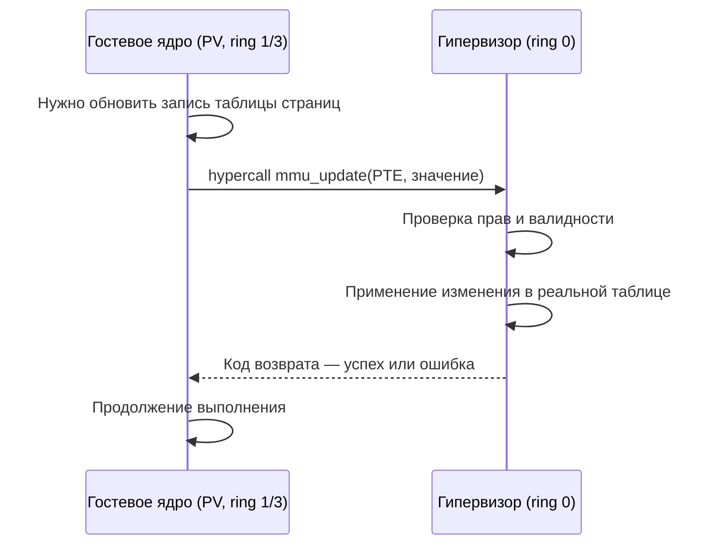
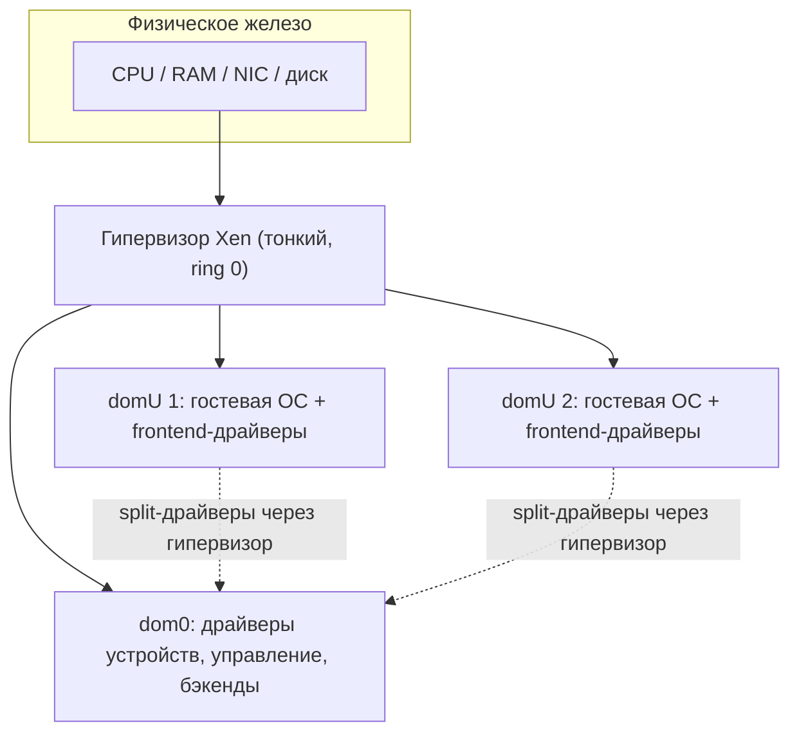
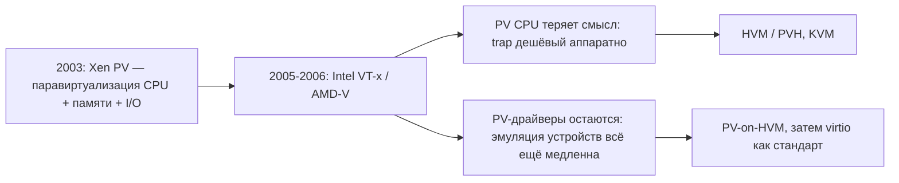

В предыдущих разделах мы видели, как гипервизор обманывает гостевую ОС: он перехватывает привилегированные инструкции ([Виртуализация CPU](/virtualization/cpu/)), подменяет таблицы страниц ([Виртуализация памяти](/virtualization/memory/)) и эмулирует устройства ([Виртуализация ввода-вывода](/virtualization/io/)). Гость при этом «не знает», что работает на виртуальной машине, и пытается обращаться с железом так, будто оно настоящее. Этот подход называют **полной виртуализацией** (full virtualization): иллюзия настолько полная, что немодифицированная ОС запускается без единой правки.

Паравиртуализация исходит из противоположной идеи. Раз поддержание иллюзии стоит дорого, давайте откажемся от неё: модифицируем гостевую ОС так, чтобы она **знала** о существовании гипервизора и **явно с ним кооперировала**. Вместо того чтобы гипервизор втайне ловил и эмулировал каждую опасную операцию, гость сам обращается к нему через специальный интерфейс — там, где это эффективнее всего.

Приставка *para-* (греч. «рядом», «около») здесь означает «почти виртуализация»: предоставляется не точная копия физического железа, а похожий, но упрощённый и более удобный для виртуализации программный интерфейс. Термин закрепился вместе с проектом Xen, статья о котором — «Xen and the Art of Virtualization» (SOSP 2003) — и ввела его в широкий оборот.

## Hypercall: системный вызов к гипервизору

Центральное понятие паравиртуализации — **hypercall** (гипервызов). Это явный вызов из гостевого ядра в гипервизор, прямой аналог системного вызова (`syscall`), только адресованный не ядру ОС, а монитору виртуальных машин (VMM).

Чтобы понять выигрыш, вспомним механику полной виртуализации без аппаратной поддержки. Гостевое ядро думает, что работает в ring 0, но реально исполняется в менее привилегированном кольце. Как только оно выполняет привилегированную инструкцию (загрузка регистра CR3, запрет прерываний `cli`, модификация записи таблицы страниц), происходит **trap** — аппаратное исключение, передающее управление гипервизору. Гипервизор разбирает, что именно хотел сделать гость, эмулирует эффект и возвращает управление. Каждый такой переход (trap-and-emulate) или эпизод бинарной трансляции — это дорогая смена контекста.

Паравиртуализация заменяет неявный перехват явным сотрудничеством. Вместо того чтобы напрямую писать в таблицу страниц и ловить trap, паравиртуальное ядро формирует запрос и делает hypercall: «обнови вот эту запись таблицы страниц на это значение». Гипервизор, которому теперь известно намерение гостя целиком, может:

- проверить и применить операцию без дорогостоящего декодирования инструкции;
- **батчить** несколько операций в один вызов (например, обновить десятки PTE за один hypercall), амортизируя стоимость перехода;
- отдавать часть состояния гостю напрямую через общую страницу памяти, чтобы тот вообще не делал лишних переходов.

Типичные операции, выполняемые через hypercall в паравиртуальном госте: работа с таблицами страниц и MMU, управление виртуальными прерываниями, переключение между гостевыми задачами, передача дескрипторных таблиц (GDT/LDT), уступка процессора (`yield`) и обмен с паравиртуальными устройствами. В Xen эти вызовы оформлены как единый ABI — например `HYPERVISOR_mmu_update`, `HYPERVISOR_event_channel_op`, `HYPERVISOR_sched_op`.

:::note[Аналогия]
Полная виртуализация — это как если бы переводчик подслушивал ваш разговор и тайком всё переводил. Паравиртуализация — это когда вы заранее договорились говорить переводчику напрямую: «переведи вот эту фразу». Второе быстрее и точнее, но требует, чтобы обе стороны знали о договорённости — то есть чтобы гость был модифицирован.
:::

## Модель Xen: домены dom0 и domU

Самая известная реализация паравиртуализации — гипервизор **Xen** (Type-1, см. [Гипервизоры Type-1 и Type-2](/virtualization/hypervisors/)). Его архитектура вводит понятие **домена** — так в терминологии Xen называется виртуальная машина.

- **dom0** (domain zero) — привилегированный управляющий домен. Он стартует первым вместе с гипервизором и содержит реальные драйверы физических устройств, инструменты управления (`xl`/`xend`) и бэкенды паравиртуальных устройств. Сам гипервизор Xen намеренно сделан тонким: он не содержит драйверов сетевых карт и дисков — этим занимается ядро Linux/BSD внутри dom0.
- **domU** (unprivileged domain) — обычные гостевые домены, в которых работают полезные нагрузки. Доступа к физическому железу напрямую у них нет; ввод-вывод они получают через dom0.

Ввод-вывод в Xen построен на **split-драйверах** (разделённые драйверы): в domU работает лёгкий *frontend*, в dom0 — *backend*, подключённый к настоящему железу. Они общаются через кольцевые буферы в разделяемой памяти (grant tables) и каналы событий (event channels) — это и есть паравиртуальный ввод-вывод, минующий медленную эмуляцию устройства.

## Три режима: PV, HVM и PVH

Исторически Xen прошёл через три модели запуска гостей. Их полезно сравнить, потому что они отражают эволюцию всей индустрии виртуализации.

| Режим | CPU и память | Ввод-вывод | Нужна модификация гостя | Аппаратная поддержка |
|-------|-------------|------------|-------------------------|----------------------|
| **PV** (paravirtualized) | Полная паравиртуализация через hypercall-ы | Паравиртуальные split-драйверы | Да (ядро портировано под Xen) | Не требуется |
| **HVM** (hardware virtual machine) | Аппаратная виртуализация (Intel VT-x / AMD-V), эмуляция платформы через QEMU | Эмуляция реальных устройств или PV-on-HVM | Нет | Обязательна |
| **PVH** (PV hybrid) | Аппаратная виртуализация CPU/MMU, но без эмуляции legacy-платформы | Только паравиртуальные интерфейсы | Минимальная (PVH-совместимое ядро) | Обязательна |

**PV** — классический режим из статьи 2003 года. Ни VT-x, ни AMD-V тогда не существовало, поэтому единственным способом получить приемлемую производительность была модификация гостя. PV-ядро не имеет доступа к реальным таблицам страниц и привилегированным инструкциям — всё идёт через hypercall-ы. Цена — необходимость портировать ядро (для Linux это был набор патчей, позже частично влитый в mainline как Xen-поддержка).

**HVM** появился, когда процессоры обзавелись аппаратной виртуализацией. Теперь немодифицированный гость (например, Windows) запускается «как есть»: VT-x/AMD-V аппаратно перехватывают привилегированные операции, а эмуляцию чипсета, BIOS и устройств берёт на себя QEMU в dom0. Это удобно, но эмуляция устройств медленна.

**PVH** — современный гибрид и рекомендуемый режим в актуальных версиях Xen. Он использует аппаратную виртуализацию CPU и MMU (как HVM), но полностью отказывается от эмуляции legacy-платформы и QEMU-модели устройства, оставляя только паравиртуальные интерфейсы для ввода-вывода, загрузки и прерываний. В результате — минимальная поверхность атаки, отсутствие тяжёлого эмулятора и почти нативная скорость. PVH объединяет лучшее из двух миров: аппаратную изоляцию CPU и паравиртуальную лёгкость I/O.

## Плюсы и минусы чистой PV

**Преимущества** паравиртуализации проявились именно в эпоху до аппаратной виртуализации:

- **Производительность.** Нет дорогой бинарной трансляции (как у ранних VMware) и резко меньше переходов гость↔гипервизор за счёт батчинга hypercall-ов. На рубеже 2003–2006 годов Xen PV показывал накладные расходы в единицы процентов там, где другие подходы теряли десятки.
- **Простота гипервизора.** Раз гость кооперирует, VMM не нужен сложный механизм декодирования и эмуляции инструкций — гипервизор остаётся тонким.

**Недостатки** оказались фундаментальными:

- **Требуется модификация гостевой ОС.** Нужен исходный код ядра и порт под конкретный ABI гипервизора. Для открытых ОС (Linux, *BSD, Solaris) это решаемо, для проприетарных — нет.
- **Исторически невозможно для немодифицируемых ОС.** Windows нельзя было запустить в чистом PV-режиме — его ядро закрыто и не делает hypercall-ов. Именно эту нишу закрыл аппаратный HVM.
- **Привязка к конкретному гипервизору.** PV-ядро под Xen не запустится на другом VMM без переноса под его hypercall-интерфейс.

:::caution[Важное уточнение]
Паравиртуализация CPU/MMU и паравиртуализация ввода-вывода — это разные вещи, которые часто путают. Первая (полный PV-режим) требует переписать самую чувствительную часть ядра и сегодня почти не используется. Вторая (паравиртуальные драйверы) применяется повсеместно, в том числе поверх полной аппаратной виртуализации.
:::

## Связь с virtio: паравиртуальные драйверы остались

Здесь — главный сюжетный поворот всей темы. С распространением **Intel VT-x** и **AMD-V** (середина 2000-х) необходимость в паравиртуализации CPU отпала: аппаратура перехватывает привилегированные операции дёшево и без модификации гостя ([подробнее в разделе про CPU](/virtualization/cpu/)). Чистая PV-виртуализация процессора отошла на второй план, и Xen, и весь рынок сместились к HVM/PVH и к KVM.

Но **паравиртуальные драйверы устройств никуда не исчезли** — наоборот, стали стандартом. Причина проста: аппаратная виртуализация эффективно решает проблему CPU, но **не** ускоряет эмуляцию устройств. Эмулировать сетевую карту Intel e1000 или контроллер IDE регистр за регистром — медленно независимо от VT-x. Поэтому даже у полностью аппаратного гостя выгодно заменить эмулируемое устройство на паравиртуальное: гость ставит «знающий о гипервизоре» драйвер, и ввод-вывод идёт через быстрый кольцевой буфер в разделяемой памяти. Этот гибрид называют **PV-on-HVM**: процессор виртуализуется аппаратно, а диск и сеть — паравиртуально.

Обобщением этой идеи стал **virtio** — стандартизированный интерфейс паравиртуальных устройств, по сути и есть паравиртуализация ввода-вывода в чистом виде. Его кольцевые очереди (`virtqueue`) — прямые наследники split-драйверов Xen. Подробно механика virtio разобрана в разделе [Виртуализация ввода-вывода](/virtualization/io/).

Итог исторической эволюции: паравиртуализация как способ виртуализовать процессор — артефакт эпохи до аппаратной поддержки, важный для понимания того, как развивалась область. А паравиртуализация как способ ускорить ввод-вывод — живой и доминирующий подход, на котором держится производительность современных облаков. Подробнее о том, где сегодня применяется Xen и как устроены KVM и другие решения, — в разделах [KVM/QEMU на практике](/virtualization/kvm-qemu/) и [Обзор платформ](/virtualization/platforms/).

## Задания

### Задание 1. Понимание: trap-and-emulate против hypercall

Сформулируйте принципиальную разницу между тем, как обновляет запись таблицы страниц гость при полной виртуализации (без аппаратной поддержки) и при паравиртуализации. Почему второй путь дешевле и за счёт каких трёх механизмов гипервизор дополнительно экономит на переходах?

Решение

**Полная виртуализация (trap-and-emulate).** PV-ядро думает, что работает в ring 0, но реально исполняется в менее привилегированном кольце. Когда оно пытается напрямую модифицировать запись таблицы страниц (привилегированная операция), срабатывает аппаратный **trap** — исключение передаёт управление гипервизору. Тот должен *декодировать* инструкцию, понять намерение гостя, эмулировать эффект и вернуть управление. Каждый такой переход — дорогая смена контекста, а намерение приходится восстанавливать «по факту».

**Паравиртуализация (hypercall).** Гость не пишет в таблицу напрямую и не ловит trap. Он формирует явный запрос и делает **hypercall** — прямой аналог `syscall`, только адресованный гипервизору (VMM), а не ядру ОС: «обнови вот эту PTE на это значение». Гипервизору намерение известно целиком, декодировать инструкцию не нужно.

Три механизма экономии на переходах:

1. **Нет декодирования инструкции** — гипервизор проверяет и применяет уже готовую операцию.
2. **Батчинг** — несколько операций упаковываются в один вызов (например, десятки PTE за один hypercall), стоимость перехода амортизируется.
3. **Общая страница памяти** — часть состояния отдаётся гостю напрямую, чтобы он вообще не делал лишних переходов.

Ключевая идея: неявный перехват заменяется явным сотрудничеством, но ценой того, что гость должен быть модифицирован и «знать» о гипервизоре.

### Задание 2. Архитектура Xen: домены и split-драйверы

Гипервизор Xen намеренно сделан «тонким» и не содержит драйверов сетевых карт и дисков. Где тогда живут реальные драйверы железа и как domU без прямого доступа к устройствам всё-таки выполняет сетевой ввод-вывод? Объясните роль dom0, domU и схему split-драйверов.

Решение

**dom0** (domain zero) — привилегированный управляющий домен. Стартует первым вместе с гипервизором и содержит:

- реальные драйверы физических устройств (поэтому сам Xen может оставаться тонким);
- инструменты управления (`xl`/`xend`);
- **бэкенды** паравиртуальных устройств.

**domU** (unprivileged domain) — обычные гостевые домены с полезной нагрузкой. Прямого доступа к железу у них нет; весь ввод-вывод идёт через dom0.

**Split-драйверы** (разделённые драйверы) — механизм этого I/O:

- в domU работает лёгкий **frontend**;
- в dom0 — **backend**, подключённый к настоящему железу;
- общаются они через **кольцевые буферы в разделяемой памяти (grant tables)** и **каналы событий (event channels)**.

Путь сетевого пакета из domU: frontend кладёт запрос в кольцевой буфер → сигнал через event channel → backend в dom0 забирает запрос и отдаёт его реальному драйверу NIC. Это и есть паравиртуальный ввод-вывод, минующий медленную эмуляцию устройства регистр за регистром.

### Задание 3. Сценарий: «что произойдёт, если…»

Разберите три ситуации:

а) Вы пытаетесь запустить немодифицированную Windows в **чистом PV-режиме** Xen. Что произойдёт и почему?

б) На дворе 2004 год, аппаратной виртуализации (VT-x/AMD-V) ещё нет. Почему именно PV давал тогда накладные расходы в единицы процентов, тогда как альтернативы теряли десятки?

в) У вас полностью аппаратный HVM-гость с эмулируемой сетевой картой Intel e1000. Вы включаете VT-x «помощнее» — ускорит ли это сетевой ввод-вывод? Что нужно сделать вместо этого?

Решение

**а) Windows в чистом PV.** Не запустится. PV требует портировать ядро под конкретный ABI гипервизора: PV-ядро не имеет доступа к реальным таблицам страниц и привилегированным инструкциям — всё идёт через hypercall-ы. Ядро Windows закрыто и hypercall-ов не делает, переписать его нельзя. Именно эту нишу немодифицируемых ОС закрыл аппаратный **HVM** (VT-x/AMD-V перехватывают привилегированные операции аппаратно, без правки гостя).

**б) Почему PV был быстрым до VT-x.** В ту эпоху альтернативой были trap-and-emulate (дорогие переходы на каждой привилегированной инструкции) и **бинарная трансляция** (как у ранних VMware) — оба способа тяжёлые. PV убирал и то, и другое: нет бинарной трансляции вообще, а число переходов гость↔гипервизор резко снижено за счёт батчинга hypercall-ов. Плюс гипервизор остаётся тонким — не нужен сложный декодер/эмулятор инструкций. Отсюда накладные расходы в единицы процентов против десятков у конкурентов.

**в) HVM-гость с e1000.** Усиление VT-x не поможет: аппаратная виртуализация эффективно решает проблему **CPU**, но **не ускоряет эмуляцию устройств**. Эмулировать e1000 регистр за регистром медленно независимо от VT-x. Решение — заменить эмулируемое устройство на **паравиртуальное**: поставить в гость «знающий о гипервизоре» драйвер, и ввод-вывод пойдёт через быстрый кольцевой буфер в разделяемой памяти. Этот гибрид называется **PV-on-HVM** (CPU виртуализуется аппаратно, диск и сеть — паравиртуально), а его обобщение и стандарт — **virtio**.

### Задание 4. Синтез: почему PV-CPU умер, а PV-драйверы стали стандартом

Раздел утверждает, что паравиртуализация CPU/MMU сегодня почти не используется, а паравиртуальные драйверы применяются повсеместно. Объясните это кажущееся противоречие. Заодно сравните режимы PV, HVM и PVH и укажите, какой из них рекомендуется в актуальном Xen и почему. Где в этой истории virtio?

Решение

Противоречия нет: это два **разных вида** паравиртуализации, которые часто путают.

- **PV CPU/MMU** существовала, потому что до VT-x/AMD-V (середина 2000-х) не было дешёвого аппаратного способа перехватывать привилегированные операции — приходилось переписывать самую чувствительную часть ядра. Как только появились VT-x/AMD-V, аппаратура стала перехватывать эти операции дёшево и без модификации гостя, и смысл PV-CPU пропал. Минусы (нужен исходник ядра, порт под конкретный ABI, привязка к гипервизору) перевесили.
- **PV-драйверы** решают другую задачу — медленную **эмуляцию устройств**, которую VT-x не ускоряет. Поэтому они не только выжили, но стали стандартом (PV-on-HVM → virtio).

Сравнение режимов:

| Режим | CPU и память | Ввод-вывод | Модификация гостя | Аппаратная поддержка |
|-------|-------------|------------|-------------------|----------------------|
| **PV** | Полный PV через hypercall-ы | PV split-драйверы | Да (порт ядра под Xen) | Не требуется |
| **HVM** | Аппаратная (VT-x/AMD-V) + эмуляция платформы через QEMU | Эмуляция устройств или PV-on-HVM | Нет | Обязательна |
| **PVH** | Аппаратная для CPU/MMU, без эмуляции legacy-платформы | Только паравиртуальные интерфейсы | Минимальная (PVH-совместимое ядро) | Обязательна |

**Рекомендуемый сегодня — PVH.** Он берёт аппаратную виртуализацию CPU и MMU (как HVM), но отказывается от эмуляции legacy-платформы и QEMU-модели устройства, оставляя только паравиртуальный I/O, загрузку и прерывания. Итог: минимальная поверхность атаки, нет тяжёлого эмулятора, почти нативная скорость — лучшее из двух миров (аппаратная изоляция CPU + паравиртуальная лёгкость I/O).

**virtio** — обобщение и стандартизация идеи PV-драйверов: по сути паравиртуализация ввода-вывода в чистом виде. Его кольцевые очереди (`virtqueue`) — прямые наследники split-драйверов Xen (frontend/backend + кольцевые буферы в разделяемой памяти). Так PV-I/O пережил PV-CPU и держит производительность современных облаков.

