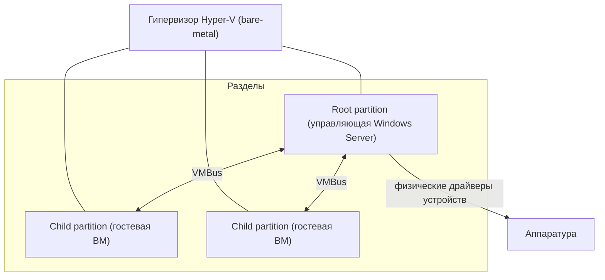
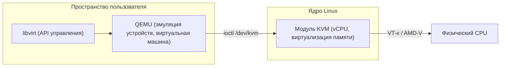
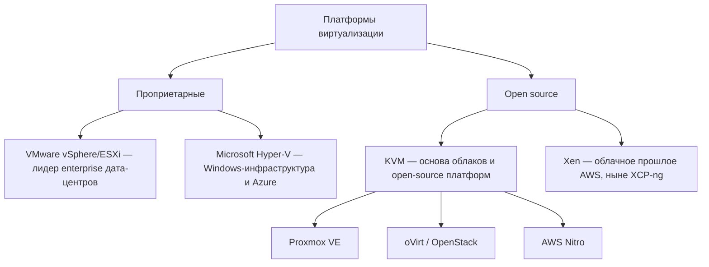

Предыдущие разделы разбирали механику виртуализации по слоям: классификацию гипервизоров в [Гипервизоры Type-1 и Type-2](/virtualization/hypervisors/), аппаратные расширения процессора в [Виртуализации CPU](/virtualization/cpu/) и кооперативную модель в [Паравиртуализации](/virtualization/paravirtualization/). Этот раздел собирает всё вместе на уровне реальных продуктов. Мы рассмотрим четыре платформы, которые определяют рынок серверной виртуализации: VMware vSphere/ESXi, Microsoft Hyper-V, Xen и KVM — их архитектуру, лицензионную модель и типичные сценарии применения. В конце посмотрим, как те же технологии работают под капотом у публичных облаков.

Почти все эти платформы — гипервизоры Type-1 (bare-metal): гипервизор работает непосредственно на железе, без промежуточной хост-ОС. Различаются они тем, как организован привилегированный управляющий слой и насколько платформа открыта.

## VMware vSphere / ESXi

VMware ESXi — проприетарный гипервизор Type-1, исторически самый зрелый продукт корпоративной виртуализации. ESXi построен вокруг собственного микроядра VMkernel, которое самостоятельно управляет планированием CPU, памятью, сетью и хранилищем; это не Linux, хотя для совместимости предоставляет POSIX-подобное окружение. Отдельные машины ESXi объединяются и управляются централизованно через vCenter Server — связка хостов плюс vCenter и образует платформу vSphere.

Флагманские возможности VMware определили отраслевые ожидания от enterprise-виртуализации:

- **vMotion** — живая миграция работающей ВМ между физическими хостами без остановки гостевой ОС. Состояние памяти переносится итеративно по сети, после чего исполнение мгновенно переключается на целевой хост.
- **Storage vMotion** — аналогичный перенос дисков ВМ между хранилищами без простоя.
- **HA (High Availability)** — автоматический перезапуск ВМ на других хостах кластера при отказе физического сервера.
- **DRS (Distributed Resource Scheduler)** — динамическая балансировка нагрузки: DRS автоматически распределяет и мигрирует ВМ по кластеру vMotion-ом, выравнивая использование CPU и памяти.

VMware десятилетиями доминирует в корпоративных дата-центрах: высокая стабильность, богатая экосистема (NSX для сети, vSAN для хранилища), широкая поддержка вендорами. После приобретения VMware компанией Broadcom (2023) произошёл переход на подписочную модель и пересмотр лицензирования, что подтолкнуло часть заказчиков искать альтернативы — Hyper-V, Proxmox VE и решения на KVM.

:::note[Терминология]
VMware Workstation и VMware Fusion — это гипервизоры Type-2 (работают поверх Windows/Linux/macOS) и относятся к desktop-виртуализации. ESXi/vSphere — это серверный Type-1, и именно о нём идёт речь в корпоративном контексте.
:::

## Microsoft Hyper-V

Hyper-V — гипервизор Type-1 от Microsoft, входящий в Windows Server и доступный в Windows Pro/Enterprise. Его архитектура часто вводит в заблуждение: кажется, что Hyper-V работает «внутри Windows», но на самом деле всё наоборот. При включении роли Hyper-V тонкий слой гипервизора вставляется под уже установленную Windows, и сама хостовая Windows становится привилегированным разделом поверх гипервизора.

Ключевые элементы архитектуры:

- **Root partition (родительский раздел)** — привилегированная управляющая ОС (Windows Server). Только она имеет прямой доступ к физическим устройствам и содержит реальные драйверы; гипервизор делегирует ей управление вводом-выводом.
- **Child partitions (дочерние разделы)** — гостевые ВМ. Прямого доступа к железу у них нет.
- **VMBus** — высокоскоростная шина обмена в памяти между дочерними разделами и root partition.
- **Enlightened-драйверы** — паравиртуальные драйверы внутри гостя. Вместо эмуляции реального устройства гость общается через VMBus с поставщиком службы (VSP) в root partition по протоколу VSC↔VSP. Это та самая паравиртуализация из [соответствующего раздела](/virtualization/paravirtualization/): гость «осведомлён» (enlightened), что работает в виртуальной среде, и не тратит такты на эмуляцию.

Hyper-V глубоко интегрирован с экосистемой Microsoft: единое управление через System Center / Windows Admin Center, Failover Clustering для отказоустойчивости, Live Migration как аналог vMotion. Тот же гипервизорный слой лежит в основе Azure — публичное облако Microsoft исторически построено на доработанном Hyper-V.

## Xen

Xen — открытый гипервизор Type-1, появившийся в 2003 году в Кембриджском университете и сыгравший ключевую роль в популяризации паравиртуализации. Его архитектура строится вокруг доменов:

- **dom0 (domain 0)** — привилегированный домен, обычно Linux, который запускается первым. Он содержит драйверы устройств и инструменты управления; через него идёт весь ввод-вывод гостей. Концептуально dom0 близок к root partition в Hyper-V.
- **domU (unprivileged domains)** — гостевые домены без прямого доступа к железу.

Xen поддерживает три режима исполнения гостей:

| Режим | Расшифровка | Как работает |
|---|---|---|
| **PV** | Paravirtualization | Гостевое ядро модифицировано и обращается к гипервизору через гипервызовы; не требует аппаратной виртуализации, но требует поддержки в ядре гостя |
| **HVM** | Hardware Virtual Machine | Полная аппаратная виртуализация (Intel VT-x / AMD-V), гость немодифицирован; эмуляция устройств через QEMU |
| **PVH** | PV в HVM-контейнере | Гибрид: аппаратная виртуализация CPU и памяти, но паравиртуальный ввод-вывод; минимум эмуляции, современный рекомендуемый режим |

Историческое значение Xen огромно: на нём долгие годы работала Amazon EC2 — первые поколения инстансов AWS были именно Xen-based, прежде чем Amazon перешла на собственный стек на базе KVM (см. ниже). Коммерческая ветка развивалась как XenServer / **Citrix Hypervisor**, а после изменения политики Citrix сообщество поддерживает полностью открытый форк **XCP-ng** с центром управления Xen Orchestra.

## KVM

KVM (Kernel-based Virtual Machine) — это не отдельный продукт, а механизм виртуализации, встроенный прямо в ядро Linux (с версии 2.6.20, 2007 год) и распространяемый под GPL. KVM превращает само ядро Linux в гипервизор Type-1: загружается модуль `kvm` плюс процессорно-зависимый `kvm-intel` или `kvm-amd`, использующий аппаратные расширения VT-x/AMD-V из [раздела про CPU](/virtualization/cpu/).

Важно понимать разделение ролей в стеке KVM:

- **KVM** в ядре отвечает за исполнение виртуальных CPU и виртуализацию памяти (включая EPT/NPT — см. [Виртуализацию памяти](/virtualization/memory/)).
- **QEMU** в пользовательском пространстве эмулирует устройства (диски, сеть, чипсет) и предоставляет паравиртуальные устройства **virtio**. Подробности связки KVM↔QEMU разбираются в [практическом разделе](/virtualization/kvm-qemu/).
- **libvirt** — стандартная библиотека и демон управления (`virsh`, `virt-manager`), единый API над KVM/QEMU.

Поскольку KVM открыт и встроен в Linux, поверх него выросла обширная экосистема готовых платформ:

- **Proxmox VE** — популярная open-source платформа: KVM для ВМ плюс LXC для контейнеров, кластеризация, веб-интерфейс, живая миграция. Частый выбор как альтернатива VMware.
- **oVirt** (и его коммерческая основа Red Hat Virtualization / RHV, ныне свёрнутая) — enterprise-управление кластерами KVM с движком на базе libvirt.
- **OpenStack** — облачная платформа IaaS, где KVM выступает дефолтным гипервизором для службы Nova.
- **AWS Nitro** — гипервизор нового поколения Amazon, построенный на минимизированном KVM с выносом ввода-вывода на отдельные Nitro-карты.

## Сравнительная таблица

| Платформа | Тип | Лицензия | ОС хоста / управляющий слой | Поддерживаемые гости | Флагманские возможности | Типичное применение |
|---|---|---|---|---|---|---|
| **VMware vSphere/ESXi** | Type-1 | Проприетарная (подписка Broadcom) | Собственный VMkernel + vCenter | Windows, Linux, BSD и др. | vMotion, HA, DRS, vSAN, NSX | Корпоративные дата-центры, VDI |
| **Microsoft Hyper-V** | Type-1 | Проприетарная (в составе Windows) | Windows Server (root partition) | Windows, Linux (поддержка enlightened) | VMBus, Live Migration, Failover Clustering | Windows-инфраструктура, гибрид с Azure |
| **Xen** | Type-1 | Open source (GPL); Citrix — коммерческая | Linux в dom0 | PV/HVM/PVH: Linux, Windows (HVM) | Режимы PV/PVH, гипервызовы, изоляция dom0 | Облака (исторически AWS), XCP-ng, провайдеры |
| **KVM** | Type-1 (в ядре Linux) | Open source (GPL) | Любой современный Linux | Windows, Linux, BSD (через QEMU + virtio) | virtio, живая миграция, интеграция с cgroups/SELinux | Облака, OpenStack, Proxmox VE, oVirt |

## Позиционирование

:::tip[Как выбирать]
Грубое правило: тяжёлая корпоративная инфраструктура с требованиями к зрелым SLA — исторически VMware; инфраструктура вокруг Windows и Azure — Hyper-V; гибкость, отсутствие лицензионных платежей и облачные масштабы — KVM (часто через Proxmox VE или OpenStack). Xen сегодня — нишевый выбор там, где уже есть его экспертиза или нужен XCP-ng.
:::

## Виртуализация в публичных облаках

Все крупные публичные облака — это, по сути, виртуализация промышленного масштаба, и каждое сделало свой архитектурный выбор:

- **AWS** начинала на Xen, но с появлением инстансов C5 (2017) перешла на **Nitro** — гипервизор на основе KVM, предельно облегчённый за счёт того, что сеть, хранилище и безопасность вынесены на специализированные аппаратные **Nitro-карты**. Это снижает накладные расходы виртуализации почти до нуля и позволяет предлагать bare-metal-инстансы под тем же управлением.
- **Microsoft Azure** построена на доработанной версии **Hyper-V** — той же технологии, что и в Windows Server, что обеспечивает плотную интеграцию гибридных сценариев между локальными ЦОД и облаком.
- **Google Cloud (GCP)** использует **KVM** с собственными значительными доработками в области безопасности и производительности.

Общая тенденция: облака тяготеют к открытым технологиям (KVM) и к выносу эмуляции ввода-вывода на выделенное оборудование (DPU/SmartNIC, как Nitro-карты), чтобы вернуть гостям почти всю производительность физического сервера. Это логическое продолжение идей паравиртуализации и аппаратного ускорения ввода-вывода, рассмотренных ранее в курсе.

:::note[Итог раздела]
Четыре платформы решают одну задачу разными путями: VMware и Hyper-V — проприетарные экосистемы с глубокой интеграцией, Xen и KVM — открытые гипервизоры, причём именно KVM стал фундаментом современных облаков и open-source-платформ вроде Proxmox VE. Понимание их архитектуры опирается на базовые механизмы из разделов про [CPU](/virtualization/cpu/), [память](/virtualization/memory/) и [паравиртуализацию](/virtualization/paravirtualization/).
:::
